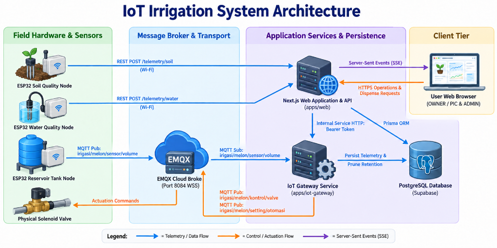

# Soil and Water Monitoring and Faucet Control System

A web-based, multi-device monitoring and control platform for ESP32/NodeMCU hardware in agricultural environments.

The platform provides end-to-end telemetry ingestion, water reservoir tracking, role-based user management, audited lifecycle administration, multi-lingual support, and safety-interlocked physical irrigation valve control.

---

## 1. Project Overview

Kebun Melon is designed to manage agricultural sensor networks and irrigation infrastructure across three distinct monitoring and control domains:

1. **Soil Quality Monitoring (REST API over Wi-Fi):**
   - Ingests Nitrogen (N), Phosphorus (P), Potassium (K), Soil Temperature (°C), Moisture (%), pH, Electrical Conductivity (EC in `µS/cm`), and Soil Status.
   - Transmitted directly from ESP32 field nodes to the Next.js Web API via HTTP POST.

2. **Water Quality Monitoring (REST API over Wi-Fi):**
   - Ingests pH, Total Dissolved Solids (TDS in `ppm`), Electrical Conductivity (EC in `µS/cm`), and Water Status.
   - Transmitted directly from ESP32 field nodes to the Next.js Web API via HTTP POST.

3. **Reservoir Water Tank Monitoring (MQTT 5.0 over TLS via EMQX Broker):**
   - Ingests Tank Water Volume (0 L–2,200 L operational scale, authoritative maximum capacity constant `WATER_TANK_MAX_CAPACITY = 2200`) and Reservoir Status.
   - Uses dedicated MQTT topics:
     - Telemetry Ingestion: `irigasi/melon/sensor/volume`
     - Manual Valve Control: `irigasi/melon/kontrol/valve`
     - Automated Dispensing: `irigasi/melon/setting/otomasi`

4. **Faucet Control & Irrigation Presets:**
   - Preset irrigation phases mapped deterministically on the server:
     - **Phase 1:** 300 mL (UI: 0.3 L)
     - **Phase 2:** 1,000 mL (UI: 1.0 L)
     - **Phase 3:** 1,500 mL (UI: 1.5 L)
   - Mandatory server-side safety flag: `ENABLE_FAUCET_CONTROL=false` by default. Dual written sign-off (Owner + Hardware Lead) is required before production physical activation.

5. **User Roles & Account Governance:**
   - Exactly two system roles: `OWNER / PIC` (Person in Charge / Penanggung Jawab) and `ADMIN`.
   - Public registration creates only `ADMIN` accounts in `PENDING_APPROVAL` status.
   - Owner approval required before protected application access is granted.
   - Owner protection invariants: Owner accounts cannot be selected, suspended, deactivated, or deleted.
   - Bulk permanent deletion supported for Admins (`POST /api/v1/users/bulk-delete`).
   - Single active session enforcement per account (`DEC-AUTH-107`) rejecting concurrent logins with HTTP 409 Conflict (`ACTIVE_SESSION_EXISTS`).

---

## 2. Core Architecture & Communication Topologies

<p align="center">
  
</p>

### Communication Principles

- **Ingress Segregation:** REST API over Wi-Fi handles Soil and Water Quality sensors. MQTT 5.0 over TLS/WSS handles the Water Tank and actuator commands.
- **No Direct Browser MQTT:** Browsers never connect directly to the MQTT broker or receive broker credentials.
- **Fail-Closed Security:** All unauthorized requests, missing device access, expired sessions, or disabled feature flags fail closed.
- **Idempotent Control:** Faucet commands require client-generated idempotency keys, atomic database reservation, and single-command concurrency per device.

---

## 3. Technology Stack

| Layer                        | Technology                                    | Purpose / Configuration                                                    |
| ---------------------------- | --------------------------------------------- | -------------------------------------------------------------------------- |
| **Monorepo Management**      | npm Workspaces                                | Multi-package repository (`apps/*`, `packages/*`)                          |
| **Web Frontend & API**       | Next.js 15 (App Router), React 19, TypeScript | Server Components, Server-side RBAC, SSR AuthContext hydration             |
| **Styling & UI Components**  | Tailwind CSS, Radix UI Dialog, Lucide React   | Clean, accessible dashboard adhering to `Premium Minimal Ops` direction    |
| **Form & Schema Validation** | React Hook Form, Zod                          | Runtime validation for forms, API endpoints, and MQTT contracts            |
| **IoT Gateway Service**      | Node.js 20, Fastify 5, TypeScript             | Standalone microservice bridging MQTT broker to PostgreSQL and Web API     |
| **MQTT Client & Broker**     | MQTT.js 5, EMQX Cloud Serverless (Dedicated)  | TLS/WSS on port 8084 (`wss://<cluster-host>:8084/mqtt`), ACL isolation     |
| **Database & ORM**           | PostgreSQL 17 (Supabase), Prisma ORM          | Relational persistence, Supavisor connection pooling, transaction locks    |
| **Transactional Email**      | Resend API (`@resend/node`)                   | Verification codes, password resets, account lifecycle notifications       |
| **Internationalisation**     | Custom lightweight JSON catalog (`id`, `en`)  | Cookie-based routing (`id` default, `en` fallback), zero URL pollution     |
| **Testing Framework**        | Vitest 4, Playwright 1.41, v8 Coverage        | Unit, integration, route, component, E2E, and quality gate test suites     |
| **Containerization**         | Docker, Docker Compose, Alpine Linux          | Multi-stage production and staging builds (`apps/web`, `apps/iot-gateway`) |

---

## 4. Repository Structure

```text
kebun-melon/
├── apps/
│   ├── web/                           # Next.js 15 Web Application & REST API
│   │   ├── app/                       # App Router routes, layouts, and API handlers
│   │   │   ├── (auth)/                # Login, register, forgot-password, verify-email
│   │   │   ├── api/v1/                # REST endpoints (/auth, /users, /devices, etc.)
│   │   │   ├── dashboard/             # Aggregated operational monitoring view
│   │   │   ├── devices/               # Device registry, configuration, status
│   │   │   ├── users/                 # Owner-only user lifecycle administration
│   │   │   ├── approvals/             # Owner-only admin registration approval queue
│   │   │   ├── profile/               # User profile, password change, email update
│   │   │   └── setting/               # Application settings, locale switcher
│   │   ├── components/                # Reusable UI components & dialogs
│   │   ├── contexts/                  # React Contexts (AuthContext, DeviceContext)
│   │   ├── lib/                       # Server-side auth, RBAC, session, email utilities
│   │   ├── messages/                  # Localization strings (id.json, en.json)
│   │   └── Dockerfile                 # Standalone multi-stage production Dockerfile
│   │
│   └── iot-gateway/                   # Standalone Fastify IoT Gateway Microservice
│       ├── src/
│       │   ├── app.ts                 # Fastify server composition, hooks, rate limiting
│       │   ├── index.ts               # Server startup, MQTT connection, graceful shutdown
│       │   ├── commands/              # Outbound faucet command polling & dispatching
│       │   ├── config/                # Environment schema and secret redaction
│       │   ├── maintenance/           # Automated telemetry retention scheduler
│       │   ├── mqtt/                  # GatewayMqttClient & HardwareMqttAdapter
│       │   ├── observability/         # Structured logger with secret redaction
│       │   └── telemetry/             # Reservoir telemetry processor & DB persistence
│       └── Dockerfile                 # Multi-stage production Dockerfile
│
├── packages/
│   ├── contracts/                     # Shared TypeScript interfaces, types, and Zod schemas
│   │   └── src/                       # User, device, telemetry, command, and auth contracts
│   └── database/                      # Prisma ORM schema, client, migrations, repositories
│       ├── prisma/                    # schema.prisma and SQL migration history
│       └── src/                       # UserRepository, DeviceRepository, Prisma client
│
├── docs/                              # 17 Authoritative Architecture & Specification Documents
│   ├── PRD.md                         # Product intent, scope, and domain invariants
│   ├── RBAC.md                        # Roles, permissions, access matrices, and lifecycle
│   ├── USER_FLOWS.md                  # Detailed user journeys, UX flows, and error handling
│   ├── SECURITY.md                    # Threat model, auth, encryption, and rate limiting
│   ├── DEVICE_COMMUNICATION.md        # Hardware topics, telemetry schemas, and MQTT policy
│   ├── API.md                         # REST API endpoint specifications and contracts
│   ├── DATABASE.md                    # Database schema, entities, indexes, and retention
│   ├── ARCHITECTURE.md                # System topology, boundaries, and components
│   ├── I18N.md                        # Multilingual behavior, terminology, and formatting
│   ├── UI_UX.md                       # Design directions, motion effects, and governance
│   ├── FRONTEND_AUDIT.md              # Historical codebase inspection and component inventory
│   ├── TESTING.md                     # Verification strategies, quality gates, and E2E rules
│   └── DECISIONS.md                   # Formal architectural and product decision register
│
├── scripts/                           # Maintenance, seeding, testing, and simulation scripts
│   ├── run-dev-gateway-hw.ts          # Local gateway runner connected to hardware testbed
│   ├── device-simulator.ts            # ESP32 and MQTT telemetry/command simulator
│   ├── seed-owner.ts                  # Interactive CLI first Owner provisioning script
│   ├── cleanup-retention.ts           # Telemetry retention batch execution script
│   ├── check-translations.ts          # Translation key parity verification tool
│   └── scan-secrets.ts                # Repository secret pattern detection scanner
│
├── docker-compose.staging.yml         # Containerized staging deployment configuration
├── docker-compose.yml                 # Local development Mosquitto MQTT broker configuration
├── TASKS.md                           # Master implementation backlog and execution status
└── AGENTS.md                          # Operating rules and coding agent governance
```

---

## 5. Getting Started (Local Development)

### Prerequisites

- **Node.js:** `v20.x` or higher (LTS recommended)
- **npm:** `v10.x` or higher
- **Docker & Docker Compose:** For containerized local broker and staging deployment
- **PostgreSQL / Supabase Database:** Configured database instance with connection pooling

### 1. Clone & Install Dependencies

```bash
git clone https://github.com/Hugo141132/Melon.git
cd Melon
npm install
```

### 2. Environment Configuration

Copy the development environment templates:

```bash
cp .env.example .env
```

Populate the `.env` file with genuine development credentials:

- `DATABASE_URL`: PostgreSQL connection string (Supabase with connection pooling).
- `AUTH_SECRET`: Minimum 32-byte hexadecimal random string.
- `INTERNAL_SERVICE_TOKEN`: Minimum 16-character machine-to-machine authentication token.
- `MQTT_BROKER_URL`: EMQX Cloud broker endpoint (`wss://<host>:8084/mqtt`).
- `MQTT_GATEWAY_USERNAME` & `MQTT_GATEWAY_PASSWORD`: Gateway MQTT credentials.
- `RESEND_API_KEY`: API key for email delivery via Resend.
- `ENABLE_FAUCET_CONTROL=false`: Enforce safety lock during development.

### 3. Generate Database Client & Seed First Owner

```bash
# Generate Prisma Client
npm run db:generate

# Apply migrations to development database
npm run db:migrate:dev

# Provision the first Owner account (interactive CLI)
npm run seed:owner
```

### 4. Running the Development Services

Run services in separate terminal windows:

#### Terminal 1 — Web Application (Next.js)

```bash
# Starts Next.js development server at http://localhost:3000
npm run dev:web
# or
npm run dev
```

#### Terminal 2 — IoT Gateway (Choose Mode)

- **Standard Gateway (Development DB & primary broker):**
  ```bash
  npm run dev:gateway
  ```
- **Hardware Testbed Gateway (Connects to public `broker.emqx.io` testbed for ESP32 bench testing):**
  ```bash
  npm run dev:gateway:hw
  ```

---

## 6. Running with Docker (Staging Environment)

The staging environment runs containerized services decoupled from external PaaS dependencies.

### Build and Start Staging Containers

```bash
docker compose -f docker-compose.staging.yml up -d --build
```

### Verify Container Health

```bash
# Check running containers
docker ps --filter "name=kebun-melon-staging"

# Probe Web Service Health & Readiness
curl -i http://localhost:3000/health
curl -i http://localhost:3000/ready

# Probe IoT Gateway Health
curl -i http://localhost:3001/health
```

### Gateway Behavior in Docker

- The containerized gateway (`kebun-melon-staging-gateway`) runs the unified, production-ready IoT Gateway build.
- By default, it connects securely to the dedicated Staging EMQX Cloud cluster defined in `.env.staging` over TLS/WSS.
- It automatically subscribes to canonical hardware topics (`irigasi/melon/sensor/volume`), handles telemetry persistence, runs scheduled 90-day retention pruning, and exposes protected health probes.

---

## 7. Available Scripts

| Command                      | Description                                                                                 |
| ---------------------------- | ------------------------------------------------------------------------------------------- |
| `npm run dev`                | Starts the Next.js web application (`apps/web`) in development mode                         |
| `npm run dev:gateway`        | Starts the IoT Gateway (`apps/iot-gateway`) in development mode                             |
| `npm run dev:gateway:hw`     | Starts the IoT Gateway bound to the public hardware testbed broker                          |
| `npm run build`              | Builds contracts, database package, and Next.js web application                             |
| `npm run build:gateway`      | Builds contracts, database package, and IoT Gateway                                         |
| `npm run test`               | Executes all Vitest unit and integration test suites                                        |
| `npm run test:coverage`      | Generates full test coverage report across all workspaces                                   |
| `npm run test:e2e`           | Executes Playwright end-to-end integration tests                                            |
| `npm run check:quality`      | Full quality gate: typecheck, lint, format check, i18n check, secret scan, dep check, build |
| `npm run format`             | Automatically formats all codebase files using Prettier                                     |
| `npm run format:check`       | Verifies code formatting compliance without modifying files                                 |
| `npm run lint`               | Runs ESLint across all workspaces                                                           |
| `npm run typecheck`          | Validates TypeScript types across all 4 monorepo packages                                   |
| `npm run i18n:check`         | Verifies 100% translation key parity between `id.json` and `en.json`                        |
| `npm run scan:secrets`       | Scans workspace files for leaked API keys, tokens, or private secrets                       |
| `npm run db:generate`        | Generates Prisma Client from schema                                                         |
| `npm run db:migrate:dev`     | Runs database migrations in development                                                     |
| `npm run seed:owner`         | Secure CLI script to provision the initial `OWNER / PIC` account                            |
| `npm run mqtt:verify:hw`     | Verifies hardware testbed broker connectivity and payload parsing                           |
| `npm run mqtt:verify:ingest` | Verifies end-to-end hardware telemetry ingestion and DB persistence                         |
| `npm run sim:reservoir`      | Simulates reservoir telemetry publishing to MQTT                                            |
| `npm run sim:esp32-001`      | Simulates ESP32 field device transmitting sensor data                                       |

---

## 8. Authentication & User Administration

### Role Structure

- **`OWNER / PIC`**: Person in Charge. Full administrative authority, global device visibility, user approvals, user lifecycle management (suspend, reactivate, bulk delete), device settings, and faucet control.
- **`ADMIN`**: Operational role. Manages assigned devices, monitors telemetry, and triggers irrigation commands for assigned devices. Cannot manage users, approve accounts, or alter global device configurations.

### Key Security & Governance Features

- **6-Digit Verification Codes (`TASK-0214`):** Email verification and password resets utilize CSPRNG-generated 6-digit numeric codes with 15-minute expiry and `sha256(userId:code)` database token hashing.
- **Single Active Session (`DEC-AUTH-107`, `TASK-0217`):** Enforces exactly 1 active session per user account. Concurrent login attempts from different devices are rejected with HTTP 409 Conflict (`ACTIVE_SESSION_EXISTS`).
- **Verified Email Change (`DEC-AUTH-106`, `TASK-0216`):** Self-service email updates require password confirmation and candidate email verification code before altering persistent records.
- **Owner Invariant Protection (`TASK-0212`):** Owner accounts cannot be selected, suspended, deactivated, or deleted. Checkboxes are disabled with clear protection tooltips.
- **Bulk Permanent Deletion (`TASK-0212`):** Owners can permanently delete multiple Admin accounts simultaneously via `POST /api/v1/users/bulk-delete` with audit logging and notification emails.
- **Automated Default Action Reasons:** When an Owner performs account actions without typing an optional reason, the system provides standard audited attribution:
  - _"Account suspended by OWNER / PIC."_
  - _"Account reactivated by OWNER / PIC."_
  - _"Account permanently deleted by OWNER / PIC."_

---

## 9. Safety Invariants & Release Governance

1. **Physical Faucet Safety Lock:**
   - `ENABLE_FAUCET_CONTROL=false` is enforced across all environments by default.
   - Dual written authorization from both the **Owner** and **Hardware Lead** is strictly required before enabling physical actuation in production.
2. **Untranslated Canonical Values:**
   - Database enums, API fields, MQTT topic paths, audit event keys, raw measurements, and scientific symbols (`N`, `P`, `K`, `pH`, `EC`, `TDS`, `ESP32`, `NodeMCU`, `MQTT`, `mL`, `L`, `°C`, `ppm`, `µS/cm`) are never translated or localized.
3. **No Direct Browser MQTT Connection:**
   - Web clients communicate strictly over HTTPS and Server-Sent Events (SSE). MQTT credentials and broker topology remain confidential to the backend gateway.
4. **Append-Only Audit Trails:**
   - All authentication, approval, lifecycle, access assignment, and faucet command events are permanently recorded to PostgreSQL audit tables.

---

## 10. Documentation Index & Authority

All implementation and contribution must follow the 14-level hierarchy of authority established in [`AGENTS.md`](AGENTS.md):

1. [`docs/PRD.md`](docs/PRD.md) — Product intent, functional scope, and domain invariants.
2. [`docs/RBAC.md`](docs/RBAC.md) — Roles, permissions, approval lifecycle, and access rules.
3. [`docs/USER_FLOWS.md`](docs/USER_FLOWS.md) — End-to-end user journeys, UX behavior, and error handling.
4. [`docs/SECURITY.md`](docs/SECURITY.md) — Mandatory security controls, threat mitigations, and tokens.
5. [`docs/DEVICE_COMMUNICATION.md`](docs/DEVICE_COMMUNICATION.md) — Hardware contracts, MQTT topics, and REST telemetry.
6. [`docs/API.md`](docs/API.md) — REST API specifications, DTOs, and real-time SSE protocols.
7. [`docs/DATABASE.md`](docs/DATABASE.md) — PostgreSQL persistence, Prisma entities, and retention policies.
8. [`docs/ARCHITECTURE.md`](docs/ARCHITECTURE.md) — System boundaries, microservices, and network topologies.
9. [`docs/I18N.md`](docs/I18N.md) — Multilingual behavior, terminology, and locale switching.
10. [`docs/UI_UX.md`](docs/UI_UX.md) — Visual standards, 6 UI directions, and 12 controlled motion effects.
11. [`docs/FRONTEND_AUDIT.md`](docs/FRONTEND_AUDIT.md) — Historical audit of the initial frontend codebase.
12. [`docs/TESTING.md`](docs/TESTING.md) — Quality gates, test suites, and release verification.
13. [`TASKS.md`](TASKS.md) — Master implementation backlog and execution status.
14. [`AGENTS.md`](AGENTS.md) — Coding agent rules, constraints, and execution policies.
