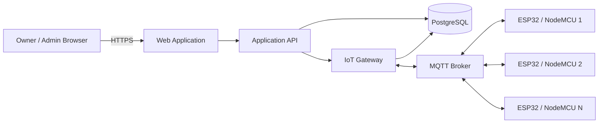

# Soil and Water Monitoring and Faucet Control System

A web-based, multi-device monitoring and control platform for ESP32/NodeMCU hardware.

The system is designed to:

- Monitor soil conditions.
- Monitor water conditions.
- Track multiple devices.
- Display current and historical telemetry.
- Manage Owner and Admin access.
- Require Owner approval for Admin registrations.
- Provide controlled faucet-dispensing presets.
- Support English and Bahasa Indonesia.
- Communicate with hardware through a backend-managed MQTT gateway.

> **Current project status:** `TASK-0101` through `TASK-0401` (Repository Foundation, Auth & RBAC, Device Registry & Access Assignments, and IoT Gateway Service) are complete (`TASK-0401` status: `DONE`). Fastify + TypeScript gateway service (`apps/iot-gateway`), MQTT client with TLS/reconnect handling, secret redaction, real DB + MQTT `/ready` endpoint, subsystem scaffolds, and test suites are verified.

---

## 1. Core Features

### 1.1 Soil Monitoring

Transmitted via **REST API over Wi-Fi** directly to the web backend:

- Nitrogen, Phosphorus, Potassium, Temperature, Moisture, pH, EC, Soil status.

### 1.2 Water Monitoring (General Water Quality)

Transmitted via **REST API over Wi-Fi** directly to the web backend:

- pH, TDS, EC, Latitude, Longitude, Water status.

### 1.3 Reservoir-Water Monitoring

Transmitted via **MQTT 5.0 over TLS through EMQX broker** to backend IoT Gateway:

- Tank water volume, Tank water flow rate, Reservoir status.

### 1.4 Shared Sensor/Tool Battery Monitoring (`BAT`)

Transmitted via **REST API over Wi-Fi** along with soil & water equipment power supply:

- Battery level / power supply status (exact REST JSON payload placement `TBD`). Not a water-quality or reservoir parameter.

### Faucet Control

The approved preset phases are:

| Phase   | Target volume |
| ------- | ------------: |
| Phase 1 |        300 mL |
| Phase 2 |      1,000 mL |
| Phase 3 |      1,500 mL |

The web browser selects a phase only.

The backend is responsible for mapping the selected phase to the approved target volume.

### User Roles

The initial system contains exactly two roles:

```text
OWNER
ADMIN
```

Public registration creates:

```text
role = ADMIN
accountStatus = PENDING_APPROVAL
```

An Owner must approve the registration before protected application access is allowed.

---

## 2. Project Principles

The implementation shall follow these principles:

1. Preserve the existing frontend design and source code where practical.
2. Enforce all permissions on the server.
3. Enforce mandatory per-device access assignment for Admins (`Active ADMIN + assigned device access + active and controllable device = faucet-control permission`).
4. Scope every device operation by `deviceId`.
5. Prevent the browser from communicating directly with MQTT.
6. Keep canonical API, database, and MQTT values untranslated.
7. Preserve the distinction between zero, null, missing, stale, and invalid telemetry.
8. Persist faucet commands before publishing them to a device.
9. Prevent duplicate physical execution through application-level idempotency.
10. Never report a faucet command as completed before valid final confirmation.
11. Treat unresolved physical-control decisions as blockers.
12. Keep production physical control disabled until security, hardware, and UAT approval are complete.

---

## 3. Proposed Architecture



### Monitoring Flow

```text
ESP32 / NodeMCU
→ MQTT Broker
→ IoT Gateway
→ PostgreSQL
→ Application API
→ Web Interface
```

### Faucet-Control Flow

```text
User confirmation
→ Authenticated API request
→ RBAC validation
→ Device-access validation
→ Command persistence
→ IoT Gateway
→ MQTT Broker
→ Selected device
→ Device acknowledgement
→ Device final event
→ Command status update
→ Web interface
```

The browser shall never receive:

- MQTT broker administrator credentials.
- Device passwords.
- Private keys.
- Direct unrestricted publish permissions.

---

## 4. Recommended Technology Stack

The final technology stack depends on the existing frontend audit.

### Web Application

Recommended when compatible with the existing codebase:

```text
Next.js
React
TypeScript
Tailwind CSS
Existing UI components
Zod
React Hook Form
TanStack Query
Recharts
MapLibre GL JS
```

### IoT Gateway

Recommended:

```text
Node.js
TypeScript
Fastify or equivalent
MQTT.js
Zod or JSON Schema
```

### Data and Infrastructure

Recommended:

```text
PostgreSQL
Prisma or equivalent ORM
Mosquitto for development
EMQX as a production broker candidate
Redis only when justified
Docker
```

These are recommendations, not confirmed selections.

The existing frontend framework must first be confirmed through `TASK-0001`.

---

## 5. Documentation

The repository documentation is authoritative and shall be read before implementation.

### Product and Interface

| Document                 | Purpose                                                                       |
| ------------------------ | ----------------------------------------------------------------------------- |
| `docs/FRONTEND_AUDIT.md` | Existing frontend structure, technology, reusable components, and constraints |
| `docs/UI_UX.md`          | Visual behaviour, interface states, layouts, and design requirements          |
| `docs/PRD.md`            | Product requirements and scope                                                |
| `docs/RBAC.md`           | Roles, permissions, account states, and resource access                       |
| `docs/USER_FLOWS.md`     | End-to-end user flows and error states                                        |
| `docs/I18N.md`           | English and Bahasa Indonesia requirements                                     |

### Technical Design

| Document                       | Purpose                                                                            |
| ------------------------------ | ---------------------------------------------------------------------------------- |
| `docs/DEVICE_COMMUNICATION.md` | MQTT topics, telemetry contracts, commands, acknowledgements, and device security  |
| `docs/ARCHITECTURE.md`         | System components, boundaries, data flows, deployment, and scalability             |
| `docs/DATABASE.md`             | PostgreSQL entities, relationships, constraints, indexes, and migrations           |
| `docs/API.md`                  | REST endpoints, request and response contracts, errors, and real-time API          |
| `docs/SECURITY.md`             | Threat model, authentication, authorisation, secrets, MQTT, and incident response  |
| `docs/TESTING.md`              | Unit, integration, E2E, MQTT, hardware, security, performance, and release testing |

### Execution

| Document    | Purpose                                                                             |
| ----------- | ----------------------------------------------------------------------------------- |
| `TASKS.md`  | Prioritised implementation backlog, blockers, dependencies, and acceptance criteria |
| `AGENTS.md` | Coding-agent operating rules, hard stops, reporting, and Definition of Done         |
| `README.md` | Project entry point and setup overview                                              |

---

## 6. Documentation Precedence

When requirements conflict, use this order:

1. `PRD.md`
2. `RBAC.md`
3. `USER_FLOWS.md`
4. `SECURITY.md`
5. `DEVICE_COMMUNICATION.md`
6. `API.md`
7. `DATABASE.md`
8. `ARCHITECTURE.md`
9. `I18N.md`
10. `UI_UX.md`
11. `FRONTEND_AUDIT.md`
12. `TESTING.md`
13. `TASKS.md`
14. `AGENTS.md`

Do not silently resolve conflicts.

Report the conflict and follow the higher-ranked document.

---

## 7. Proposed Repository Structure

```text
soil-water-monitoring/
├── apps/
│   ├── web/
│   │   ├── src/
│   │   │   ├── app/
│   │   │   ├── components/
│   │   │   ├── features/
│   │   │   ├── hooks/
│   │   │   ├── lib/
│   │   │   ├── messages/
│   │   │   └── styles/
│   │   └── package.json
│   │
│   └── iot-gateway/
│       ├── src/
│       │   ├── mqtt/
│       │   ├── telemetry/
│       │   ├── devices/
│       │   ├── commands/
│       │   ├── acknowledgements/
│       │   ├── realtime/
│       │   ├── validation/
│       │   └── observability/
│       └── package.json
│
├── packages/
│   ├── contracts/
│   ├── database/
│   ├── authorization/
│   ├── config/
│   ├── observability/
│   └── ui/
│
├── docs/
│   ├── FRONTEND_AUDIT.md
│   ├── UI_UX.md
│   ├── PRD.md
│   ├── RBAC.md
│   ├── USER_FLOWS.md
│   ├── I18N.md
│   ├── DEVICE_COMMUNICATION.md
│   ├── ARCHITECTURE.md
│   ├── DATABASE.md
│   ├── API.md
│   ├── SECURITY.md
│   └── TESTING.md
│
├── TASKS.md
├── AGENTS.md
├── README.md
├── package.json
├── pnpm-workspace.yaml
└── docker-compose.yml
```

This structure is proposed.

Do not migrate the current frontend into this structure until the frontend audit confirms it is appropriate.

---

## 8. Local Development

The exact setup commands are `TBD` until the existing frontend technology is confirmed.

The expected local services are:

```text
Web application
IoT gateway
PostgreSQL
MQTT broker
Optional Redis
Device simulator
```

### Expected Prerequisites

Provisional prerequisites:

- Node.js.
- A supported package manager.
- Docker and Docker Compose.
- PostgreSQL client tools, optional.
- Git.

Exact versions shall be documented after `TASK-0001`.

### Expected Setup Flow

```bash
# 1. Clone the repository
git clone <repository-url>
cd <repository-directory>

# 2. Install dependencies
<package-manager> install

# 3. Create local environment files
cp .env.example .env

# 4. Start infrastructure
docker compose up -d

# 5. Run database migrations
<database-migration-command>

# 6. Seed roles, permissions, and the approved first Owner
<seed-command>

# 7. Start the web application
<web-development-command>

# 8. Start the IoT gateway
<gateway-development-command>
```

Do not replace placeholders until the actual project commands are confirmed.

---

## 9. Environment Variables

Expected variables include:

```text
APP_ENV
DATABASE_URL
AUTH_SECRET

MQTT_BROKER_URL
MQTT_GATEWAY_CLIENT_ID
MQTT_GATEWAY_USERNAME
MQTT_GATEWAY_PASSWORD

DEFAULT_LOCALE
FALLBACK_LOCALE
REALTIME_TRANSPORT
```

Mutual TLS deployments may also require:

```text
MQTT_CA_CERT_PATH
MQTT_CLIENT_CERT_PATH
MQTT_CLIENT_KEY_PATH
```

### Rules

- Do not commit production values.
- Do not expose server secrets through frontend-prefixed environment variables.
- Validate required values at startup.
- Reject insecure development defaults in production.
- Keep `.env.example` limited to placeholders.

---

## 10. Authentication and Account Lifecycle

### Public Registration

```text
Unauthenticated applicant
→ Register
→ ADMIN role
→ PENDING_APPROVAL
→ Owner reviews
→ Approved or rejected
```

Only active accounts may use protected functionality.

### Canonical Account Statuses

```text
PENDING_APPROVAL
APPROVED
ACTIVE
REJECTED
SUSPENDED
DEACTIVATED
```

The distinction between `APPROVED` and `ACTIVE` remains `TBD`.

### First Owner

The first Owner shall be provisioned through an approved secure administrative process.

The first Owner shall never be created through public registration.

---

## 11. Device Communication

The proposed application protocol is:

```text
MQTT 5.0 over TLS
```

Recommended production port:

```text
8883
```

MQTT 3.1.1 may be supported as a compatibility fallback.

### Topic Pattern

```text
agriculture/{environment}/{siteId}/{deviceId}
```

Example topics:

```text
agriculture/production/site-01/water-node-001/telemetry/water
agriculture/production/site-01/water-node-001/status
agriculture/production/site-01/water-node-001/heartbeat
agriculture/production/site-01/water-node-001/command/faucet
agriculture/production/site-01/water-node-001/ack/faucet
agriculture/production/site-01/water-node-001/event/faucet
```

Faucet commands shall never be retained.

Each device shall have isolated broker permissions.

---

## 12. Canonical Values

These values remain stable in APIs, the database, MQTT, and audit records.

### Roles

```text
OWNER
ADMIN
```

### Device Statuses

```text
ONLINE
OFFLINE
STALE
UNKNOWN
INACTIVE
```

### Monitoring Statuses

```text
NORMAL
WARNING
CRITICAL
UNKNOWN
UNAVAILABLE
INVALID
```

### Faucet Command Statuses

```text
QUEUED
SENT
ACKNOWLEDGED
IN_PROGRESS
COMPLETED
FAILED
CANCELLED
TIMEOUT
EXPIRED
```

Do not store translated values as canonical state.

---

## 13. API Overview

Recommended base path:

```text
/api/v1
```

Primary API domains:

```text
/auth
/me
/users
/approvals
/devices
/monitoring
/alerts
/faucet-commands
/audit-logs
/settings
/realtime
```

### Example Endpoints

```text
POST   /api/v1/auth/register
POST   /api/v1/auth/login
POST   /api/v1/auth/logout

GET    /api/v1/me
PATCH  /api/v1/me
PATCH  /api/v1/me/preferences

GET    /api/v1/approvals/pending
POST   /api/v1/approvals/{userId}/approve
POST   /api/v1/approvals/{userId}/reject

GET    /api/v1/devices
GET    /api/v1/devices/{deviceId}
GET    /api/v1/devices/{deviceId}/monitoring/latest
GET    /api/v1/devices/{deviceId}/monitoring/soil/history
GET    /api/v1/devices/{deviceId}/monitoring/water/history

POST   /api/v1/devices/{deviceId}/faucet-commands
GET    /api/v1/devices/{deviceId}/faucet-commands/{commandId}

GET    /api/v1/alerts
POST   /api/v1/alerts/{alertId}/acknowledge

GET    /api/v1/audit-logs
GET    /api/v1/realtime/stream
```

See `docs/API.md` for the full contract.

---

## 14. Database Overview

Recommended database:

```text
PostgreSQL
```

Core tables:

```text
users
roles
permissions
user_roles
role_permissions
account_approvals

sites
devices
device_capabilities
user_device_access
device_status_events

soil_readings
water_readings

faucet_commands
faucet_command_events

alerts
alert_acknowledgements

user_preferences
sessions
audit_logs
integration_errors
```

Important integrity rules include:

- Unique email.
- Exactly one active role per user initially.
- Unique canonical device ID.
- Unique telemetry message ID per device.
- Separate `canView` and `canControl`.
- Fixed phase-to-volume constraint.
- Unique command ID.
- Unique idempotency key.
- Append-only command events and audit logs.

---

## 15. Internationalisation

Supported locales:

```text
en
id
```

Display labels shall be translated in the frontend.

The following remain untranslated:

- Device IDs.
- API field names.
- MQTT topics.
- Database fields.
- Canonical statuses.
- Audit event keys.
- pH.
- EC.
- TDS.
- N.
- P.
- K.
- ESP32.
- NodeMCU.
- MQTT.
- API.
- RBAC.

The default and fallback locale remain `TBD`.

---

## 16. Testing

The implementation shall include:

- Unit tests.
- Component tests.
- API contract tests.
- Database tests.
- Integration tests.
- End-to-end tests.
- MQTT tests.
- Security tests.
- Accessibility tests.
- Performance tests.
- Hardware-in-the-loop tests.
- User acceptance testing.

Recommended tools:

```text
Vitest or Jest
React Testing Library
Playwright
Testcontainers
MQTT.js test clients
k6
axe-core
OWASP ZAP
Gitleaks
Trivy
```

The final tools depend on the existing codebase.

---

## 17. Security

Mandatory security expectations include:

- HTTPS in production.
- MQTT over TLS in production.
- Server-side RBAC.
- Device-level access.
- Unique device credentials.
- Topic-level ACLs.
- Secure password hashing.
- Session revocation.
- CSRF protection where applicable.
- CORS allowlist.
- Content Security Policy.
- Rate limiting.
- Input validation.
- Secret scanning.
- Dependency scanning.
- Append-only audit logging.
- No browser access to MQTT credentials.

See `docs/SECURITY.md` for full requirements.

---

## 18. Implementation Sequence

The implementation backlog is defined in `TASKS.md`.

Recommended order:

```text
Phase 0  — Resolve blockers and audit frontend
Phase 1  — Repository, database, configuration, and CI
Phase 2  — Authentication, approval, and RBAC
Phase 3  — Device registry and assignments
Phase 4  — IoT gateway and telemetry ingestion
Phase 5  — Monitoring and history
Phase 6  — Internationalisation
Phase 7  — Alerts
Phase 8  — Faucet control
Phase 9  — Security and observability
Phase 10 — Testing, UAT, and production readiness
```

---

## 19. First Implementation Task

Start with:

```text
TASK-0001 — Confirm Existing Frontend Technology
```

Do not modify application behaviour during this task.

The coding agent shall inspect the current repository and update `FRONTEND_AUDIT.md` with:

- Framework and version.
- Build tool.
- Routing.
- Styling.
- Component libraries.
- State management.
- Authentication code.
- API integration.
- Chart and map libraries.
- Project structure.
- Reusable components.
- Existing technical debt.
- Security concerns.
- Files that must be preserved.
- Conflicts with the proposed architecture.

Do not start another task until the frontend audit has been reviewed.

---

## 20. Recommended Agent Prompt

```text
Read AGENTS.md and all project documentation referenced by the selected task.

Start with TASK-0001 only: Confirm Existing Frontend Technology.

Do not modify application behaviour yet.

Inspect the current repository and update FRONTEND_AUDIT.md with:

- Framework and version
- Build tool
- Routing
- Styling
- Component libraries
- State management
- Authentication code
- API integration
- Chart and map libraries
- Project structure
- Reusable components
- Existing technical debt
- Security concerns
- Files that must be preserved
- Conflicts with the proposed architecture

Then report:

- Files inspected
- Findings
- Documentation changes
- Blockers
- Recommended next READY task

Do not start another task.
```

---

## 21. Current Release Blockers

Production release remains blocked until:

- [ ] Existing frontend technology is confirmed.
- [ ] Authentication and session strategy are approved.
- [ ] First Owner provisioning is approved.
- [ ] Owner/Admin permissions are final.
- [ ] Device access rules are implemented.
- [ ] MQTT broker and device authentication are selected.
- [ ] Production MQTT TLS and ACLs are verified.
- [ ] Telemetry units are confirmed.
- [ ] `Water BAT` is clarified.
- [ ] Offline and stale thresholds are approved.
- [ ] Faucet permission matrix is approved.
- [ ] Command concurrency is approved.
- [ ] Timeout and late-event handling are approved.
- [ ] Duplicate physical execution protection passes.
- [ ] Hardware-in-the-loop tests pass.
- [ ] Security tests pass.
- [ ] UAT is approved.
- [ ] Backup and rollback are verified.
- [ ] Production physical-control enablement is explicitly approved.

---

## 22. Known Open Decisions

The current documentation still contains unresolved decisions, including:

1. Existing frontend framework and version.
2. Monorepo or separate repositories.
3. Authentication library.
4. Session storage.
5. First Owner provisioning.
6. Multiple Owner policy.
7. `APPROVED` versus `ACTIVE`.
8. Owner device scope.
9. Site model.
10. Owner faucet-control permission.
11. Admin faucet-control permission.
12. Control-assignment model.
13. Concurrent command policy.
14. Cancellation and stop.
15. Command timeout values.
16. Late-event reconciliation.
17. MQTT broker selection.
18. Device password versus certificate authentication.
19. Telemetry intervals.
20. Measurement units.
21. `Water BAT` meaning.
22. Offline and stale thresholds.
23. Default and fallback locale.
24. Real-time transport.
25. Redis requirement.
26. Notification channels.
27. Hosting platform.
28. Backup objectives.
29. Performance targets.
30. Hardware dispensing tolerance.

Do not invent these values during implementation.

---

## 23. Contribution Rules

Before contributing:

1. Read `AGENTS.md`.
2. Select a `READY` task from `TASKS.md`.
3. Confirm dependencies.
4. Read relevant specifications.
5. State the task and expected changes.
6. Implement the smallest coherent change.
7. Add tests.
8. Run tests.
9. Update documentation.
10. Report remaining blockers.

### Commit Format

Recommended:

```text
type(scope): summary
```

Examples:

```text
feat(auth): add pending admin registration
feat(rbac): enforce device-level access
feat(gateway): validate soil telemetry
fix(control): prevent duplicate faucet commands
test(auth): cover suspended account access
docs(api): document approval endpoints
```

---

## 24. Definition of Done

A task is complete only when:

- Requirements are implemented.
- Error and alternative states are implemented.
- Server-side security is enforced.
- Device access is enforced where relevant.
- English and Indonesian text is included.
- Tests are added.
- Tests pass.
- Build passes.
- Documentation is updated.
- No unresolved requirement was silently invented.
- Required human review is complete.

---

## 25. Critical Prohibitions

Never:

- Create an Owner through public registration.
- Allow pending Admins into protected pages.
- Allow Admins to manage other users.
- Trust a browser-supplied role.
- Trust a browser-supplied account status.
- Trust a browser-supplied target volume.
- Expose MQTT or device credentials to the browser.
- Retain faucet commands in MQTT.
- Mark a faucet command completed without final confirmation.
- Treat a timeout as completion.
- Retry a physical command blindly.
- Convert missing telemetry into zero.
- Translate canonical API or database values.
- Commit secrets.
- Delete audit history to simplify development.
- Enable production physical control without approval.

---

## 26. Licence

The project licence is `TBD`.

Do not assume the repository is open source until a licence file is added.

---

## 27. Project Status

```text
Documentation: Complete
Frontend audit: Pending
Architecture decisions: Partially unresolved
Implementation: Not yet started or not yet confirmed
Physical control: Must remain disabled until approved
```

The next action is:

```text
Execute TASK-0001 only.
```
