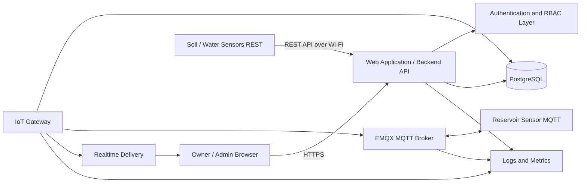
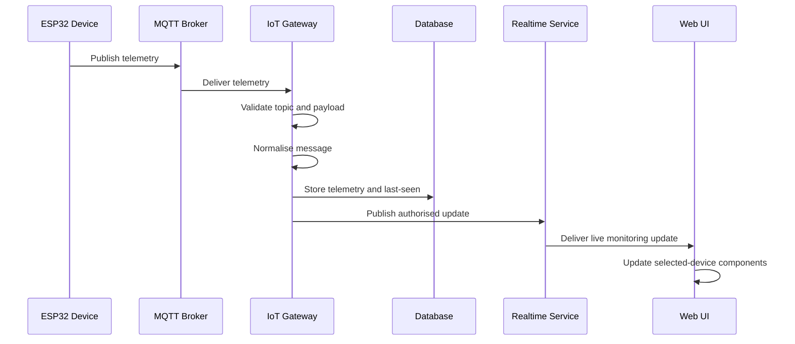
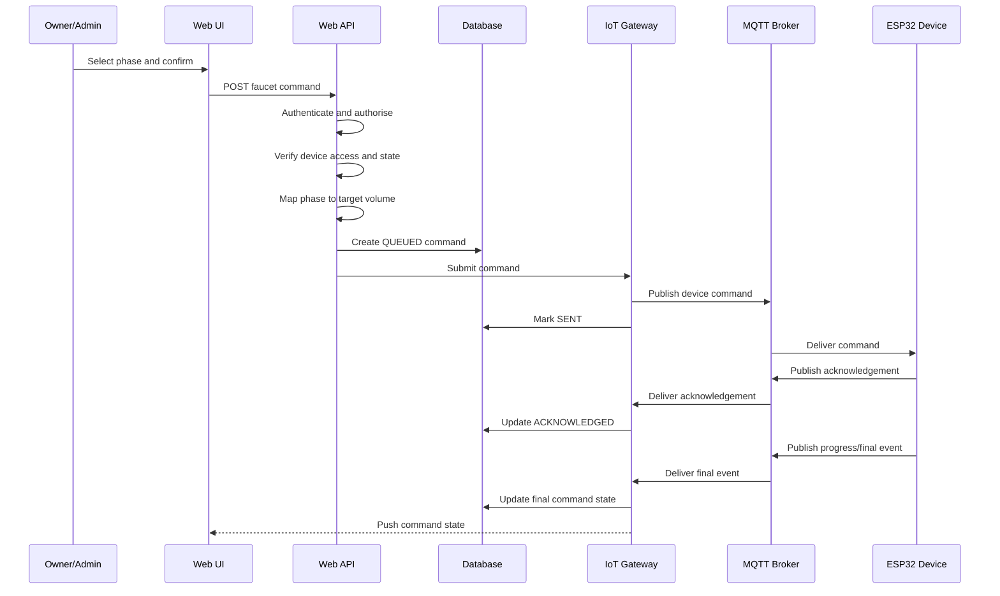
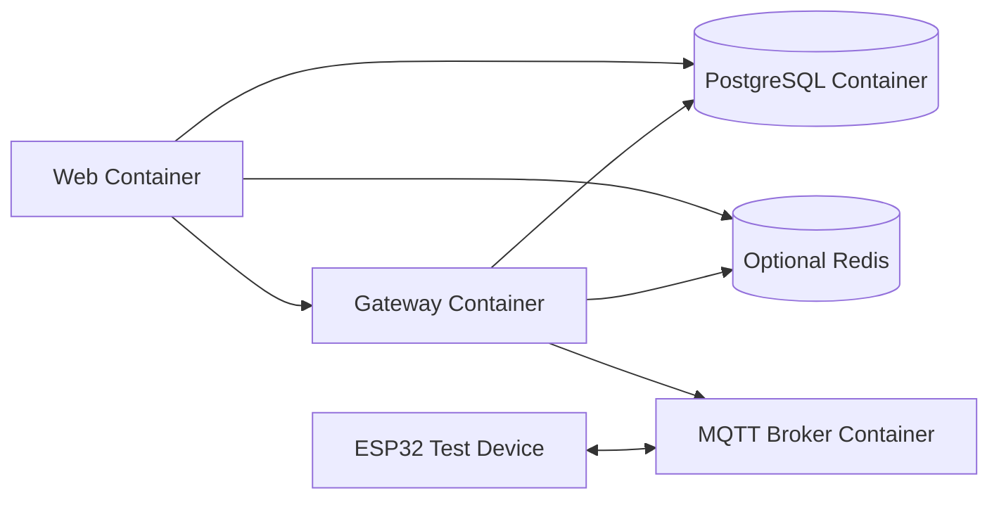

# System Architecture Specification

## 1. Document Information

| Item | Description |
|---|---|
| Product | Web-Based Soil and Water Monitoring and Faucet Control System |
| Document | System Architecture Specification |
| Version | 1.0 |
| Status | Proposed baseline architecture |
| Hardware | ESP32 / NodeMCU |
| Primary roles | `OWNER`, `ADMIN` |
| Recommended device protocol | MQTT 5.0 over TLS |
| Related documents | `FRONTEND_AUDIT.md`, `UI_UX.md`, `PRD.md`, `RBAC.md`, `USER_FLOWS.md`, `I18N.md`, `DEVICE_COMMUNICATION.md` |

---

## 2. Purpose

This document defines the proposed software and infrastructure architecture for the monitoring and faucet-control application.

The architecture shall:

- Preserve the existing frontend design and source code where practical.
- Support multiple ESP32/NodeMCU devices.
- Separate browser-facing logic from device communication.
- Enforce authentication, RBAC, and device-level access on the server.
- Support real-time monitoring updates.
- Store current and historical telemetry.
- Provide auditable faucet-control commands.
- Support English and Bahasa Indonesia.
- Remain deployable in local, staging, and production environments.
- Avoid coupling the frontend directly to raw MQTT messages or hardware-specific details.

---

## 3. Architectural Principles

### 3.1 Separation of Concerns

The system shall separate:

- Frontend presentation.
- Authentication and authorisation.
- Business logic.
- Device communication.
- Telemetry ingestion.
- Persistence.
- Real-time updates.
- Audit logging.
- Infrastructure concerns.

### 3.2 Backend-Mediated Device Control

The browser shall never send commands directly to the ESP32/NodeMCU or MQTT broker.

All faucet-control requests shall pass through:

1. Authentication.
2. Account-status validation.
3. RBAC validation.
4. Device-access validation.
5. Command validation.
6. Command persistence.
7. Gateway publication.
8. Device acknowledgement.
9. Audit logging.

### 3.3 Canonical Internal Data

The backend shall expose a normalised application model.

The frontend shall not need to understand:

- Raw MQTT topic structure.
- Device-specific payload variants.
- Firmware-specific field names.
- Broker credentials.
- Device credentials.
- Hardware transport details.

### 3.4 Multi-Device First

Every device-specific operation shall be scoped by a canonical `deviceId`. Services resolve device identifiers deterministically, accepting both canonical string `deviceId` (e.g. `soil-node-001`) and internal database UUID `id`.

Authorised device endpoints (`GET /api/v1/devices`, `GET /api/v1/devices/{deviceId}`) enforce role-based projection and scoping (`DEC-DEV-028` / `TASK-0305`): Owner receives global visibility with canonical `deviceId`, while Admin visibility is strictly limited to active assignments (`revokedAt IS NULL`) with canonical `deviceId` strictly concealed. Safe internal database UUID `id` is retained.

No service shall assume that only one device exists. Domain routes use canonical `/soil` and `/water` paths; legacy `/tanah` and `/air` paths return 404 Not Found.

### 3.5 Secure by Default

The architecture shall use:

- Server-side authorisation.
- Encrypted production transport.
- Unique device credentials.
- Least privilege.
- Audit logging.
- Idempotent command handling.
- Explicit device assignment.

### 3.6 Preserve Existing Frontend

The existing frontend source code shall be treated as the visual implementation baseline.

Migration to a different frontend framework shall occur only when justified by the audit and approved separately.

---

## 4. Architecture Overview



### 4.1 Ingress Paths by Domain

1. **Soil & Water Quality Telemetry**: Equipment sends REST API calls over Wi-Fi directly to backend REST endpoints (`W`), which validate, persist (`DB`), and emit real-time updates (`R`).
2. **Reservoir-Water Telemetry & Control**: Reservoir nodes connect via MQTT 5.0 over TLS to the EMQX broker (`M`). The IoT Gateway (`G`) ingests messages, validates payloads, persists to PostgreSQL (`DB`), and handles faucet commands.

---

## 5. Logical Architecture

The system is divided into five logical layers:

```text
1. Presentation Layer
2. Application Layer
3. Device Integration Layer
4. Data Layer
5. Infrastructure and Operations Layer
```

### 5.1 Presentation Layer (ARCH-COMP-001)

Responsibilities:

- Render the existing user interface.
- Display monitoring data.
- Display user, role, approval, and profilee pages.
- Provide device selection.
- Provide charts and historical data.
- Display alerts.
- Provide faucet-control confirmation and status.
- Support English and Bahasa Indonesia.
- Handle loading, empty, offline, stale, invalid, success, and error states.

The presentation layer shall not:

- Store secrets.
- Connect directly to MQTT.
- Decide user permissions independently.
- Infer device access from hidden buttons.
- Store canonical device state as its only source of truth.
- Execute hardware commands directly.

### 5.2 Application Layer (ARCH-COMP-002)

Responsibilities:

- Authentication and session management.
- Password recovery and transactional email delivery via Resend (`DEC-AUTH-102` / `TASK-0213`).
- Registration email ownership verification and token management via Resend (`DEC-AUTH-104` / `TASK-0214`).
- Server-side guest route guards (`DEC-AUTH-103` on `/login`, `/register`, `/forgot-password`, `/reset-password`, `/verify-email`).
- RBAC and account approval/rejection gating via `emailVerifiedAt` (`DEC-AUTH-104`).
- Account approval.
- User-profilee management.
- Device access assignment.
- Monitoring queries.
- Historical-data queries.
- Alert queries.
- Faucet-command creation.
- Audit-event generation.
- Locale preference persistence.
- API response normalisation.

### 5.3 Device Integration Layer (ARCH-COMP-003 / ARCH-COMP-005)

Responsibilities:

- Maintain the MQTT connection.
- Subscribe to device telemetry and status topics.
- Validate payloads.
- Normalise device data.
- Track device state.
- Store telemetry.
- Publish commands.
- Process acknowledgements.
- Track command lifecycle.
- Handle duplicate and out-of-order messages.
- Broadcast live updates.

### 5.4 Data Layer

Responsibilities:

- Persist users.
- Persist roles and permissions.
- Persist account statuses.
- Persist device records.
- Persist device assignments.
- Persist telemetry.
- Persist faucet commands.
- Persist command events.
- Persist alerts.
- Persist audit logs.
- Persist locale preferences.

### 5.5 Infrastructure and Operations Layer

Responsibilities:

- Broker hosting.
- Database hosting.
- Application hosting.
- TLS.
- Secrets.
- Backups.
- Monitoring.
- Centralised logs.
- Health checks.
- Deployment.
- Recovery.

---

## 6. Recommended Technology Stack

The final stack shall be confirmed after reviewing `FRONTEND_AUDIT.md`.

### 6.1 Preferred Web Stack

```text
Frontend and web application: Next.js with TypeScript
UI styling: Existing styles, optionally Tailwind CSS
UI components: Existing reusable components, optionally shadcn/ui
Validation: Zod
Forms: React Hook Form
Server state: TanStack Query
Charts: Recharts
Maps: MapLibre GL JS
Authentication: Auth.js or equivalent
```

This is the preferred stack only if it is compatible with the current frontend.

### 6.2 Preferred IoT Gateway Stack

```text
Runtime: Node.js
Language: TypeScript
Framework: Fastify or a lightweight service framework
MQTT client: MQTT.js
Validation: Zod or JSON Schema
```

The gateway shall run as a long-lived service.

It shall not depend on short-lived serverless execution for its persistent MQTT connection.

### 6.3 Preferred Data Stack

```text
Database: PostgreSQL
ORM: Prisma or equivalent
Optional cache: Redis
```

Redis is optional and shall be introduced only when required for:

- Session storage.
- Live event distribution.
- Command locking.
- Rate limiting.
- Distributed cache.
- Idempotency state.

### 6.4 Preferred Broker

```text
Development: Eclipse Mosquitto
Production candidate: EMQX
```

The application shall remain broker-independent at the MQTT contract level.

### 6.5 Deployment

Preferred deployment format:

```text
Docker containers
```

The final hosting platform is `TBD`.

---

## 7. Recommended Repository Structure

A monorepo is recommended.

```text
agriculture-monitoring/
├── apps/
│   ├── web/
│   │   ├── src/
│   │   │   ├── app/
│   │   │   ├── components/
│   │   │   ├── features/
│   │   │   ├── hooks/
│   │   │   ├── lib/
│   │   │   ├── messages/
│   │   │   └── styles/
│   │   └── package.json
│   │
│   └── iot-gateway/
│       ├── src/
│       │   ├── mqtt/
│       │   ├── telemetry/
│       │   ├── devices/
│       │   ├── commands/
│       │   ├── acknowledgements/
│       │   ├── realtime/
│       │   ├── validation/
│       │   ├── observability/
│       │   └── server.ts
│       └── package.json
│
├── packages/
│   ├── contracts/
│   ├── database/
│   ├── authorization/
│   ├── config/
│   ├── observability/
│   └── ui/
│
├── docs/
│   ├── FRONTEND_AUDIT.md
│   ├── UI_UX.md
│   ├── PRD.md
│   ├── RBAC.md
│   ├── USER_FLOWS.md
│   ├── I18N.md
│   ├── DEVICE_COMMUNICATION.md
│   ├── ARCHITECTURE.md
│   ├── DATABASE.md
│   ├── API.md
│   ├── SECURITY.md
│   └── TESTING.md
│
├── tasks/
│   └── TASKS.md
├── AGENTS.md
├── README.md
├── package.json
├── pnpm-workspace.yaml
└── docker-compose.yml
```

If the existing frontend repository cannot be converted safely into a monorepo, the web and gateway may remain separate repositories.

That decision is `TBD`.

---

## 8. Web Application Architecture

### 8.1 Frontend Modules

Recommended feature modules:

```text
auth
approvals
dashboard
devices
monitoring
history
faucet-control
alerts
users
profilee
settings
i18n
```

### 8.2 Page Groups

Recommended protected routes:

```text
/dashboard
/devices
/devices/{deviceId}
/history
/controls
/alerts
/users
/users/pending
/profilee
/settings
```

Recommended public routes:

```text
/login
/create-account
/account-status
/forgot-password
```

Exact route structure shall preserve the existing application where practical.

### 8.3 Server and Client Components

When using a framework that supports server rendering:

Use server-side code for:

- Session checks.
- Permission checks.
- Initial protected data loading.
- Sensitive backend operations.
- Owner-only page guards.

Use client-side code for:

- Device selector interaction.
- Charts.
- Language selector interaction.
- Live monitoring updates.
- Forms.
- Dialogs.
- Command progress.

### 8.4 Frontend State

State categories shall remain separate:

- Authentication state.
- Locale state.
- Selected-device state.
- Server data.
- UI state.
- Form state.
- Live-update state.

Server data shall not be copied into global client state unless necessary.

### 8.5 Faucet Control UI Subsystem (`/controls` / TASK-0807)

The actuator control interface is structured into modular, single-responsibility components:

```text
/controls (Server Page Guard)
└── FaucetControlPanel (Client Root Container)
    ├── FaucetPresetSelector (Presets, Plant Count Stepper, Manual Actions, Physical Badge)
    ├── FaucetConfirmationModal (Action-aware Dialog with Warning & Volume Summary)
    ├── FaucetStatusCard (Active Command Display, 2.5s Polling Loop, Physical State Derivation)
    └── FaucetHistoryTable (Paginated History, Filter, Status Badges)
```

**Architecture Contracts:**
1. **Idempotency**: Client generates `cmd-<uuid>` and transmits it exclusively via HTTP header `Idempotency-Key`.
2. **Polling Lifecycle**: `FaucetStatusCard` polls `GET /api/v1/devices/{deviceId}/faucet-commands/{commandId}` every 2,500ms strictly while status is `QUEUED`, `SENT`, `ACKNOWLEDGED`, or `IN_PROGRESS`. Polling immediately terminates upon reaching any terminal state (`COMPLETED`, `FAILED`, `CANCELLED`, `TIMEOUT`, `EXPIRED`) or upon component unmount.
3. **Physical State Derivation**: Authoritative physical valve state (`OPEN`, `CLOSED`, `UNKNOWN`) is derived strictly from verified terminal command outcomes (`COMPLETED OPEN` $\rightarrow$ `OPEN`, `COMPLETED CLOSE` $\rightarrow$ `CLOSED`; active commands, failures, and `DISPENSE` completions strictly present `UNKNOWN`).

---

## 9. Authentication Architecture

### 9.1 Account Access

Only `ACTIVE` accounts shall access protected functionality.

The authentication layer shall verify:

- Credentials.
- Account status.
- Session validity.
- Role.
- Permission changes.
- Suspension or deactivation.

### 9.2 Account Approval

Registration flow:

```text
Public registration
→ ADMIN role
→ PENDING_APPROVAL
→ Owner decision
→ APPROVED or ACTIVE
```

The distinction between `APPROVED` and `ACTIVE` remains `TBD`.

### 9.3 Session Strategy

Supported approaches:

- Secure database-backed sessions.
- Secure signed session tokens with server-side revocation support.

A session model without timely revocation is not recommended because:

- Owners may suspend Admins.
- Device access may be revoked.
- Role changes must take effect.
- Protected live subscriptions must stop.

### 9.4 Session Invalidation

The system shall support invalidation when:

- Account is suspended.
- Account is deactivated.
- Role changes.
- Password changes.
- Security-sensitive event occurs.

The exact mechanism is `TBD`.

---

## 10. Authorisation Architecture

### 10.1 Authorisation Layers

Authorisation shall be evaluated at:

1. Route level.
2. API endpoint level.
3. Business service level.
4. Resource level.
5. Device level.
6. Live update subscription level.

### 10.2 Permission Check

Recommended server flow:

```text
requireSession()
→ requireActiveAccount()
→ requirePermission(permission)
→ requireResourceAccess(resourceId)
→ execute operation
```

### 10.3 Device Access

Recommended relationship:

```text
user
→ user_device_access
→ device
```

The system shall verify device access independently of role.

### 10.4 Control Permission

Monitoring and control shall use separate permission checks.

Example:

```text
monitoring.current.read
device.control.dispense
```

An Admin who can view a device shall not automatically control it.

---

## 11. Device Integration Architecture

### 11.1 Gateway Process

The gateway shall be a long-running process.

It shall contain:

```text
MQTT client
Topic router
Payload validator
Telemetry processor
Device-status processor
Command publisher
Acknowledgement processor
Command-state machine
Realtime broadcaster
Persistence adapter
Health endpoint
```

### 11.2 Topic Routing

The topic router shall derive:

- Environment.
- Site ID.
- Device ID.
- Message category.
- Message subtype.

It shall reject topic and payload identity mismatches.

### 11.3 Payload Validation

Validation shall occur before persistence.

Invalid messages shall:

- Not overwrite valid data.
- Produce an integration event.
- Be counted in operational metrics.
- Be quarantined only if raw payload storage is approved.

### 11.4 Normalisation

The gateway shall transform device payloads into canonical application records.

Normalisation may include:

- Canonical field names.
- Timestamp handling.
- Capability mapping.
- Status mapping.
- Approved unit conversion.

The gateway shall not perform undocumented sensor calibration.

---

## 12. Telemetry Data Flow



### 12.1 Telemetry Processing Order

1. Receive message.
2. Parse topic.
3. Validate broker identity.
4. Validate payload.
5. Verify topic and payload device match.
6. Check schema version.
7. Detect duplicate.
8. Normalise data.
9. Persist telemetry.
10. Update latest-device state.
11. Emit live update.
12. Record metrics.

---

## 13. Faucet Command Data Flow



### 13.1 Command Ownership

Every command shall remain associated with:

- Initiating user.
- User role at request time.
- Device.
- Phase.
- Target volume.
- Command ID.
- Timestamps.
- Final status.

### 13.2 Idempotency

The backend and device shall use `commandId` to prevent duplicate physical execution.

---

## 14. Realtime Web Architecture

### 14.1 Recommended Initial Transport

Recommended:

```text
Server-Sent Events
```

Use cases:

- New telemetry.
- Device status.
- Alert updates.
- Faucet-command updates.
- Access revocation notifications.

### 14.2 WebSocket Alternative

Use WebSocket when the application requires:

- High-frequency bidirectional browser messages.
- Complex live collaboration.
- Bidirectional session protocol beyond normal HTTPS actions.

### 14.3 Polling Fallback

Polling may be used when:

- Hosting does not support long-lived connections.
- The system is in early prototype stage.
- Real-time requirements are modest.

### 14.4 Realtime Security

Each live connection shall:

- Require authentication.
- Verify account status.
- Filter devices by access.
- End when the session expires.
- Stop revoked device streams.
- Avoid exposing MQTT topics and credentials.

---

## 15. Database Architecture

PostgreSQL is the recommended system of record.

Primary domains:

```text
Identity and access
Devices
Telemetry
Commands
Alerts
Audit
Settings
```

Recommended tables:

```text
users
roles
permissions
user_roles
user_device_access
devices
device_capabilities
device_status_events
soil_readings
water_readings
faucet_commands
faucet_command_events
alerts
alert_acknowledgements
audit_logs
sessions
user_preferences
```

Detailed schema shall be defined in `DATABASE.md`.

---

## 16. Current and Historical Data Strategy

### 16.1 Latest Values

The application may obtain latest values using:

- Latest telemetry query from PostgreSQL.
- A denormalised latest-reading table.
- A cache.

The first version may query indexed latest records directly.

### 16.2 Historical Values

Historical telemetry shall remain append-only where practical.

Queries shall support:

- Device.
- Metric.
- Date range.
- Aggregation interval.
- Pagination or bounded result size.

### 16.3 Retention

Retention period remains `TBD`.

### 16.4 Aggregation

For large datasets, future aggregation tables may provide:

- Minute.
- Hour.
- Day.

Aggregation shall not replace raw data until the retention policy permits it.

---

## 17. Cache Architecture

Redis is optional.

Potential uses:

- Session storage.
- Distributed rate limiting.
- Command idempotency.
- Device last-seen cache.
- Realtime pub/sub.
- Permission cache.
- Short-lived query cache.

Redis shall not become the only durable source of:

- User accounts.
- Permissions.
- Telemetry history.
- Commands.
- Audit logs.

If only one application instance exists initially, Redis may be deferred.

---

## 18. Alert Architecture

Alert generation sources may include:

- Device offline.
- Data stale.
- Invalid payload.
- Device-reported warning.
- Device-reported critical state.
- Low battery.
- Low tank volume.
- Faucet command failure.
- Faucet timeout.
- Pending Admin approval.

Threshold-based alerts shall use externally approved rules.

Alert processing may be:

- Synchronous during telemetry ingestion.
- Asynchronous through a job queue.

The first version may use synchronous generation for low volume, but command and notification work should remain separable.

---

## 19. Internationalisation Architecture

The I18N layer shall live in the web application.

It shall translate:

- Navigation.
- Forms.
- Statuses.
- Errors.
- Alerts.
- Approval messages.
- Monitoring labels.
- Faucet-control messages.
- Accessibility text.

The following remain canonical:

- Role values.
- Account statuses.
- Device statuses.
- Command statuses.
- API error codes.
- Audit event keys.
- Device payload keys.

Locale preference shall be stored in the user profilee and, for unauthenticated pages, in a cookie or local storage. All user-facing UI text across authentication, dashboard, monitoring, controls, navigation, and historical charts is wired to `next-intl` translation keys (`TASK-0603`).

---

## 20. API Architecture

The web frontend shall communicate through a stable application API.

Recommended API domains:

```text
/auth
/me
/users
/approvals
/devices
/monitoring
/history
/alerts
/faucet-commands
/audit
/settings
```

The API shall:

- Use stable English field names.
- Return canonical enums.
- Return machine-readable error codes.
- Avoid exposing raw broker details.
- Apply server-side validation.
- Apply RBAC and device access boundaries.
- Enforce role-based field filtering: expose external canonical `deviceId` exclusively to Owner; strictly conceal `deviceId` in Admin responses (`DEC-DEV-028`).
- Prohibit in-app device creation via application API; device provisioning is managed out-of-band (`DEC-DEV-027`).
- Manage active device selection in-memory during navigation without persisting last-accessed device history across logins (`DEC-DEV-029`).
- Support pagination.
- Support idempotency for control requests.

Detailed contracts shall be defined in `API.md`.

---

## 21. Background Jobs

Potential background jobs include:

- Alert notifications.
- Telemetry aggregation.
- Data retention.
- Command timeout detection.
- Session cleanup.
- Device offline detection.
- Audit archival.
- Email delivery.
- Retryable non-physical notifications.

Physical faucet commands shall not be retried blindly by a generic background worker.

A command retry that could trigger physical action requires explicit idempotency and policy.

The final job-queue technology is `TBD`.

---

## 22. Deployment Architecture

### 22.1 Local Development

Recommended local services:

```text
web
iot-gateway
postgres
mqtt-broker
optional redis
```

Docker Compose is recommended.



### 22.2 Staging

Staging environment topology is fully provisioned and verified:

- **Web Frontend**: Railway PaaS (`https://melon-monitor.up.railway.app`)
- **IoT Gateway Service**: Railway PaaS (`https://iot-gateway-production-7e17.up.railway.app`)
- **Staging Database**: Supabase PostgreSQL (`scqrbtfilmttqrutynyo`) via Supavisor Session Pooler (`aws-0-ap-south-1.pooler.supabase.com:6543`)
- **Staging MQTT Broker**: EMQX Cloud Serverless (`wss://` WebSockets / TLS, client password authentication, per-device topic ACLs)
- **Safety Policy**: `ENABLE_FAUCET_CONTROL=false` strictly enforced

### 22.3 Production

Production shall use:

- HTTPS.
- MQTT over TLS.
- Managed or secured PostgreSQL.
- Secure secret storage.
- Automated backups.
- Health checks.
- Central logs.
- Metrics.
- Controlled migrations.

### 22.4 Hosting Options

Possible hosting models:

- VPS with Docker.
- Managed container platform.
- Kubernetes, only when scale justifies it.
- Hybrid deployment with broker and gateway on a dedicated server.

The final hosting platform is `TBD`.

---

## 23. Network Architecture

Required network paths:

| Source | Destination | Protocol |
|---|---|---|
| Browser | Web application | HTTPS |
| Web application | Database | TLS-enabled database connection where supported |
| Web application | Gateway | Internal HTTPS, RPC, or shared application service |
| Gateway | MQTT broker | MQTT over TLS |
| Device | MQTT broker | MQTT over TLS |
| Gateway | Database | TLS-enabled database connection |
| Web application | Email provider | HTTPS or SMTP over TLS, if used |

The database shall not be publicly exposed.

The MQTT broker shall expose only required secure listener ports.

---

## 24. Service Communication

### 24.1 Web to Gateway

Possible approaches:

1. Internal HTTP API.
2. Shared database command queue.
3. Message queue.
4. Direct library integration when deployed as one backend process.

Recommended first version:

```text
Internal authenticated HTTP API or shared service boundary
```

The gateway shall remain independently deployable.

### 24.2 Gateway to Web Realtime

Possible approaches:

- Database notification.
- Redis pub/sub.
- Internal event bus.
- Direct SSE service.
- WebSocket gateway.

The exact choice is `TBD`.

---

## 25. Failure Handling

### 25.1 Broker Failure

When the broker is unavailable:

- Gateway reconnects with backoff.
- Device state becomes unknown or offline according to timing.
- Monitoring displays stale or offline states.
- New commands are rejected or queued only according to explicit policy.
- No command is reported as sent unless publication succeeds.

### 25.2 Gateway Failure

When the gateway is unavailable:

- Web monitoring may show stored historical/latest values.
- Live updates stop.
- New control requests fail safely.
- Devices may continue publishing to the broker.
- Broker backlog behaviour depends on QoS and session configuration.

### 25.3 Database Failure

When the database is unavailable:

- The web app shall reject writes safely.
- The gateway shall avoid acknowledging persistence if data was not stored.
- Buffering policy is `TBD`.
- Faucet commands shall not be accepted if a durable audit record cannot be created, unless explicitly approved.

### 25.4 Realtime Failure

When live delivery fails:

- The UI may fall back to polling.
- Stored data remains queryable.
- Control requests remain ordinary authenticated API requests.

### 25.5 Device Failure

When a device is offline:

- Last-known data remains labelled.
- Live data is unavailable.
- New faucet commands are rejected.
- Historical data remains accessible.

---

## 26. Consistency and Transaction Boundaries

### 26.1 User Approval

Owner approval shall update:

- Account status.
- Approval metadata.
- Audit log.

These changes should occur transactionally.

### 26.2 Device Assignment

Device assignment shall update:

- Assignment record.
- Effective access.
- Audit log.

### 26.3 Faucet Command Creation

Creating a command shall transactionally record:

- Command.
- Initiating user.
- Device.
- Phase.
- Target volume.
- Initial status.
- Audit event or command event.

The system shall not publish a device command without a durable command record unless explicitly justified.

---

## 27. Observability Architecture

Each service shall expose:

- Health status.
- Readiness status.
- Structured logs.
- Metrics.
- Correlation IDs.

### 27.1 Web Metrics

- Request latency.
- Error rate.
- Login failures.
- Authorisation denials.
- Active sessions.
- Control requests.

### 27.2 Gateway Metrics

- Broker connection status.
- Connected device count.
- Telemetry rate.
- Invalid payload rate.
- Duplicate message count.
- Command acknowledgement latency.
- Command timeout count.

### 27.3 Database Metrics

- Connections.
- Query latency.
- Storage growth.
- Slow queries.
- Backup status.

### 27.4 Correlation

Use:

```text
requestId
messageId
commandId
deviceId
userId
```

Sensitive values shall not be logged.

---

## 28. Security Architecture

### 28.1 Human Authentication

- Secure password hashing.
- Secure cookies or equivalent.
- Session expiry.
- Rate limiting.
- Account-status checks.
- Optional multi-factor authentication in later phases.

### 28.2 Device Authentication

- Unique device identity.
- Unique password or certificate.
- Topic ACL.
- Revocable credentials.
- TLS.

### 28.3 Application Authorisation

- Server-side RBAC.
- Device-level access.
- Separate control permissions.
- Owner-only user management.
- Canonical permission keys.

### 28.4 Secrets

Secrets shall be stored in:

- Environment variables for development.
- Managed secret storage for production where available.

Secrets shall not be committed to source control.

### 28.5 Audit

High-risk events shall be immutable through normal application functions.

Detailed security requirements shall be defined in `SECURITY.md`.

---

## 29. Scalability Strategy

The initial architecture shall support modest scale without unnecessary complexity.

### 29.1 Horizontal Scaling

The web application may scale horizontally if:

- Sessions are shared or stateless with revocation support.
- Realtime delivery is distributed.
- Permission caches are shared or short-lived.

### 29.2 Gateway Scaling

Gateway scaling options:

- One gateway with multiple subscriptions.
- Multiple gateway instances divided by topic/site.
- Shared-consumer or broker-specific mechanisms.

The initial version should begin with one gateway instance unless device volume requires more.

### 29.3 Database Scaling

Initial:

- Indexed PostgreSQL.
- Bounded historical queries.
- Appropriate telemetry indexes.

Future:

- Partition telemetry tables.
- Add rollups.
- Add read replicas.
- Archive old data.

---

## 30. Data Partitioning

Future telemetry partitioning may use:

- Date.
- Device.
- Site.

Recommended first partition strategy, if needed:

```text
Time-based partitioning by month
```

Partitioning is not required until data volume justifies it.

---

## 31. Environment Configuration

Each environment shall define:

```text
APP_ENV
DATABASE_URL
AUTH_SECRET
MQTT_BROKER_URL
MQTT_GATEWAY_CLIENT_ID
MQTT_GATEWAY_USERNAME
MQTT_GATEWAY_PASSWORD or certificate paths
DEFAULT_LOCALE
FALLBACK_LOCALE
REALTIME_TRANSPORT
```

Production secrets shall not use example defaults.

Configuration shall be validated at startup.

---

## 32. Health Checks

### 32.1 Web Health

Checks:

- Process running.
- Database connectivity.
- Authentication dependencies.
- Optional gateway reachability.

### 32.2 Gateway Health

Checks:

- Process running.
- Broker connection.
- Database connection.
- Event delivery.
- Last successful message.

### 32.3 Broker Health

Checks:

- Listener availability.
- Authentication service.
- Connection count.
- Message throughput.

Readiness and liveness shall remain distinct.

---

## 33. Backup and Recovery

The system shall back up:

- User accounts.
- Device registry.
- Device assignments.
- Telemetry.
- Faucet commands.
- Alerts.
- Audit logs.
- Configuration metadata.

The system shall not rely only on container-local storage.

The following are `TBD`:

- Backup frequency.
- Retention.
- Recovery point objective.
- Recovery time objective.
- Restore testing schedule.

---

## 34. Architecture Decision Records

Major decisions shall be documented as ADRs.

Recommended initial ADRs:

```text
ADR-001 Use MQTT for device communication
ADR-002 Separate IoT gateway from web application
ADR-003 Use PostgreSQL as system of record
ADR-004 Enforce device-level access
ADR-005 Use server-mediated faucet control
ADR-006 Use canonical untranslated statuses
ADR-007 Use SSE or selected realtime transport
ADR-008 Preserve existing frontend design
```

---

## 35. Implementation Phases

### Phase 1 — Foundation

- Preserve and organise existing frontend.
- Configure authentication.
- Implement Owner and Admin roles.
- Implement approval workflow.
- Configure database.
- Create device registry.

### Phase 2 — Monitoring

- Implement gateway connection.
- Validate telemetry.
- Store soil and water data.
- Implement device selection.
- Display current values.
- Implement device status.

### Phase 3 — History and Alerts

- Historical queries.
- Charts.
- Alert generation.
- Alert views.
- Data-freshness states.

### Phase 4 — Faucet Control

- Permission checks.
- Command creation.
- Gateway publication.
- Acknowledgement processing.
- Command status UI.
- Audit history.

### Phase 5 — Hardening

- TLS.
- Topic ACL.
- Rate limiting.
- Backup.
- Observability.
- Security tests.
- Load tests.

---

## 36. Architecture Acceptance Criteria

The architecture is acceptable when:

1. The browser does not connect directly to the MQTT broker.
2. The existing frontend design can be preserved.
3. Authentication and RBAC are enforced on the server.
4. Admin approval is enforced before protected access.
5. Admins cannot manage other users.
6. Device access is checked independently from role.
7. Monitoring and faucet control have separate permissions.
8. Multiple devices remain isolated by `deviceId`.
9. The gateway validates and normalises device payloads.
10. Telemetry can be stored and queried historically.
11. Live updates can be delivered securely.
12. Faucet commands are durable, idempotent, and auditable.
13. The UI does not claim completion before device confirmation.
14. Canonical values remain untranslated.
15. The architecture supports English and Bahasa Indonesia.
16. Production transport can use HTTPS and MQTT over TLS.
17. Services expose health and operational metrics.
18. Secrets remain outside source code.
19. Failure of the broker, gateway, database, or device produces safe states.
20. The deployment can run in development, staging, and production.

---

## 37. Open Decisions

1. Existing frontend framework and version.
2. Whether the project becomes a monorepo.
3. Final web framework.
4. Final authentication library.
5. Session strategy.
6. `APPROVED` versus `ACTIVE` lifecycle.
7. Final MQTT adoption.
8. MQTT broker.
9. Final gateway framework.
10. ~~Web-to-gateway communication method.~~ **RESOLVED** — Internal HTTP probe with `Authorization: Bearer <INTERNAL_SERVICE_TOKEN>` and default 2000ms timeout per `DEC-INF-078` (`TASK-0905`).
11. Realtime transport.
12. Redis requirement.
13. Job queue requirement.
14. Hosting platform.
15. Production topology.
16. Device provisioning.
17. Owner device scope.
18. Admin control permission.
19. Telemetry retention.
20. Aggregation strategy.
21. Database partitioning.
22. Notification provider.
23. Backup and recovery targets.
24. Raw device-payload retention.
25. High-availability requirements.

---

## 38. Conflicts and Gaps Found

1. The frontend design exists, but its framework must be confirmed before selecting libraries.
2. MQTT is recommended but not yet formally approved by the hardware team.
3. The device assignment model remains partially unresolved.
4. Faucet-control role permissions remain `TBD`.
5. The distinction between `APPROVED` and `ACTIVE` is not final.
6. The realtime transport is not final.
7. Hosting and infrastructure remain under discussion.
8. Telemetry retention and aggregation remain undefined.
9. Alert thresholds remain outside the current software specification.
10. The system needs a dedicated `DATABASE.md`, `API.md`, `SECURITY.md`, and `TESTING.md` before implementation begins.

---

## Monitoring and Device Architecture Implementation Note (Reconciled 2026-08-19)

The following facts are supported by the current implementation regarding device selection, routing, and monitoring resolution (`TASK-0306`, `TASK-0501`, `TASK-0503`, `TASK-0504`):
- **Frontend Selection/Context/URL:** Frontend state and page hooks consistently consume immutable database primary key `devices.id` UUID as the selected device identity.
- **Bare Routes:** Remain neutral with no auto-selection (`/`, `/sensor`, `/soil`, `/water`). Canonical routes remain `/soil` and `/water` (legacy `/tanah` and `/air` return 404).
- **Rehydration:** Valid `?deviceId=<UUID>` rehydrates after server authorization validation on hard refresh.
- **Invalid/Revoked IDs:** Clear selection safely to `null` with a notice banner.
- **Backend Identifier Resolution:** Monitoring API endpoints (`/monitoring/latest`, `/monitoring/soil/latest`, `/monitoring/water/latest`, `/monitoring/soil/history`, `/monitoring/water/history`) accept both internal UUID and external canonical `deviceId` string through dual-lookup repositories.
- **Admin Privacy & Scoping:** Admin canonical `deviceId` concealment and device assignment scoping (`UserDeviceAccess` active assignments where `revokedAt IS NULL`) remain strictly enforced.
- **Empty History Semantics:** Soil/water history queries with zero matching telemetry records return HTTP 200 with `{ series: [], pagination: { page: 1, pageSize: 20, totalRecords: 0, totalPages: 1 } }`, never HTTP 404 or fabricated data.
- **Zero Architecture Deviation:** No MQTT/device-protocol behavior was changed; browser interacts exclusively with backend REST/SSE boundaries.

<!-- Reconciled for Manual Faucet Open/Close Control and Volume Presets -->
<!-- TASK-0802 Reconciled: 2026-08-19 -->

---

## Gateway Command Publisher Architecture Implementation Note (Reconciled 2026-08-20)

The following facts are supported by the verified implementation of `TASK-0804` (`CommandPublisher` in `@kebun-melon/iot-gateway`):
- **Gateway Publisher Role:** Decoupled background publisher safely queries unexpired `QUEUED` faucet commands from PostgreSQL, validates target `WATER_TANK_NODE` active state and presence of non-empty `siteId`, formats per-device canonical topics (`agriculture/{environment}/{siteId}/{deviceId}/command/faucet`), and dispatches over MQTT 5.0 with QoS 1 and `retain=false`.
- **Target Volume Passthrough:** For `DISPENSE` commands, the publisher passes through the canonical integer `targetVolumeMl` persisted during `TASK-0803` without performing independent recalculations.
- **Manual Control Payloads:** For `OPEN` and `CLOSE` commands, `phase`, `plantCount`, and `targetVolumeMl` are strictly omitted from MQTT payloads.
- **State Transition & Failure Boundary:** Atomic progression to `SENT` occurs only after broker publish confirmation. In the event of broker disconnection or failure, commands remain `QUEUED` in the database with zero false `SENT` transitions. Expired commands transition to `EXPIRED` without dispatch.
- **Decoupling:** Gateway command publisher (`TASK-0804`) operates independently of acknowledgement processing (`TASK-0805`), which in turn decouples from downstream state machine tasks (`TASK-0806`).
<!-- TASK-0804 Reconciled: 2026-08-20 -->

---

## Device Acknowledgement Processing Architecture Implementation Note (Reconciled 2026-08-20)

The following facts are supported by the verified architecture of `TASK-0805` (`AcknowledgementProcessor` in `@kebun-melon/iot-gateway`):
- **Gateway ACK Processing Role:** Dedicated background processor subscribes to canonical MQTT topics (`agriculture/{environment}/{siteId}/{deviceId}/ack/faucet`, QoS 1). Normalizes incoming payloads, validates `WATER_TANK_NODE` device scope and database identity, and asserts persisted command action eligibility (`DISPENSE`, `OPEN`, `CLOSE`).
- **Contract & Topic Decoupling:** Faucet ACK MQTT payloads identify commands strictly through `commandId` and `deviceId` without embedding an action field. Command action is resolved from stored database state.
- **State Progression Boundary:** Accepted ACKs transition `SENT` → `ACKNOWLEDGED` only. The processor never transitions commands to `COMPLETED` and never infers confirmed physical `OPEN`/`CLOSED` state (reserved for `TASK-0806`). Rejected ACKs transition `SENT` → `FAILED` with canonical reason codes and trigger `CommandFailureAlert` generation.
- **Idempotency & Isolation:** In-memory event checking and database partial unique indexing prevent duplicate processing of replayed `messageId` occurrences. Late, non-`SENT`, or out-of-order ACKs are ignored without regressing state.
- **System Decoupling:** Downstream command event execution state machine (`TASK-0806`) and timeout processing (`TASK-0809`) remain decoupled.
<!-- TASK-0805 Reconciled: 2026-08-20 -->

---

## Command Event State Machine Architecture Implementation Note (Reconciled 2026-08-20)

The following facts are supported by the verified architecture of `TASK-0806` (`FaucetEventProcessor` in `@kebun-melon/iot-gateway`):
- **Gateway Event Processor Role:** Long-running background processor subscribes to canonical MQTT topics (`agriculture/{environment}/{siteId}/{deviceId}/event/faucet`, QoS 1). Validates payload schema, device identity, topic site matching, and verifies the persisted command action is one of `DISPENSE`, `OPEN`, or `CLOSE`.
- **Command Lifecycle State Machine:** Executes strict state transitions (`ACKNOWLEDGED` → `IN_PROGRESS` → `COMPLETED`, `ACKNOWLEDGED`/`IN_PROGRESS` → `FAILED`). Terminal states (`COMPLETED`, `FAILED`, `CANCELLED`, `TIMEOUT`, `EXPIRED`) are immutable; late execution events are ignored without regressing state or mutating terminal records.
- **Physical Faucet State Architecture:** Physical valve state is authoritatively confirmed ONLY from physical device execution events (`COMPLETED OPEN` → `OPEN`, `COMPLETED CLOSE` → `CLOSED`, `COMPLETED DISPENSE` → `UNKNOWN`, failed/uncertain/in-progress → `UNKNOWN`). Physical state is never inferred from API creation, MQTT publication, or command ACKs.
- **Audit & Persistence Model:** Appends immutable audit records to `faucet_command_events` while updating mutable lifecycle status in `faucet_commands` within transactional boundaries. Does not introduce event sourcing or CQRS infrastructure.
- **Idempotency & Redundancy Prevention:** Duplicate `messageId` occurrences are matched against stored event history and ignored without invoking redundant database writes.
- **Alert Integration:** Automatically generates `CommandFailureAlert` for `FAILED` execution events linking device, command, and `physicalOutcome: 'UNKNOWN'`.
- **Decoupling & Downstream Isolation:** Downstream timeout processing (`TASK-0809`) and duplicate command protection (`TASK-0808`) remain decoupled.
<!-- TASK-0806 Reconciled: 2026-08-20 -->

---

## Centralized Authentication State Hydration Architecture Note (Reconciled 2026-08-22)

The following facts are supported by the verified architecture of `TASK-0215` (`AuthContext` and RootLayout SSR Hydration):
- **Server-to-Client State Hydration:** `RootLayout` (`apps/web/app/layout.tsx`) retrieves session metadata during initial server-side rendering via `getSessionOrNull()` (`apps/web/lib/auth/rbac.ts`). This session data is passed to `AuthProvider` (`apps/web/context/AuthContext.tsx`), rendering authenticated state synchronously across client trees.
- **Client State Unification:** Eliminates redundant client-side `useEffect` and `fetch('/api/v1/auth/session')` requests on page mount (e.g. on `/` and `/setting`).
- **Clean Component Interfaces:** Eliminates prop-drilling of `user` and `role` down through `TopAppBar` into `Sidebar`. Components independently access `{ user, role, isAuthenticated }` using the `useAuth()` hook.
- **Security & Authorization Boundaries:** Client-side `AuthContext` is restricted to UI presentation and route navigation. Server-side route handlers (`/api/v1/*`) and Server Actions maintain authoritative security checks via `requireSession()`, `requireRole()`, and `requirePermission()`. No secrets or raw tokens are stored in browser storage.
<!-- TASK-0215 Reconciled: 2026-08-22 -->

