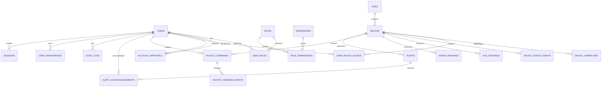

# Database Specification

## 1. Document Information

| Item | Description |
|---|---|
| Product | Web-Based Soil and Water Monitoring and Faucet Control System |
| Document | Database Specification |
| Version | 1.0 |
| Status | Proposed baseline schema |
| Recommended database | PostgreSQL |
| Recommended ORM | Prisma or equivalent |
| Primary roles | `OWNER`, `ADMIN` |
| Related documents | `FRONTEND_AUDIT.md`, `UI_UX.md`, `PRD.md`, `RBAC.md`, `USER_FLOWS.md`, `I18N.md`, `DEVICE_COMMUNICATION.md`, `ARCHITECTURE.md` |

---

## 2. Purpose

This document defines the application database model for:

- Authentication and user accounts.
- Owner approval of Admin registrations.
- Role-based access control.
- User profile management.
- Multiple ESP32/NodeMCU devices.
- Device capabilities and assignments.
- Soil telemetry.
- Water telemetry.
- Device status.
- Faucet-control commands.
- Alerts.
- User preferences.
- Sessions.
- Audit logs.
- Operational integration records.

The database shall be the durable system of record for application state.

---

## 3. Database Principles

### 3.1 PostgreSQL as the System of Record

PostgreSQL is the recommended primary database because the application requires:

- Relational integrity.
- Transactions.
- Role and permission relationships.
- Device assignments.
- Historical telemetry.
- Command lifecycle tracking.
- Audit records.
- Indexed date-range queries.
- Future table partitioning.

### 3.2 Canonical Values

The database shall store canonical, language-neutral values.

Examples:

```text
OWNER
ADMIN
ACTIVE
PENDING_APPROVAL
ONLINE
COMPLETED
```

The database shall not store translated presentation values such as:

```text
Pemilik
Menunggu Persetujuan
Terhubung
Selesai
```

Translations belong in the frontend.

### 3.3 Server-Generated Identifiers

Primary keys shall be generated on the server.

Recommended identifier types:

```text
UUID
UUIDv7
ULID
```

The project shall choose one consistent identifier strategy.

Recommended:

```text
UUID
```

Device IDs may remain stable human-readable identifiers in addition to internal UUID primary keys.

### 3.4 Timestamps

All tables that represent mutable business entities should include:

```text
created_at
updated_at
```

Timestamps shall be stored in PostgreSQL using:

```text
TIMESTAMPTZ
```

The application shall display timestamps according to the active locale and timezone.

### 3.5 Deletion and Soft Deactivation Policies

Security-sensitive and historical records (audit logs, telemetry history) shall not be arbitrarily deleted.

Deletion policies:

- Owner-initiated Admin Account Deletion (`DELETE /api/v1/users/{userId}`): Permanently hard-deletes the target Admin user row and account-owned dependent records (`sessions`, `user_roles`, `user_preferences`, `user_device_access`, `account_approvals`, `faucet_commands`) inside a single database transaction, while anonymizing `actorUserId` in existing audit logs and recording an `account.deleted` audit event.
- Devices and Device assignments: Soft deletion or deactivation is used where historical telemetry reconstruction matters.

Telemetry and audit records shall follow retention policies rather than user-triggered deletion.

### 3.6 Monetary Data

This application does not currently require monetary fields.

---

## 4. Database Domains

The schema is divided into:

```text
1. Identity and Access
2. Device Registry
3. Telemetry
4. Faucet Control
5. Alerts
6. Audit
7. Sessions and Preferences
8. Integration Operations
```

---

## 5. High-Level Entity Relationship Diagram



---

# 6. Identity and Access Tables

## 6.1 `users` (DB-USER-001)

Stores user identity, role-independent profile fields, account status, and approval eligibility.

| Column | PostgreSQL type | Nullable | Constraints / Notes |
|---|---|---:|---|
| `id` | UUID | No | Primary key |
| `full_name` | VARCHAR(150) | No | Trimmed |
| `email` | VARCHAR(320) | No | Unique, normalised |
| `username` | VARCHAR(100) | Yes | Unique when used |
| `password_hash` | TEXT | No | Never returned to frontend |
| `account_status` | VARCHAR(40) or enum | No | Canonical status |
| `email_verified_at` | TIMESTAMPTZ | Yes | If email verification is implemented |
| `last_login_at` | TIMESTAMPTZ | Yes | Updated after successful login |
| `suspended_at` | TIMESTAMPTZ | Yes | Status metadata |
| `deactivated_at` | TIMESTAMPTZ | Yes | Status metadata |
| `created_at` | TIMESTAMPTZ | No | Default current timestamp |
| `updated_at` | TIMESTAMPTZ | No | Updated on modification |

Allowed `account_status` values:

```text
PENDING_APPROVAL
APPROVED
ACTIVE
REJECTED
SUSPENDED
DEACTIVATED
```

### Constraints

- `email` shall be unique after normalisation.
- Public registration shall create `ADMIN` separately through role assignment.
- Public registration shall set `account_status = PENDING_APPROVAL`.
- Public registration shall not set `ACTIVE`.
- Password hashes shall never be logged.
- `APPROVED` and `ACTIVE` remain separate until the activation policy is finalised.

### Recommended indexes

```text
UNIQUE INDEX users_email_unique ON users (lower(email))
UNIQUE INDEX users_username_unique ON users (lower(username)) WHERE username IS NOT NULL
INDEX users_account_status_idx ON users (account_status)
INDEX users_created_at_idx ON users (created_at DESC)
```

---

## 6.2 `roles` (DB-USER-004)

Stores supported application roles.

| Column | Type | Nullable | Notes |
|---|---|---:|---|
| `id` | UUID | No | Primary key |
| `code` | VARCHAR(40) | No | Unique canonical role code |
| `name` | VARCHAR(100) | No | Administrative label |
| `description` | TEXT | Yes | Internal description |
| `is_system_role` | BOOLEAN | No | Default true |
| `created_at` | TIMESTAMPTZ | No | |
| `updated_at` | TIMESTAMPTZ | No | |

Initial role codes:

```text
OWNER
ADMIN
```

No additional roles shall be seeded unless requirements change.

---

## 6.3 `permissions`

Stores stable permission keys.

| Column | Type | Nullable | Notes |
|---|---|---:|---|
| `id` | UUID | No | Primary key |
| `code` | VARCHAR(100) | No | Unique permission key |
| `description` | TEXT | Yes | Internal description |
| `created_at` | TIMESTAMPTZ | No | |
| `updated_at` | TIMESTAMPTZ | No | |

Initial permission examples:

```text
account.approve
account.reject
account.suspend
account.deactivate
profile.self.read
profile.self.update
profile.other.read
profile.other.update
device.read
device.assign
device.unassign
monitoring.current.read
monitoring.history.read
monitoring.location.read
device.control.dispense
device.control.cancel
alert.read
alert.acknowledge
audit.read
language.self.update
```

---

## 6.4 `user_roles`

Associates users with roles.

| Column | Type | Nullable | Notes |
|---|---|---:|---|
| `id` | UUID | No | Primary key |
| `user_id` | UUID | No | Foreign key to `users` |
| `role_id` | UUID | No | Foreign key to `roles` |
| `assigned_by_user_id` | UUID | Yes | Owner who assigned role |
| `assigned_at` | TIMESTAMPTZ | No | |
| `revoked_at` | TIMESTAMPTZ | Yes | Historical revocation |

### Constraints

- One active role per user is recommended for version 1.
- Public registration shall assign only the `ADMIN` role.
- Public registration creates an `OWNER` (with `accountStatus = ACTIVE`) ONLY IF no non-revoked `OWNER` assignment exists in the system. Otherwise, public registration creates an `ADMIN` (with `accountStatus = PENDING_APPROVAL`).

Recommended uniqueness:

```text
UNIQUE (user_id) WHERE revoked_at IS NULL
```

If the ORM cannot express partial uniqueness cleanly, use application and migration constraints.

---

## 6.5 `role_permissions`

Associates roles with permissions.

| Column | Type | Nullable | Notes |
|---|---|---:|---|
| `id` | UUID | No | Primary key |
| `role_id` | UUID | No | |
| `permission_id` | UUID | No | |
| `created_at` | TIMESTAMPTZ | No | |

Constraint:

```text
UNIQUE (role_id, permission_id)
```

Role-permission assignments shall be seeded and changed through controlled migrations or Owner-authorised administrative functionality if later approved.

---

## 6.6 `account_approvals` (DB-USER-003)

Stores Owner decisions for Admin registration requests.

| Column | Type | Nullable | Notes |
|---|---|---:|---|
| `id` | UUID | No | Primary key |
| `applicant_user_id` | UUID | No | Registered Admin |
| `decision` | VARCHAR(30) | No | Canonical decision |
| `previous_status` | VARCHAR(40) | No | |
| `new_status` | VARCHAR(40) | No | |
| `decided_by_user_id` | UUID | No | Acting Owner |
| `decision_note` | TEXT | Yes | User-entered, not translated |
| `decided_at` | TIMESTAMPTZ | No | |
| `created_at` | TIMESTAMPTZ | No | |

Allowed decision values:

```text
APPROVED
REJECTED
ACTIVATED
```

### Rules

- Approval decisions shall be append-only.
- Duplicate conflicting decisions shall be prevented.
- The current account state remains in `users.account_status`.
- Historical approval decisions remain in this table.

Recommended index:

```text
INDEX account_approvals_applicant_idx
ON account_approvals (applicant_user_id, decided_at DESC)
```

---

# 7. Sites and Device Registry

## 7.1 `sites` (DB-DEV-003)

Stores project, field, or operational site information.

| Column | Type | Nullable | Notes |
|---|---|---:|---|
| `id` | UUID | No | Primary key |
| `site_code` | VARCHAR(100) | No | Unique stable code |
| `name` | VARCHAR(200) | No | User-facing name |
| `description` | TEXT | Yes | |
| `latitude` | NUMERIC(9,6) | Yes | Optional site coordinate |
| `longitude` | NUMERIC(9,6) | Yes | Optional site coordinate |
| `is_active` | BOOLEAN | No | Default true |
| `created_at` | TIMESTAMPTZ | No | |
| `updated_at` | TIMESTAMPTZ | No | |

Whether sites are required in version 1 is `TBD`, but the schema is recommended because multiple devices are confirmed.

---

## 7.2 `devices` (DB-DEV-001)

Stores registered ESP32/NodeMCU devices.

| Column | Type | Nullable | Notes |
|---|---|---:|---|
| `id` | UUID | No | Internal primary key |
| `device_id` | VARCHAR(150) | No | Unique canonical hardware identity |
| `site_id` | UUID | Yes | Foreign key to `sites` |
| `name` | VARCHAR(200) | No | User-facing device name |
| `device_type` | VARCHAR(60) | No | Canonical type |
| `account_status` | VARCHAR(30) | No | Device lifecycle state |
| `connection_status` | VARCHAR(30) | No | Latest connection state |
| `firmware_version` | VARCHAR(100) | Yes | |
| `hardware_revision` | VARCHAR(100) | Yes | |
| `schema_version` | VARCHAR(30) | Yes | Last supported payload schema |
| `last_seen_at` | TIMESTAMPTZ | Yes | Server receipt time |
| `last_message_at` | TIMESTAMPTZ | Yes | Latest device recorded time |
| `latitude` | NUMERIC(9,6) | Yes | Latest known coordinate |
| `longitude` | NUMERIC(9,6) | Yes | Latest known coordinate |
| `created_at` | TIMESTAMPTZ | No | |
| `updated_at` | TIMESTAMPTZ | No | |
| `deactivated_at` | TIMESTAMPTZ | Yes | |

Recommended `device_type` values:

```text
SOIL_NODE
WATER_QUALITY_NODE
WATER_TANK_NODE
```

Recommended device lifecycle values:

```text
ACTIVE
INACTIVE
DEACTIVATED
```

Recommended connection values:

```text
ONLINE
OFFLINE
STALE
UNKNOWN
INACTIVE
```

### Constraints

- `device_id` shall be unique.
- Device coordinates shall remain within valid latitude and longitude ranges.
- A deactivated device shall not receive new faucet commands.
- Device credentials shall not be stored in plain text in this table.

### Indexes

```text
UNIQUE INDEX devices_device_id_unique ON devices (device_id)
INDEX devices_site_idx ON devices (site_id)
INDEX devices_connection_status_idx ON devices (connection_status)
INDEX devices_last_seen_idx ON devices (last_seen_at DESC)
```

---

## 7.3 `device_capabilities`

Stores capabilities supported by each device.

| Column | Type | Nullable | Notes |
|---|---|---:|---|
| `id` | UUID | No | Primary key |
| `device_id` | UUID | No | FK to `devices.id` |
| `capability` | VARCHAR(80) | No | Canonical capability |
| `enabled` | BOOLEAN | No | Default true |
| `source` | VARCHAR(30) | Yes | Provisioned or device reported |
| `created_at` | TIMESTAMPTZ | No | |
| `updated_at` | TIMESTAMPTZ | No | |

Allowed capability examples:

```text
SOIL_TELEMETRY
WATER_TELEMETRY
LOCATION
TANK_MONITORING
FLOW_MONITORING
FAUCET_CONTROL
BATTERY_MONITORING
```

Constraint:

```text
UNIQUE (device_id, capability)
```

---

## 7.4 `user_device_access` (DB-DEV-002)

Stores mandatory device-level access assignments.

| Column | Type | Nullable | Notes |
|---|---|---:|---|
| `id` | UUID | No | Primary key |
| `user_id` | UUID | No | FK to `users` |
| `device_id` | UUID | No | FK to `devices` |
| `assigned_by_user_id` | UUID | No | Acting Owner |
| `assigned_at` | TIMESTAMPTZ | No | |
| `revoked_at` | TIMESTAMPTZ | Yes | Historical revocation |
| `created_at` | TIMESTAMPTZ | No | |
| `updated_at` | TIMESTAMPTZ | No | |

### Rules

- Only Owners may create or revoke device assignments.
- Device assignment is mandatory for Admin access. Admins cannot view or control unassigned devices.
- Active Admin device assignment grants both telemetry monitoring and faucet-control capabilities for active Admin users on active, controllable devices:
  ```text
  Active ADMIN
  + assigned device access
  + active and controllable device
  = faucet-control permission
  ```
- Separate per-user-device `can_control` permission grants are not used.
- Revoked assignments shall remain historically queryable.
- Admins shall not assign devices to themselves or other users.

Recommended active uniqueness:

```text
UNIQUE (user_id, device_id) WHERE revoked_at IS NULL
```

---

## 7.5 `device_status_events`

Stores device status transitions.

| Column | Type | Nullable | Notes |
|---|---|---:|---|
| `id` | UUID | No | Primary key |
| `device_id` | UUID | No | FK to `devices` |
| `status` | VARCHAR(30) | No | Canonical status |
| `reason_code` | VARCHAR(80) | Yes | Canonical reason |
| `recorded_at` | TIMESTAMPTZ | Yes | Device timestamp |
| `received_at` | TIMESTAMPTZ | No | Server timestamp |
| `message_id` | VARCHAR(150) | Yes | Device message identifier |
| `metadata` | JSONB | Yes | Safe diagnostics |
| `created_at` | TIMESTAMPTZ | No | |

Indexes:

```text
INDEX device_status_events_device_time_idx
ON device_status_events (device_id, received_at DESC)

UNIQUE INDEX device_status_events_message_unique
ON device_status_events (device_id, message_id)
WHERE message_id IS NOT NULL
```

---

# 8. Telemetry Tables

## 8.1 Telemetry Design Decision

Two dedicated telemetry tables are recommended:

```text
soil_readings
water_readings
```

This provides:

- Clear typed columns.
- Simpler queries.
- Easier validation.
- Better indexes.
- Better chart performance.
- Cleaner future partitioning.

A generic entity-attribute-value design is not recommended for version 1 because it weakens type safety and query clarity.

---

## 8.2 `soil_readings` (DB-TEL-001)

| Column | Type | Nullable | Notes |
|---|---|---:|---|
| `id` | UUID | No | Primary key |
| `device_id` | UUID | No | FK to `devices` |
| `message_id` | VARCHAR(150) | No | Device message ID |
| `sequence_number` | BIGINT | Yes | Device sequence |
| `schema_version` | VARCHAR(30) | No | |
| `recorded_at` | TIMESTAMPTZ | Yes | Device measurement time |
| `received_at` | TIMESTAMPTZ | No | Server receipt time |
| `nitrogen` | NUMERIC | Yes | Unit defined externally |
| `phosphorus` | NUMERIC | Yes | Unit defined externally |
| `potassium` | NUMERIC | Yes | Unit defined externally |
| `temperature` | NUMERIC | Yes | Unit defined externally |
| `moisture` | NUMERIC | Yes | Unit defined externally |
| `ph` | NUMERIC | Yes | |
| `ec` | NUMERIC | Yes | Unit defined externally |
| `status` | VARCHAR(30) | Yes | Canonical status |
| `validation_status` | VARCHAR(30) | No | `VALID`, `PARTIAL`, etc. |
| `created_at` | TIMESTAMPTZ | No | |

Recommended validation statuses:

```text
VALID
PARTIAL
INVALID
QUARANTINED
```

### Constraints

- `message_id` shall be unique per device.
- Zero values shall remain valid zeroes.
- Unavailable values shall use `NULL`.
- Invalid numeric values shall not be stored in typed columns.
- `recorded_at` and `received_at` shall remain separate.

### Indexes

```text
UNIQUE INDEX soil_readings_message_unique
ON soil_readings (device_id, message_id)

INDEX soil_readings_device_recorded_idx
ON soil_readings (device_id, recorded_at DESC)

INDEX soil_readings_device_received_idx
ON soil_readings (device_id, received_at DESC)

INDEX soil_readings_status_idx
ON soil_readings (device_id, status, recorded_at DESC)
```

---

## 8.3 `water_readings` (DB-TEL-002)

Stores general water-quality telemetry.

| Column | Type | Nullable | Notes |
|---|---|---:|---|
| `id` | UUID | No | Primary key |
| `device_id` | UUID | No | FK to `devices` |
| `message_id` | VARCHAR(150) | No | Device message ID |
| `sequence_number` | BIGINT | Yes | |
| `schema_version` | VARCHAR(30) | No | |
| `recorded_at` | TIMESTAMPTZ | Yes | |
| `received_at` | TIMESTAMPTZ | No | |
| `ph` | NUMERIC | Yes | |
| `tds` | NUMERIC | Yes | Unit `TBD` |
| `ec` | NUMERIC | Yes | Unit `TBD` |
| `latitude` | NUMERIC(9,6) | Yes | DELETED parameter |
| `longitude` | NUMERIC(9,6) | Yes | DELETED parameter |
| `status` | VARCHAR(30) | Yes | Canonical status |
| `validation_status` | VARCHAR(30) | No | |
| `created_at` | TIMESTAMPTZ | No | |

---

## 8.4 `reservoir_water_readings` (DB-TEL-003)

Stores reservoir-water volume and flow rate telemetry independently from general water-quality.

| Column | Type | Nullable | Notes |
|---|---|---:|---|
| `id` | UUID | No | Primary key |
| `device_id` | UUID | No | FK to `devices` |
| `message_id` | VARCHAR(150) | No | Device message ID |
| `sequence_number` | BIGINT | Yes | |
| `schema_version` | VARCHAR(30) | No | |
| `recorded_at` | TIMESTAMPTZ | Yes | |
| `received_at` | TIMESTAMPTZ | No | |
| `tank_volume` | NUMERIC | Yes | Unit `L` (Liters) |
| `flow_rate` | NUMERIC | Yes | Unit `m³/h` (Cubic meters per hour) |
| `status` | VARCHAR(30) | Yes | Canonical status |
| `validation_status` | VARCHAR(30) | No | |
| `created_at` | TIMESTAMPTZ | No | |

---

## 8.5 `sensor_battery_readings` (DB-TEL-004)
Stores time-series battery / power-supply measurements incorporated into soil (`SOIL_NODE`) and water (`WATER_QUALITY_NODE`) monitoring equipment. (`BAT` stands for Battery, `DEC-MON-085`).

| Column | Type | Nullable | Notes |
|---|---|---:|---|
| `id` | UUID | No | Primary key |
| `device_id` | UUID | No | FK to `devices` |
| `message_id` | VARCHAR(150) | No | Device message ID |
| `sequence_number` | BIGINT | Yes | |
| `schema_version` | VARCHAR(30) | No | |
| `recorded_at` | TIMESTAMPTZ | Yes | |
| `received_at` | TIMESTAMPTZ | No | |
| `battery_level` | NUMERIC | No | Battery power level (`BAT`) |
| `status` | VARCHAR(30) | Yes | Canonical status |
| `validation_status` | VARCHAR(30) | No | |
| `created_at` | TIMESTAMPTZ | No | |

### Constraints

- Latitude between `-90` and `90`.
- Longitude between `-180` and `180`.
- `message_id` unique per device.
- Missing values shall remain `NULL`.
- Battery shall not be constrained until its meaning is confirmed.

### Indexes

```text
UNIQUE INDEX water_readings_message_unique
ON water_readings (device_id, message_id)

INDEX water_readings_device_recorded_idx
ON water_readings (device_id, recorded_at DESC)

INDEX water_readings_device_received_idx
ON water_readings (device_id, received_at DESC)

INDEX water_readings_status_idx
ON water_readings (device_id, status, recorded_at DESC)
```

---

## 8.4 Latest Reading Strategy

The first version may query the latest reading using indexed descending timestamps.

For higher scale, add:

```text
device_latest_soil
device_latest_water
```

These tables would hold one current row per device and be updated transactionally after valid ingestion.

The denormalised latest-reading tables are optional and shall not replace historical telemetry.

---

## 8.5 Raw Integration Messages

Optional table:

```text
integration_messages
```

Use only when operational troubleshooting requires raw payload retention.

Suggested fields:

| Column | Type |
|---|---|
| `id` | UUID |
| `device_id` | UUID nullable |
| `topic` | TEXT |
| `message_id` | VARCHAR |
| `payload` | JSONB or TEXT |
| `validation_status` | VARCHAR |
| `error_code` | VARCHAR nullable |
| `received_at` | TIMESTAMPTZ |
| `expires_at` | TIMESTAMPTZ nullable |

Raw payload retention is `TBD`.

Secrets shall never be stored in raw payloads.

---

# 9. Faucet-Control Tables

## 9.1 `faucet_commands` (DB-CMD-001)

Stores one durable record per logical faucet-control request.

| Column | Type | Nullable | Notes |
|---|---|---:|---|
| `id` | UUID | No | Primary key |
| `command_id` | VARCHAR(150) | No | Globally unique external command ID |
| `device_id` | UUID | No | Target device |
| `initiated_by_user_id` | UUID | No | User who confirmed command |
| `initiated_by_role` | VARCHAR(40) | No | Role snapshot |
| `phase` | SMALLINT | No | `1`, `2`, or `3` |
| `target_volume_ml` | INTEGER | No | Server-mapped value |
| `actual_volume_ml` | NUMERIC | Yes | Only when supplied |
| `status` | VARCHAR(40) | No | Canonical command status |
| `requested_at` | TIMESTAMPTZ | No | |
| `queued_at` | TIMESTAMPTZ | Yes | |
| `sent_at` | TIMESTAMPTZ | Yes | |
| `acknowledged_at` | TIMESTAMPTZ | Yes | |
| `started_at` | TIMESTAMPTZ | Yes | |
| `completed_at` | TIMESTAMPTZ | Yes | |
| `failed_at` | TIMESTAMPTZ | Yes | |
| `cancelled_at` | TIMESTAMPTZ | Yes | |
| `expires_at` | TIMESTAMPTZ | No | |
| `failure_reason_code` | VARCHAR(100) | Yes | Canonical |
| `idempotency_key` | VARCHAR(150) | No | Unique per logical browser request |
| `created_at` | TIMESTAMPTZ | No | |
| `updated_at` | TIMESTAMPTZ | No | |

Allowed statuses:

```text
QUEUED
SENT
ACKNOWLEDGED
IN_PROGRESS
COMPLETED
FAILED
CANCELLED
TIMEOUT
EXPIRED
```

### Constraints

```text
phase = 1 → target_volume_ml = 300
phase = 2 → target_volume_ml = 1000
phase = 3 → target_volume_ml = 1500
```

Recommended check:

```text
CHECK (
  (phase = 1 AND target_volume_ml = 300) OR
  (phase = 2 AND target_volume_ml = 1000) OR
  (phase = 3 AND target_volume_ml = 1500)
)
```

Additional constraints:

- `command_id` unique.
- `idempotency_key` unique within an appropriate scope.
- Final states shall not be changed back to non-final states without reconciliation logic.
- Commands shall not be hard-deleted through normal UI actions.

### Indexes

```text
UNIQUE INDEX faucet_commands_command_unique
ON faucet_commands (command_id)

UNIQUE INDEX faucet_commands_idempotency_unique
ON faucet_commands (idempotency_key)

INDEX faucet_commands_device_time_idx
ON faucet_commands (device_id, requested_at DESC)

INDEX faucet_commands_user_time_idx
ON faucet_commands (initiated_by_user_id, requested_at DESC)

INDEX faucet_commands_status_idx
ON faucet_commands (status, requested_at DESC)
```

---

## 9.2 `faucet_command_events` (DB-CMD-002)

Stores every command lifecycle event.

| Column | Type | Nullable | Notes |
|---|---|---:|---|
| `id` | UUID | No | Primary key |
| `faucet_command_id` | UUID | No | FK to command |
| `event_status` | VARCHAR(40) | No | Canonical status |
| `message_id` | VARCHAR(150) | Yes | Device event message |
| `reason_code` | VARCHAR(100) | Yes | |
| `actual_volume_ml` | NUMERIC | Yes | |
| `recorded_at` | TIMESTAMPTZ | Yes | Device time |
| `received_at` | TIMESTAMPTZ | No | Server time |
| `metadata` | JSONB | Yes | Safe structured metadata |
| `created_at` | TIMESTAMPTZ | No | |

### Rules

- Events are append-only.
- Duplicate device events shall be idempotent.
- Out-of-order events shall remain stored but not silently regress the current command state.

Recommended indexes:

```text
INDEX faucet_command_events_command_time_idx
ON faucet_command_events (faucet_command_id, received_at ASC)

UNIQUE INDEX faucet_command_events_message_unique
ON faucet_command_events (message_id)
WHERE message_id IS NOT NULL
```

---

## 9.3 Active Command Concurrency

A partial unique index may prevent more than one active command per device:

```text
UNIQUE INDEX faucet_commands_one_active_per_device
ON faucet_commands (device_id)
WHERE status IN ('QUEUED', 'SENT', 'ACKNOWLEDGED', 'IN_PROGRESS')
```

Whether concurrent commands are prohibited is `TBD`.

Do not add this index until the concurrency policy is approved.

---

# 10. Alert Tables

## 10.1 `alerts`

| Column | Type | Nullable | Notes |
|---|---|---:|---|
| `id` | UUID | No | Primary key |
| `device_id` | UUID | Yes | Null for account-level alerts |
| `user_id` | UUID | Yes | Optional direct recipient |
| `alert_type` | VARCHAR(80) | No | Canonical type |
| `severity` | VARCHAR(30) | No | Canonical severity |
| `status` | VARCHAR(30) | No | Open/acknowledged/resolved |
| `source_type` | VARCHAR(50) | No | Device, command, account, system |
| `source_id` | UUID | Yes | Related record |
| `title_key` | VARCHAR(150) | Yes | Translation key |
| `message_key` | VARCHAR(150) | Yes | Translation key |
| `message_params` | JSONB | Yes | Interpolation values |
| `opened_at` | TIMESTAMPTZ | No | |
| `resolved_at` | TIMESTAMPTZ | Yes | |
| `created_at` | TIMESTAMPTZ | No | |
| `updated_at` | TIMESTAMPTZ | No | |

Recommended severities:

```text
INFO
WARNING
CRITICAL
```

Recommended statuses:

```text
OPEN
ACKNOWLEDGED
RESOLVED
```

Alert thresholds and generation ownership remain `TBD`.

---

## 10.2 `alert_acknowledgements`

| Column | Type | Nullable | Notes |
|---|---|---:|---|
| `id` | UUID | No | Primary key |
| `alert_id` | UUID | No | |
| `acknowledged_by_user_id` | UUID | No | |
| `note` | TEXT | Yes | User-entered |
| `acknowledged_at` | TIMESTAMPTZ | No | |
| `created_at` | TIMESTAMPTZ | No | |

Alert acknowledgement shall not delete the alert.

---

# 11. User Preferences and Sessions

## 11.1 `user_preferences`

| Column | Type | Nullable | Notes |
|---|---|---:|---|
| `id` | UUID | No | Primary key |
| `user_id` | UUID | No | Unique FK |
| `preferred_locale` | VARCHAR(10) | No | `en` or `id` |
| `timezone` | VARCHAR(100) | Yes | Recommended `Asia/Jakarta` default |
| `default_device_id` | UUID | Yes | Must be authorised |
| `created_at` | TIMESTAMPTZ | No | |
| `updated_at` | TIMESTAMPTZ | No | |

Constraints:

```text
preferred_locale IN ('en', 'id')
UNIQUE (user_id)
```

The default and fallback locale remain application configuration values.

---

## 11.2 `sessions` (DB-USER-002)

The exact fields depend on the authentication library.

Recommended minimum:

| Column | Type | Nullable | Notes |
|---|---|---:|---|
| `id` | UUID | No | Primary key |
| `session_token_hash` | TEXT | No | Unique hashed token |
| `user_id` | UUID | No | |
| `expires_at` | TIMESTAMPTZ | No | |
| `revoked_at` | TIMESTAMPTZ | Yes | |
| `last_seen_at` | TIMESTAMPTZ | Yes | |
| `ip_address` | INET | Yes | Subject to privacy policy |
| `user_agent` | TEXT | Yes | |
| `created_at` | TIMESTAMPTZ | No | |
| `updated_at` | TIMESTAMPTZ | No | |

### Rules

- Raw session tokens shall not be stored when hashing is supported.
- Suspended or deactivated accounts shall have sessions revoked.
- Role or device-access changes shall take effect without indefinite stale access.

---

## 11.3 Password Reset and Verification Tables

Optional tables:

```text
password_reset_tokens
email_verification_tokens
```

Tokens shall be stored hashed where practical.

The password recovery and email-verification process is `TBD`.

---

# 12. Audit Tables

## 12.1 `audit_logs` (DB-AUDIT-001)

Stores security and business audit events.

| Column | Type | Nullable | Notes |
|---|---|---:|---|
| `id` | UUID | No | Primary key |
| `event_key` | VARCHAR(150) | No | Canonical event |
| `actor_user_id` | UUID | Yes | Null for system actor |
| `actor_role` | VARCHAR(40) | Yes | Role snapshot |
| `target_type` | VARCHAR(80) | Yes | User, device, command, etc. |
| `target_id` | UUID | Yes | |
| `result` | VARCHAR(30) | No | Success, failure, denied |
| `previous_values` | JSONB | Yes | Redacted |
| `new_values` | JSONB | Yes | Redacted |
| `metadata` | JSONB | Yes | Safe metadata |
| `request_id` | VARCHAR(150) | Yes | Correlation |
| `ip_address` | INET | Yes | Subject to policy |
| `user_agent` | TEXT | Yes | |
| `created_at` | TIMESTAMPTZ | No | Immutable timestamp |

Recommended event keys:

```text
account.registration.created
account.approved
account.rejected
account.suspended
account.deactivated
profile.self.updated
profile.other.updated
device.access.assigned
device.access.removed
auth.login.success
auth.login.failed
faucet.command.created
faucet.command.completed
faucet.command.failed
faucet.command.timeout
alert.acknowledged
authorisation.high_risk.denied
```

### Rules

- Audit rows shall be append-only.
- Password hashes, raw tokens, device secrets, private keys, and broker credentials shall never be stored.
- Audit event keys shall remain untranslated.
- Normal application users shall not edit or delete audit records.

### Indexes

```text
INDEX audit_logs_actor_time_idx
ON audit_logs (actor_user_id, created_at DESC)

INDEX audit_logs_target_time_idx
ON audit_logs (target_type, target_id, created_at DESC)

INDEX audit_logs_event_time_idx
ON audit_logs (event_key, created_at DESC)
```

---

# 13. Integration Operations Tables

## 13.1 `device_message_deduplication`

Optional high-volume idempotency table.

| Column | Type |
|---|---|
| `device_id` | UUID |
| `message_id` | VARCHAR |
| `message_type` | VARCHAR |
| `received_at` | TIMESTAMPTZ |
| `expires_at` | TIMESTAMPTZ |

Primary or unique key:

```text
(device_id, message_id)
```

This table may be unnecessary when telemetry tables already enforce unique message IDs.

---

## 13.2 `integration_errors`

Stores operational validation and communication errors.

| Column | Type | Nullable |
|---|---|---:|
| `id` | UUID | No |
| `device_id` | UUID | Yes |
| `message_id` | VARCHAR(150) | Yes |
| `topic` | TEXT | Yes |
| `error_code` | VARCHAR(100) | No |
| `error_details` | JSONB | Yes |
| `received_at` | TIMESTAMPTZ | No |
| `created_at` | TIMESTAMPTZ | No |

Raw payload storage shall remain optional and retention-limited.

---

# 14. Data Types and Precision

## 14.1 Numeric Sensor Fields

Use PostgreSQL `NUMERIC` when controlled precision is required.

Avoid binary floating-point for persisted values when precision matters.

Exact precision and scale remain `TBD` until units and sensor capabilities are confirmed.

Examples:

```text
NUMERIC(10,3)
NUMERIC(12,4)
```

### 14.2 Coordinates

Recommended:

```text
latitude  NUMERIC(9,6)
longitude NUMERIC(9,6)
```

### 14.3 Tank and Flow

Recommended provisional types:

```text
tank_volume NUMERIC(12,3)
flow_rate   NUMERIC(12,3)
```

Final units remain `TBD`.

### 14.4 JSONB

Use `JSONB` only for:

- Safe flexible metadata.
- Message parameters.
- Diagnostics.
- Non-core extensible fields.

Do not move core queryable fields into JSONB merely to avoid schema design.

---

# 15. Foreign Key Behaviour

Recommended policies:

| Relationship | Delete behaviour |
|---|---|
| User to role assignment | Restrict or soft revoke |
| User to device assignment | Soft revoke |
| Device to telemetry | Restrict device deletion |
| Device to commands | Restrict device deletion |
| User to commands | Restrict user deletion |
| Command to events | Cascade only if command cannot be deleted |
| Alert to acknowledgement | Cascade only if alerts are retention-managed |
| User to audit logs | Preserve logs; actor may be nullable only for system cases |

Users and devices should normally be deactivated rather than deleted.

---

# 16. Transaction Boundaries

## 16.1 Account Approval Transaction

One transaction should:

1. Lock or reload the pending account.
2. Verify current status.
3. Update account status.
4. Insert approval history.
5. Insert audit log.
6. Commit.

Notification delivery shall occur after commit and shall not roll back approval when notification fails.

## 16.2 Device Assignment Transaction

One transaction should:

1. Verify Owner permission.
2. Verify target user and device.
3. Create or reactivate assignment.
4. Insert audit record.
5. Commit.

## 16.3 Faucet Command Creation Transaction

One transaction should:

1. Verify user, permission, and device access.
2. Verify device state.
3. Validate phase.
4. Map target volume.
5. Check idempotency.
6. Insert command as `QUEUED`.
7. Insert command-created event or audit row.
8. Commit.
9. Publish to gateway after durable commit.

## 16.4 Telemetry Ingestion Transaction

One transaction may:

1. Verify deduplication.
2. Insert telemetry.
3. Update device last-seen and status.
4. Insert derived alert, where approved.
5. Commit.
6. Emit live update after commit.

---

# 17. Query Patterns

## 17.1 Latest Soil Reading

Query by:

```text
device_id
ORDER BY recorded_at DESC NULLS LAST, received_at DESC
LIMIT 1
```

## 17.2 Latest Water Reading

Same pattern as soil.

## 17.3 Historical Monitoring

Filter by:

- `device_id`.
- `recorded_at` or `received_at`.
- Date range.
- Requested metric.

Every query shall enforce device access in the application layer.

## 17.4 Pending Approvals

Filter:

```text
users.account_status = 'PENDING_APPROVAL'
```

## 17.5 Active Commands

Filter:

```text
status IN ('QUEUED', 'SENT', 'ACKNOWLEDGED', 'IN_PROGRESS')
```

---

# 18. Partitioning Strategy

Telemetry tables may grow rapidly.

Initial deployment may use ordinary indexed tables.

When data volume justifies partitioning, recommended approach:

```text
Monthly range partitioning by received_at
```

Alternative:

```text
Monthly range partitioning by recorded_at
```

`received_at` is safer operationally because it always exists.

Partitioning shall be introduced through tested migrations.

---

# 19. Retention and Archival

The following retention periods remain `TBD`:

- Raw telemetry.
- Aggregated telemetry.
- Integration errors.
- Raw payloads.
- Alerts.
- Sessions.
- Audit logs.
- Faucet command events.

Recommended principles:

- Audit logs require longer retention than sessions.
- Faucet command records shall be retained for operational traceability.
- Raw payloads, if stored, shall have shorter retention.
- Historical aggregates may outlive raw telemetry.
- Retention jobs shall never remove records still required by active investigations.

---

# 20. Data Aggregation

Future aggregate tables may include:

```text
soil_readings_hourly
soil_readings_daily
water_readings_hourly
water_readings_daily
```

Aggregate fields may include:

- Minimum.
- Maximum.
- Average.
- Count.
- First timestamp.
- Last timestamp.

Aggregation shall not invent data for missing intervals.

---

# 21. Backup and Recovery

The database backup plan shall include:

- Automated backups.
- Point-in-time recovery where supported.
- Encrypted backup storage.
- Restore testing.
- Retention policy.
- Access control.

The following remain `TBD`:

- Backup frequency.
- Recovery point objective.
- Recovery time objective.
- Backup retention.
- Restore drill frequency.

---

# 22. Migration Strategy

All schema changes shall use versioned migrations.

Rules:

- Production schema shall not be modified manually without a recorded emergency procedure.
- Destructive migrations require backup and rollback planning.
- Enum changes require compatibility review.
- Large telemetry table migrations shall be tested for locking impact.
- Application and schema deployment order shall support backward compatibility where possible.

---

# 23. ORM Guidance

If Prisma is selected:

- Prisma schema shall reflect this document.
- Raw SQL migrations may be used for partial indexes, partitioning, check constraints, and advanced PostgreSQL features.
- Prisma-generated types shall not replace runtime input validation.
- Database constraints shall remain authoritative for integrity.
- `Decimal` types shall be used for PostgreSQL `NUMERIC`.

---

# 24. Security Requirements

The database shall:

- Use a dedicated application user.
- Apply least-privilege grants.
- Not expose the database publicly.
- Use TLS where supported.
- Separate development, staging, and production databases.
- Protect backups.
- Store password hashes, never plain passwords.
- Store session tokens hashed where supported.
- Exclude secrets from audit and JSON metadata.
- Prevent Admin users from directly querying the database.
- Use parameterised queries or ORM query builders.

---

# 25. Privacy and Data Minimisation

The database shall store only profile data required by the product.

The following are `TBD`:

- Required registration fields.
- IP-address retention.
- User-agent retention.
- Support contact information.
- Legal retention obligations.

Location data belongs to devices, not automatically to individual users.

---

# 26. Seed Data

Initial seed data shall include:

- `OWNER` role.
- `ADMIN` role.
- Required permissions.
- Role-permission mappings.
- Default locale configuration.
- Optional first Owner account through a secure provisioning process.

The first Owner shall not be created through public registration.

---

# 27. Example Canonical Schema Summary

```text
users
roles
permissions
user_roles
role_permissions
account_approvals

sites
devices
device_capabilities
user_device_access
device_status_events

soil_readings
water_readings

faucet_commands
faucet_command_events

alerts
alert_acknowledgements

user_preferences
sessions
password_reset_tokens
email_verification_tokens

audit_logs
integration_errors
```

---

# 28. Testing Requirements

## 28.1 Integrity Tests

- Duplicate email rejected.
- Public registration cannot create Owner.
- Pending account cannot become active without approved workflow.
- Admin cannot assign devices.
- Duplicate device ID rejected.
- Duplicate telemetry message rejected.
- Invalid coordinate rejected.
- Invalid faucet phase rejected.
- Phase-volume mismatch rejected.
- Duplicate idempotency key returns existing command.
- Audit records remain append-only.

## 28.2 Transaction Tests

- Approval status and approval history commit together.
- Device assignment and audit commit together.
- Faucet command and audit commit before gateway publication.
- Failed telemetry transaction does not update latest device state.

## 28.3 Query Tests

- Admin sees only assigned devices.
- History queries remain scoped to one authorised device.
- Latest reading query returns the correct device.
- Missing readings remain null.
- Zero readings remain zero.
- Revoked access stops queries.

## 28.4 Performance Tests

- Latest-reading query uses indexes.
- Historical range query uses indexes or partitions.
- Pending approval list remains responsive.
- Command history pagination remains responsive.
- Audit-log filters remain responsive.

---

# 29. Database Acceptance Criteria

The database design is accepted when:

1. Users and roles are stored separately.
2. Only `OWNER` and `ADMIN` roles exist initially.
3. Public registration creates pending Admin accounts.
4. Owner approval history is preserved.
5. Admins cannot manage other users through database-backed API flows.
6. Device assignments separate view and control access.
7. Multiple devices are uniquely identifiable.
8. Soil and water readings are stored historically.
9. Missing values are not converted to zero.
10. Message IDs prevent duplicate telemetry storage.
11. Faucet phase and volume are constrained.
12. Faucet commands are durable before publication.
13. Command events are append-only.
14. Alerts preserve canonical types and translation keys.
15. User locale is stored independently from role and permissions.
16. Audit logs are append-only and redact secrets.
17. All security-sensitive changes are transactional.
18. Indexed queries support latest and historical data.
19. Production migrations are versioned.
20. Backup and retention policies can be applied.

---

# 30. Open Decisions

1. Identifier strategy: UUID, UUIDv7, or ULID.
2. Whether sites are required in version 1.
3. Exact user profile fields.
4. Whether username is required.
5. Whether `APPROVED` and `ACTIVE` remain separate.
6. Whether multiple Owner accounts are permitted.
7. Owner scope model.
8. Exact device lifecycle states.
9. Exact units and precision for sensor fields.
10. Final meaning of `Water BAT`.
11. Latest-reading denormalisation.
12. Raw payload retention.
13. Telemetry retention.
14. Table partitioning threshold.
15. Aggregate tables.
16. Alert generation ownership.
17. Alert thresholds.
18. Command concurrency.
19. Command timeout values.
20. Command cancellation support.
21. Session implementation.
22. Password recovery.
23. Email verification.
24. IP and user-agent retention.
25. Audit retention.
26. Backup objectives.
27. Database hosting.
28. Prisma or alternative ORM.

---

# 31. Conflicts and Gaps Found

1. Several telemetry units and precision requirements remain undefined.
2. `Water BAT` remains ambiguous.
3. The Owner device-access scope is not final.
4. Faucet-control role permissions are not final.
5. Command concurrency and cancellation rules are unresolved.
6. The distinction between `APPROVED` and `ACTIVE` remains unresolved.
7. Historical retention and aggregation remain undefined.
8. Alert thresholds remain outside the current software specification.
9. The authentication library will influence the final session schema.
10. The hosting decision will influence backup, partitioning, and operational configuration.

---

# 32. Advisory Lock Strategy for First Owner Provisioning (`TASK-0106`)

To prevent race conditions during initial system bootstrap across concurrent CLI instances or processes, initial Owner creation uses PostgreSQL transaction-scoped advisory locking (`pg_advisory_xact_lock`):

- **Lock Identifier:** `84736291106` (`BigInt`).
- **Scope:** Transaction-scoped (`pg_advisory_xact_lock`). The lock is automatically acquired inside the `Serializable` transaction critical section and released upon transaction commit or rollback.
- **Execution:**
  ```sql
  SELECT pg_advisory_xact_lock(84736291106);
  ```
- **Behavior:** Concurrent attempts wait for the first process to finish, then observe the newly created `OWNER` assignment and safely terminate with a non-zero exit code (`PROVISIONING FAILED: First Owner account already exists`).
