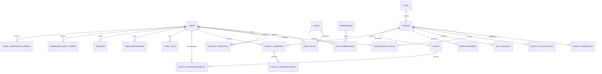

# Database Specification

## 1. Document Information

| Item | Description |
|---|---|
| Product | Web-Based Soil and Water Monitoring and Faucet Control System |
| Document | Database Specification |
| Version | 1.0 |
| Status | Proposed baseline schema |
| Recommended database | PostgreSQL |
| Recommended ORM | Prisma or equivalent |
| Primary roles | `OWNER`, `ADMIN` |
| Related documents | `FRONTEND_AUDIT.md`, `UI_UX.md`, `PRD.md`, `RBAC.md`, `USER_FLOWS.md`, `I18N.md`, `DEVICE_COMMUNICATION.md`, `ARCHITECTURE.md` |

---

## 2. Purpose

This document defines the application database model for:

- Authentication and user accounts.
- Owner approval of Admin registrations.
- Role-based access control.
- User profilee management.
- Multiple ESP32/NodeMCU devices.
- Device capabilities and assignments.
- Soil telemetry.
- Water telemetry.
- Device status.
- Faucet-control commands.
- Alerts.
- User preferences.
- Sessions.
- Audit logs.
- Operational integration records.

The database shall be the durable system of record for application state.

### 2.1 TASK-0914 Environment & Schema Reconciliation
`TASK-0914` required zero database schema migrations or data alterations:
- **Environment Isolation:** Local development connects to its configured local database (`DATABASE_URL`), while staging connects to the dedicated Supabase PostgreSQL database (`scqrbtfilmttqrutynyo`) (formerly hosted on Railway, transitioning to containerized staging per `TASK-1012`). Staging database records and canonical identities remain intact and unmodified.
- **Dynamic Device Identity:** Canonical device strings (`devices.device_id`) are managed as environment data and resolved dynamically at runtime by simulation tools via CLI/environment variables, with no hardcoded device ID assumptions in source code.

---


## 3. Database Principles

### 3.1 PostgreSQL as the System of Record

PostgreSQL is the recommended primary database because the application requires:

- Relational integrity.
- Transactions.
- Role and permission relationships.
- Device assignments.
- Historical telemetry.
- Command lifecycle tracking.
- Audit records.
- Indexed date-range queries.
- Future table partitioning.

### 3.2 Canonical Values

The database shall store canonical, language-neutral values.

Examples:

```text
OWNER
ADMIN
ACTIVE
PENDING_APPROVAL
ONLINE
COMPLETED
```

The database shall not store translated presentation values such as:

```text
Pemilik
Menunggu Persetujuan
Terhubung
Selesai
```

Translations belong in the frontend (implemented via `next-intl` presentation namespaces, `TASK-0603`).

### 3.3 Server-Generated Identifiers

Primary keys shall be generated on the server.

Recommended identifier types:

```text
UUID
UUIDv7
ULID
```

The project shall choose one consistent identifier strategy.

Recommended:

```text
UUID
```

Device IDs remain stable human-readable identifiers (e.g. `soil-node-001`) in addition to internal UUID primary keys. Database repository lookups resolve both canonical string `deviceId` and internal `id` UUID values.

Telemetry EC readings are persisted in canonical source units (`mS/cm`). Presentation boundaries in the web UI convert these to `µS/cm` (×1000) for visual display.

### 3.4 Timestamps

All tables that represent mutable business entities should include:

```text
created_at
updated_at
```

Timestamps shall be stored in PostgreSQL using:

```text
TIMESTAMPTZ
```

The application shall display timestamps according to the active locale and timezone.

### 3.5 Deletion, Soft Deactivation, and Data Retention Policies

Security-sensitive and historical records (audit logs, telemetry history) shall not be arbitrarily deleted.

#### Deletion and Deactivation Policies

- Owner-initiated Admin Account Deletion (`DELETE /api/v1/users/{userId}`): Permanently hard-deletes the target Admin user row and account-owned dependent records (`sessions`, `user_roles`, `user_preferences`, `user_device_access`, `account_approvals`, `faucet_commands`) inside a single database transaction, while anonymizing `actorUserId` in existing audit logs and recording an `account.deleted` audit event.
- Devices and Device assignments: Soft deletion or deactivation is used where historical telemetry reconstruction matters (`DEC-DEV-030`). Hard device deletion is permanently disabled.

#### Telemetry Data Retention and Automated Maintenance Policy (TASK-0913)

Telemetry and operational time-series data follow an automated lifecycle maintenance policy to prevent unbounded Supabase storage growth while ensuring compliance with the maximum 31-day historical query window (`DEC-MON-087`):

1. **Raw Telemetry Retention TTL:** High-frequency raw sensor telemetry records and ephemeral operational errors older than **90 days** (`DEC-MON-048`) are automatically purged by scheduled maintenance routines.
2. **Approved Telemetry & Operational Tables:**
   - `soil_readings`
   - `water_readings`
   - `reservoir_water_readings`
   - `sensor_battery_readings` (legacy schema coverage)
   - `device_status_events`
   - `integration_errors`
3. **Protected & Exempt Data (Zero-Purge Guarantee):**
   The following critical compliance, security, and operational audit tables are strictly **exempt** from telemetry retention cleanup (`SEC-DATA-004`) and are enforced as immutable / non-purgeable by `RetentionService`:
   - `audit_logs` (Security and compliance audit history, retained indefinitely)
   - `faucet_commands` (Actuator command audit trail and lifecycle records)
   - `faucet_command_events` (Deterministic state transition log for faucet commands)
   - `account_approvals` (Historical Owner approval and rejection decision trail)
4. **Chunked Batch Deletion Strategy:**
   To eliminate table locks, prevent transaction timeouts, and avoid impacting real-time telemetry ingestion, deletions are executed iteratively in batches (`RETENTION_BATCH_SIZE`, default `1000`) using indexed primary key ID ranges (`DELETE FROM <table> WHERE id IN (...)`) with an asynchronous event loop pause (`yieldMs: 20`) between batches.
5. **Execution Architecture:**
   - **Database Layer:** [`RetentionService`](file:///c:/Users/Puroh/Documents/Melon/packages/database/src/retention-service.ts) in `@kebun-melon/database`.
   - **Background Worker:** [`RetentionScheduler`](file:///c:/Users/Puroh/Documents/Melon/apps/iot-gateway/src/maintenance/retention-scheduler.ts) in `apps/iot-gateway` running on a configurable interval (`RETENTION_INTERVAL_MS`, default 24h).
   - **Operator CLI:** Standalone manual maintenance script [`scripts/cleanup-retention.ts`](file:///c:/Users/Puroh/Documents/Melon/scripts/cleanup-retention.ts) (`npm run db:cleanup`).

### 3.6 Monetary Data

This application does not currently require monetary fields.

---

## 4. Database Domains

The schema is divided into:

```text
1. Identity and Access
2. Device Registry
3. Telemetry
4. Faucet Control
5. Alerts
6. Audit
7. Sessions and Preferences
8. Integration Operations
```

---

## 5. High-Level Entity Relationship Diagram



---

# 6. Identity and Access Tables

## 6.1 `users` (DB-USER-001)

Stores user identity, role-independent profilee fields, account status, and approval eligibility.

| Column | PostgreSQL type | Nullable | Constraints / Notes |
|---|---|---:|---|
| `id` | UUID | No | Primary key |
| `full_name` | VARCHAR(150) | No | Trimmed |
| `email` | VARCHAR(320) | No | Unique, normalised |
| `username` | VARCHAR(100) | Yes | Unique when used |
| `password_hash` | TEXT | No | Never returned to frontend |
| `account_status` | VARCHAR(40) or enum | No | Canonical status |
| `email_verified_at` | TIMESTAMPTZ | Yes | Nullable timestamp recording email ownership verification (`DEC-AUTH-104` / `TASK-0214`) |
| `last_login_at` | TIMESTAMPTZ | Yes | Updated after successful login |
| `suspended_at` | TIMESTAMPTZ | Yes | Status metadata |
| `deactivated_at` | TIMESTAMPTZ | Yes | Status metadata |
| `created_at` | TIMESTAMPTZ | No | Default current timestamp |
| `updated_at` | TIMESTAMPTZ | No | Updated on modification |

Allowed `account_status` values:

```text
PENDING_APPROVAL
APPROVED
ACTIVE
REJECTED
SUSPENDED
DEACTIVATED
```

### Constraints

- `email` shall be unique after normalisation.
- Public registration shall create `ADMIN` separately through role assignment.
- Public registration shall set `account_status = PENDING_APPROVAL`.
- Public registration shall not set `ACTIVE`.
- Password hashes shall never be logged.
- `APPROVED` and `ACTIVE` remain separate until the activation policy is finalised.

### Recommended indexes

```text
UNIQUE INDEX users_email_unique ON users (lower(email))
UNIQUE INDEX users_username_unique ON users (lower(username)) WHERE username IS NOT NULL
INDEX users_account_status_idx ON users (account_status)
INDEX users_created_at_idx ON users (created_at DESC)
```

---

## 6.2 `roles` (DB-USER-004)

Stores supported application roles.

| Column | Type | Nullable | Notes |
|---|---|---:|---|
| `id` | UUID | No | Primary key |
| `code` | VARCHAR(40) | No | Unique canonical role code |
| `name` | VARCHAR(100) | No | Administrative label |
| `description` | TEXT | Yes | Internal description |
| `is_system_role` | BOOLEAN | No | Default true |
| `created_at` | TIMESTAMPTZ | No | |
| `updated_at` | TIMESTAMPTZ | No | |

Initial role codes:

```text
OWNER
ADMIN
```

No additional roles shall be seeded unless requirements change.

---

## 6.3 `permissions`

Stores stable permission keys.

| Column | Type | Nullable | Notes |
|---|---|---:|---|
| `id` | UUID | No | Primary key |
| `code` | VARCHAR(100) | No | Unique permission key |
| `description` | TEXT | Yes | Internal description |
| `created_at` | TIMESTAMPTZ | No | |
| `updated_at` | TIMESTAMPTZ | No | |

Initial permission examples:

```text
account.approve
account.reject
account.suspend
account.deactivate
profilee.self.read
profilee.self.update
profilee.other.read
profilee.other.update
device.read
device.update
device.deactivate
device.activate
device.assign
device.unassign
monitoring.current.read
monitoring.history.read
monitoring.location.read
device.control.dispense
device.control
alert.read
alert.acknowledge
audit.read
language.self.update
```

---

## 6.4 `user_roles`

Associates users with roles.

| Column | Type | Nullable | Notes |
|---|---|---:|---|
| `id` | UUID | No | Primary key |
| `user_id` | UUID | No | Foreign key to `users` |
| `role_id` | UUID | No | Foreign key to `roles` |
| `assigned_by_user_id` | UUID | Yes | Owner who assigned role |
| `assigned_at` | TIMESTAMPTZ | No | |
| `revoked_at` | TIMESTAMPTZ | Yes | Historical revocation |

### Constraints

- One active role per user is recommended for version 1.
- Public registration shall assign only the `ADMIN` role.
- Public registration creates an `OWNER` (with `accountStatus = ACTIVE`) ONLY IF no non-revoked `OWNER` assignment exists in the system. Otherwise, public registration creates an `ADMIN` (with `accountStatus = PENDING_APPROVAL`).

Recommended uniqueness:

```text
UNIQUE (user_id) WHERE revoked_at IS NULL
```

If the ORM cannot express partial uniqueness cleanly, use application and migration constraints.

---

## 6.5 `role_permissions`

Associates roles with permissions.

| Column | Type | Nullable | Notes |
|---|---|---:|---|
| `id` | UUID | No | Primary key |
| `role_id` | UUID | No | |
| `permission_id` | UUID | No | |
| `created_at` | TIMESTAMPTZ | No | |

Constraint:

```text
UNIQUE (role_id, permission_id)
```

Role-permission assignments shall be seeded and changed through controlled migrations or Owner-authorised administrative functionality if later approved.

---

## 6.6 `account_approvals` (DB-USER-003)

Stores Owner decisions for Admin registration requests.

| Column | Type | Nullable | Notes |
|---|---|---:|---|
| `id` | UUID | No | Primary key |
| `applicant_user_id` | UUID | No | Registered Admin |
| `decision` | VARCHAR(30) | No | Canonical decision |
| `previous_status` | VARCHAR(40) | No | |
| `new_status` | VARCHAR(40) | No | |
| `decided_by_user_id` | UUID | No | Acting Owner |
| `decision_note` | TEXT | Yes | User-entered, not translated |
| `decided_at` | TIMESTAMPTZ | No | |
| `created_at` | TIMESTAMPTZ | No | |

Allowed decision values:

```text
APPROVED
REJECTED
ACTIVATED
```

### Rules

- Approval decisions shall be append-only.
- Duplicate conflicting decisions shall be prevented.
- The current account state remains in `users.account_status`.
- Historical approval decisions remain in this table.

Recommended index:

```text
INDEX account_approvals_applicant_idx
ON account_approvals (applicant_user_id, decided_at DESC)
```

---

## 6.7 `password_reset_tokens` (DB-AUTH-005 / DEC-AUTH-102)

Stores cryptographic hashes for single-use password recovery tokens.

| Column | Type | Nullable | Notes |
|---|---|---:|---|
| `id` | UUID | No | Primary key (`DEFAULT gen_random_uuid()`) |
| `user_id` | UUID | No | Foreign key referencing `users(id) ON DELETE CASCADE` |
| `token_hash` | VARCHAR(64) | No | Cryptographic SHA-256 hex digest of the raw 256-bit token |
| `expires_at` | TIMESTAMPTZ | No | Token expiration timestamp (configurable, default 15 minutes) |
| `used_at` | TIMESTAMPTZ | Yes | Timestamp when the token was successfully consumed (NULL until used) |
| `created_at` | TIMESTAMPTZ | No | Token generation timestamp (`DEFAULT NOW()`) |

### Constraints & Security Rules

- **Raw Token Storage Forbidden**: The raw CSPRNG token is NEVER stored in plaintext; only the SHA-256 hash is persisted.
- **Single Use**: Once consumed, `used_at` is populated transactionally. A token with `used_at IS NOT NULL` is permanently invalidated and cannot be replayed.
- **Transactional Invalidation**: Creating a new password reset token marks/invalidates any prior unused tokens for that user.
- **Session Revocation**: Consuming a valid reset token transactionally revokes all active login sessions for the associated `user_id` across devices per `TASK-0908`.

### Recommended Indexes

```text
INDEX password_reset_tokens_user_id_idx ON password_reset_tokens (user_id)
INDEX password_reset_tokens_expires_at_idx ON password_reset_tokens (expires_at)
INDEX password_reset_tokens_token_hash_idx ON password_reset_tokens (token_hash)
```

---

## 6.8 `email_verification_tokens` (DB-AUTH-006 / DEC-AUTH-104 / DEC-AUTH-106)

Stores cryptographic hashes for registration email ownership verification and verified self-email change codes.

| Column | Type | Nullable | Notes |
|---|---|---:|---|
| `id` | UUID | No | Primary key |
| `user_id` | UUID | No | Foreign key referencing `users(id) ON DELETE CASCADE` |
| `token_hash` | VARCHAR(64) | No | Unique cryptographic SHA-256 hex digest (`sha256(userId:code)` or `sha256(userId:newEmail:code)`) |
| `pending_email` | VARCHAR(320) | Yes | Target candidate email for email change flow (`NULL` for registration verification) |
| `expires_at` | TIMESTAMPTZ | No | Expiration timestamp (approved: 15 minutes) |
| `created_at` | TIMESTAMPTZ | No | Code generation timestamp (`DEFAULT NOW()`) |

### Constraints & Security Rules

- **Raw Code Storage Forbidden**: The raw 6-digit numeric CSPRNG code is never stored in plaintext; only the SHA-256 hash scoped to user ID (and target email when applicable) is persisted in `token_hash`. Scoping prevents unique constraint collisions.
- **Single Use**: Upon successful verification, the token record is consumed/deleted and `users.email_verified_at` (and `users.email` if `pending_email` was set) is updated.
- **Authority Isolation**: When `pending_email` is set for email change requests (`DEC-AUTH-106`), the current `users.email` remains 100% authoritative until verification completes.
- **Transactional Invalidation**: Creating a new verification code transactionally deletes/invalidates prior unused codes for the user.
- **Concurrency & Conflict Handling**: `verifyEmailWithToken` / `verifyEmailChange` wraps transactions in bounded exponential backoff retries (3 attempts) on Prisma `P2034` write conflicts.

### Recommended Indexes

```text
UNIQUE INDEX email_verification_tokens_token_hash_key ON email_verification_tokens (token_hash)
INDEX email_verification_tokens_user_id_idx ON email_verification_tokens (user_id)
INDEX email_verification_tokens_expires_at_idx ON email_verification_tokens (expires_at)
```

---

## 6.9 `sessions` (DB-AUTH-007 / DEC-AUTH-001 / DEC-AUTH-107)

Stores active authentication sessions with server-managed revocation and single active session concurrency enforcement.

| Column | Type | Nullable | Notes |
|---|---|---:|---|
| `id` | UUID | No | Primary key (`DEFAULT gen_random_uuid()`) |
| `user_id` | UUID | No | Foreign key referencing `users(id) ON DELETE CASCADE` |
| `session_token_hash` | VARCHAR(64) | No | Unique SHA-256 hex digest of the raw session secret |
| `expires_at` | TIMESTAMPTZ | No | Absolute session expiration (8 hours max lifetime) |
| `revoked_at` | TIMESTAMPTZ | Yes | Explicit revocation timestamp (`NULL` if active) |
| `last_seen_at` | TIMESTAMPTZ | No | Inactivity timestamp for 30-minute idle timeout (`DEFAULT NOW()`) |
| `ip_address` | VARCHAR(45) | Yes | Client IP address at session creation |
| `user_agent` | TEXT | Yes | Client User-Agent at session creation |
| `created_at` | TIMESTAMPTZ | No | Session creation timestamp (`DEFAULT NOW()`) |
| `updated_at` | TIMESTAMPTZ | No | Updated on modification (`last_seen_at` bump, etc.) |

### Constraints & Security Rules

- **Single Active Session Rule (`DEC-AUTH-107`)**: Each user account is strictly limited to at most 1 active, non-revoked, non-expired, non-idle session at any time.
- **Login Rejection Semantics**: A login attempt with valid credentials when an active session exists returns HTTP 409 Conflict (`ACTIVE_SESSION_EXISTS`) and preserves the existing session.
- **Automatic Stale Pruning**: Sessions with `expires_at <= NOW()`, `NOW() - last_seen_at > 30m`, or `revoked_at IS NOT NULL` do not block new logins and are soft-revoked.
- **Transactional Row Locking**: Active session queries during login use row locks (`SELECT id FROM users WHERE id = ... FOR UPDATE`) to prevent concurrent race conditions across simultaneous login requests.
- **Session Revocation on Password Change**: Changing or resetting passwords transactionally sets `revoked_at = NOW()` for all sessions belonging to that `user_id`.
- **WAN Query Reduction Architecture (`DEC-AUTH-108`)**:
  - Prisma User & Role Lookup: Uses `relationLoadStrategy: 'join'` to emit a single SQL `LEFT JOIN` query for user and active roles, cutting lookup latency from ~1,800ms to ~400ms across WAN.
  - Streamlined Active Check: Evaluates unrevoked sessions via `findMany({ where: { userId, revokedAt: null } })`, eliminating blind table writes on clean logins.
  - Decoupled `lastLoginAt`: `user.update({ lastLoginAt })` executes asynchronously outside the transaction with `.catch(...)` fallback logging, removing 1 database round trip from the critical user path.
  - Synchronous Audit Integrity: `auditLog.create` remains strictly synchronous inside the transaction; fire-and-forget audit is prohibited.
  - Same-Client Recovery: Re-authenticates without 409 if session cookie is missing/expired on the same device (matching `existingToken` or IP + User-Agent).

### Recommended Indexes

```text
UNIQUE INDEX sessions_session_token_hash_key ON sessions (session_token_hash)
INDEX sessions_user_id_idx ON sessions (user_id)
INDEX sessions_expires_at_idx ON sessions (expires_at)
INDEX sessions_user_active_idx ON sessions (user_id, revoked_at, expires_at)
```

Added foreign key covering indexes in `20260905040000_add_auth_and_fk_performance_indexes`:
```text
INDEX user_roles_user_id_revoked_at_idx ON user_roles (user_id, revoked_at)
INDEX user_roles_user_id_idx ON user_roles (user_id)
INDEX user_roles_role_id_idx ON user_roles (role_id)
INDEX role_permissions_permission_id_idx ON role_permissions (permission_id)
INDEX account_approvals_decided_by_user_id_idx ON account_approvals (decided_by_user_id)
INDEX user_device_access_device_id_idx ON user_device_access (device_id)
INDEX user_device_access_assigned_by_user_id_idx ON user_device_access (assigned_by_user_id)
INDEX user_preferences_default_device_id_idx ON user_preferences (default_device_id)
INDEX alert_acknowledgements_user_id_idx ON alert_acknowledgements (acknowledged_by_user_id)
INDEX alert_acknowledgements_alert_id_idx ON alert_acknowledgements (alert_id)
INDEX alerts_device_id_idx ON alerts (device_id)
```

---

# 7. Sites and Device Registry

## 7.1 `sites` (DB-DEV-003)

Stores project, field, or operational site information.

| Column | Type | Nullable | Notes |
|---|---|---:|---|
| `id` | UUID | No | Primary key |
| `site_code` | VARCHAR(100) | No | Unique stable code |
| `name` | VARCHAR(200) | No | User-facing name |
| `description` | TEXT | Yes | |
| `latitude` | NUMERIC(9,6) | Yes | Optional site coordinate |
| `longitude` | NUMERIC(9,6) | Yes | Optional site coordinate |
| `is_active` | BOOLEAN | No | Default true |
| `created_at` | TIMESTAMPTZ | No | |
| `updated_at` | TIMESTAMPTZ | No | |

Whether sites are required in version 1 is `TBD`, but the schema is recommended because multiple devices are confirmed.

---

## 7.2 `devices` (DB-DEV-001)

Stores registered ESP32/NodeMCU devices. Devices are provisioned out-of-band / via database seeding; in-app device creation is removed (`DEC-DEV-027`).

| Column | Type | Nullable | Notes |
|---|---|---:|---|
| `id` | UUID | No | Internal immutable primary key (`DEC-DEV-028`) |
| `device_id` | VARCHAR(150) | No | Unique canonical hardware identity (Owner-editable; concealed from Admin per `DEC-DEV-028`) |
| `site_id` | UUID | Yes | Foreign key to `sites` |
| `name` | VARCHAR(200) | No | User-facing device name |
| `device_type` | VARCHAR(60) | No | Canonical type |
| `account_status` | VARCHAR(30) | No | Device lifecycle state |
| `connection_status` | VARCHAR(30) | No | Latest connection state |
| `firmware_version` | VARCHAR(100) | Yes | |
| `hardware_revision` | VARCHAR(100) | Yes | |
| `schema_version` | VARCHAR(30) | Yes | Last supported payload schema |
| `last_seen_at` | TIMESTAMPTZ | Yes | Server receipt time |
| `last_message_at` | TIMESTAMPTZ | Yes | Latest device recorded time |
| `latitude` | NUMERIC(9,6) | Yes | Latest known coordinate |
| `longitude` | NUMERIC(9,6) | Yes | Latest known coordinate |
| `created_at` | TIMESTAMPTZ | No | |
| `updated_at` | TIMESTAMPTZ | No | |
| `deactivated_at` | TIMESTAMPTZ | Yes | |

Recommended `device_type` values:

```text
SOIL_NODE
WATER_QUALITY_NODE
WATER_TANK_NODE
```

Recommended device lifecycle values:

```text
ACTIVE
INACTIVE
DEACTIVATED
```

Recommended connection values:

```text
ONLINE
OFFLINE
STALE
UNKNOWN
INACTIVE
```

### Constraints and Identity Governance

- `id` (UUID) is strictly immutable and serves as the relational foreign key target for all dependent tables (`user_device_access`, `soil_readings`, `water_readings`, `telemetry_reservoir`, `faucet_commands`, `alerts`, `device_status_events`).
- `device_id` shall be unique across active and inactive records.
- `device_id` is editable only by Owner users. Admin users cannot view or edit canonical `device_id` (`DEC-DEV-028`).
- In-app device creation is removed; new device records are provisioned via administrative seeds (`DEC-DEV-027`).
- **Connection States**:
  - Derived from `devices.last_message_at` relative to current time.
  - Heartbeat failure thresholds strictly defined in `DEC-DEV-022`.
- **Retention**:
  - High-frequency telemetry records (soil, water quality, reservoir) older than 90 days are periodically purged using the `purge_expired_telemetry_records` stored procedure to cap database size.
  - `audit_logs`, `faucet_commands`, and `faucet_command_events` have long-term immutable retention (minimum 1 year) and are excluded from routine telemetry cleanup.
- **No Hard Delete for Devices (`DEC-DEV-030`)**: Devices are never deleted from the database. Deleting devices would destroy foreign-key relationships and erase telemetry, alert, command, and audit histories. Device lifecycle is controlled strictly via deactivation and reactivation:
  - **Deactivation**: `account_status = 'DEACTIVATED'`, `connection_status = 'INACTIVE'`, and `deactivated_at = NOW()`. Faucet control is blocked.
  - **Reactivation**: `account_status = 'ACTIVE'`, `connection_status = 'UNKNOWN'`, and `deactivated_at = NULL`. Full operational monitoring is resumed.
- Previously/last-accessed device history is not stored or persisted (`DEC-DEV-029`). All historical telemetry, command, assignment/revocation, status, and audit data are fully preserved.
- Device coordinates shall remain within valid latitude and longitude ranges.
- A deactivated device shall not receive new faucet commands.
- Device credentials shall not be stored in plain text in this table.

### Indexes

```text
UNIQUE INDEX devices_device_id_unique ON devices (device_id)
INDEX devices_site_idx ON devices (site_id)
INDEX devices_connection_status_idx ON devices (connection_status)
INDEX devices_last_seen_idx ON devices (last_seen_at DESC)
```

---

## 7.3 `device_capabilities`

Stores capabilities supported by each device.

| Column | Type | Nullable | Notes |
|---|---|---:|---|
| `id` | UUID | No | Primary key |
| `device_id` | UUID | No | FK to `devices.id` |
| `capability` | VARCHAR(80) | No | Canonical capability |
| `enabled` | BOOLEAN | No | Default true |
| `source` | VARCHAR(30) | Yes | Provisioned or device reported |
| `created_at` | TIMESTAMPTZ | No | |
| `updated_at` | TIMESTAMPTZ | No | |

Allowed capability examples:

```text
SOIL_TELEMETRY
WATER_TELEMETRY
LOCATION
TANK_MONITORING
FLOW_MONITORING
FAUCET_CONTROL
BATTERY_MONITORING
```

Constraint:

```text
UNIQUE (device_id, capability)
```

---

## 7.4 `user_device_access` (DB-DEV-002)

Stores mandatory device-level access assignments.

| Column | Type | Nullable | Notes |
|---|---|---:|---|
| `id` | UUID | No | Primary key |
| `user_id` | UUID | No | FK to `users` |
| `device_id` | UUID | No | FK to `devices` |
| `assigned_by_user_id` | UUID | No | Acting Owner |
| `assigned_at` | TIMESTAMPTZ | No | |
| `revoked_at` | TIMESTAMPTZ | Yes | Historical revocation |
| `created_at` | TIMESTAMPTZ | No | |
| `updated_at` | TIMESTAMPTZ | No | |

### Rules

- Only Owners may create or revoke device assignments.
- Device assignment is mandatory for Admin access. Admins cannot view or control unassigned devices.
- Active Admin device assignment grants both telemetry monitoring and faucet-control capabilities for active Admin users on active, controllable devices:
  ```text
  Active ADMIN
  + assigned device access
  + active and controllable device
  = faucet-control permission
  ```
- Separate per-user-device `can_control` permission grants are not used.
- Revoked assignments shall remain historically queryable.
- Admins shall not assign devices to themselves or other users.

Recommended active uniqueness and index:

```text
UNIQUE INDEX user_device_access_active_user_device_unique ON user_device_access (user_id, device_id) WHERE revoked_at IS NULL
```

Query performance note (`TASK-0305`): Admin active assignment filtering (`WHERE user_id = $1 AND revoked_at IS NULL`) executes as an Index-Only Scan on this partial unique index, resolving assigned device UUIDs with zero heap fetches prior to querying `devices` table via `devices_pkey`.

---

## 7.5 `device_status_events`

Stores device status transitions.

| Column | Type | Nullable | Notes |
|---|---|---:|---|
| `id` | UUID | No | Primary key |
| `device_id` | UUID | No | FK to `devices` |
| `status` | VARCHAR(30) | No | Canonical status |
| `reason_code` | VARCHAR(80) | Yes | Canonical reason |
| `recorded_at` | TIMESTAMPTZ | Yes | Device timestamp |
| `received_at` | TIMESTAMPTZ | No | Server timestamp |
| `message_id` | VARCHAR(150) | Yes | Device message identifier |
| `metadata` | JSONB | Yes | Safe diagnostics |
| `created_at` | TIMESTAMPTZ | No | |

Indexes:

```text
INDEX device_status_events_device_time_idx
ON device_status_events (device_id, received_at DESC)

UNIQUE INDEX device_status_events_message_unique
ON device_status_events (device_id, message_id)
WHERE message_id IS NOT NULL
```

---

# 8. Telemetry Tables

## 8.1 Telemetry Design Decision

Two dedicated telemetry tables are recommended:

```text
soil_readings
water_readings
```

This provides:

- Clear typed columns.
- Simpler queries.
- Easier validation.
- Better indexes.
- Better chart performance.
- Cleaner future partitioning.

A generic entity-attribute-value design is not recommended for version 1 because it weakens type safety and query clarity.

---

## 8.2 `soil_readings` (DB-TEL-001)

| Column | Type | Nullable | Notes |
|---|---|---:|---|
| `id` | UUID | No | Primary key |
| `device_id` | UUID | No | FK to `devices` |
| `message_id` | VARCHAR(150) | No | Device message ID |
| `sequence_number` | BIGINT | Yes | Device sequence |
| `schema_version` | VARCHAR(30) | No | |
| `recorded_at` | TIMESTAMPTZ | Yes | Device measurement time |
| `received_at` | TIMESTAMPTZ | No | Server receipt time |
| `nitrogen` | NUMERIC | Yes | Unit defined externally |
| `phosphorus` | NUMERIC | Yes | Unit defined externally |
| `potassium` | NUMERIC | Yes | Unit defined externally |
| `temperature` | NUMERIC | Yes | Unit defined externally |
| `moisture` | NUMERIC | Yes | Unit defined externally |
| `ph` | NUMERIC | Yes | |
| `ec` | NUMERIC | Yes | Unit defined externally |
| `status` | VARCHAR(30) | Yes | Canonical status |
| `validation_status` | VARCHAR(30) | No | `VALID`, `PARTIAL`, etc. |
| `created_at` | TIMESTAMPTZ | No | |

Recommended validation statuses:

```text
VALID
PARTIAL
INVALID
QUARANTINED
```

### Constraints

- `message_id` shall be unique per device.
- Zero values shall remain valid zeroes.
- Unavailable values shall use `NULL`.
- Invalid numeric values shall not be stored in typed columns.
- `recorded_at` and `received_at` shall remain separate.

### Indexes

```text
UNIQUE INDEX soil_readings_message_unique
ON soil_readings (device_id, message_id)

INDEX soil_readings_device_recorded_idx
ON soil_readings (device_id, recorded_at DESC)

INDEX soil_readings_device_received_idx
ON soil_readings (device_id, received_at DESC)

INDEX soil_readings_status_idx
ON soil_readings (device_id, status, recorded_at DESC)
```

---

## 8.3 `water_readings` (DB-TEL-002)

Stores general water-quality telemetry.

| Column | Type | Nullable | Notes |
|---|---|---:|---|
| `id` | UUID | No | Primary key |
| `device_id` | UUID | No | FK to `devices` |
| `message_id` | VARCHAR(150) | No | Device message ID |
| `sequence_number` | BIGINT | Yes | |
| `schema_version` | VARCHAR(30) | No | |
| `recorded_at` | TIMESTAMPTZ | Yes | |
| `received_at` | TIMESTAMPTZ | No | |
| `ph` | NUMERIC | Yes | |
| `tds` | NUMERIC | Yes | Unit `TBD` |
| `ec` | NUMERIC | Yes | Unit `TBD` |
| `latitude` | NUMERIC(9,6) | Yes | DELETED parameter |
| `longitude` | NUMERIC(9,6) | Yes | DELETED parameter |
| `status` | VARCHAR(30) | Yes | Canonical status |
| `validation_status` | VARCHAR(30) | No | |
| `created_at` | TIMESTAMPTZ | No | |

---

## 8.4 `reservoir_water_readings` (DB-TEL-003)

Stores reservoir-water volume and flow rate telemetry independently from general water-quality.

| Column | Type | Nullable | Notes |
|---|---|---:|---|
| `id` | UUID | No | Primary key |
| `device_id` | UUID | No | FK to `devices` |
| `message_id` | VARCHAR(150) | No | Device message ID |
| `sequence_number` | BIGINT | Yes | |
| `schema_version` | VARCHAR(30) | No | |
| `recorded_at` | TIMESTAMPTZ | Yes | |
| `received_at` | TIMESTAMPTZ | No | |
| `tank_volume` | NUMERIC | Yes | Unit `L` (Liters) |
| `flow_rate` | NUMERIC | Yes | Unit `m³/h` (Cubic meters per hour) |
| `status` | VARCHAR(30) | Yes | Canonical status |
| `validation_status` | VARCHAR(30) | No | |
| `created_at` | TIMESTAMPTZ | No | |

---

## 8.5 `sensor_battery_readings` (DB-TEL-004)
Stores time-series battery / power-supply measurements. Note: `BAT` is completely removed from soil (`SOIL_NODE`) and water (`WATER_QUALITY_NODE`) monitoring telemetry per `DEC-MON-086` (superseding `DEC-MON-085`). Table schema is retained for standalone hardware power telemetry (`TASK-0409`).

| Column | Type | Nullable | Notes |
|---|---|---:|---|
| `id` | UUID | No | Primary key |
| `device_id` | UUID | No | FK to `devices` |
| `message_id` | VARCHAR(150) | No | Device message ID |
| `sequence_number` | BIGINT | Yes | |
| `schema_version` | VARCHAR(30) | No | |
| `recorded_at` | TIMESTAMPTZ | Yes | |
| `received_at` | TIMESTAMPTZ | No | |
| `battery_level` | NUMERIC | No | Battery power level (`BAT`) |
| `status` | VARCHAR(30) | Yes | Canonical status |
| `validation_status` | VARCHAR(30) | No | |
| `created_at` | TIMESTAMPTZ | No | |

### Constraints

- Latitude between `-90` and `90`.
- Longitude between `-180` and `180`.
- `message_id` unique per device.
- Missing values shall remain `NULL`.
- Battery shall not be constrained until its meaning is confirmed.

### Indexes

```text
UNIQUE INDEX water_readings_message_unique
ON water_readings (device_id, message_id)

INDEX water_readings_device_recorded_idx
ON water_readings (device_id, recorded_at DESC)

INDEX water_readings_device_received_idx
ON water_readings (device_id, received_at DESC)

INDEX water_readings_status_idx
ON water_readings (device_id, status, recorded_at DESC)
```

---

## 8.4 Latest Reading Strategy

The first version may query the latest reading using indexed descending timestamps.

For higher scale, add:

```text
device_latest_soil
device_latest_water
```

These tables would hold one current row per device and be updated transactionally after valid ingestion.

The denormalised latest-reading tables are optional and shall not replace historical telemetry.

---

## 8.5 Raw Integration Messages

Optional table:

```text
integration_messages
```

Use only when operational troubleshooting requires raw payload retention.

Suggested fields:

| Column | Type |
|---|---|
| `id` | UUID |
| `device_id` | UUID nullable |
| `topic` | TEXT |
| `message_id` | VARCHAR |
| `payload` | JSONB or TEXT |
| `validation_status` | VARCHAR |
| `error_code` | VARCHAR nullable |
| `received_at` | TIMESTAMPTZ |
| `expires_at` | TIMESTAMPTZ nullable |

Raw payload retention is `TBD`.

Secrets shall never be stored in raw payloads.

---

# 9. Faucet-Control Tables

## 9.1 `faucet_commands` (DB-CMD-001)

Stores one durable record per logical faucet-control request.

| Column | Type | Nullable | Notes |
|---|---|---:|---|
| `id` | UUID | No | Primary key |
| `command_id` | VARCHAR(150) | No | Globally unique external command ID |
| `device_id` | UUID | No | Target device |
| `initiated_by_user_id` | UUID | No | User who confirmed command |
| `initiated_by_role` | VARCHAR(40) | No | Role snapshot |
| `action` | VARCHAR(20) | No | Canonical action (`DISPENSE`, `OPEN`, `CLOSE`) |
| `phase` | SMALLINT | Yes | `1`, `2`, or `3` (Required if action = DISPENSE) |
| `plant_count` | INTEGER | Yes | `>= 1` (Required if action = DISPENSE) |
| `target_volume_ml` | INTEGER | Yes | Server-mapped: `preset_volume * plant_count` |
| `actual_volume_ml` | NUMERIC | Yes | Only when supplied |
| `status` | VARCHAR(40) | No | Canonical command status |
| `requested_at` | TIMESTAMPTZ | No | |
| `queued_at` | TIMESTAMPTZ | Yes | |
| `sent_at` | TIMESTAMPTZ | Yes | |
| `acknowledged_at` | TIMESTAMPTZ | Yes | |
| `started_at` | TIMESTAMPTZ | Yes | |
| `completed_at` | TIMESTAMPTZ | Yes | |
| `failed_at` | TIMESTAMPTZ | Yes | |
| `cancelled_at` | TIMESTAMPTZ | Yes | |
| `expires_at` | TIMESTAMPTZ | No | |
| `failure_reason_code` | VARCHAR(100) | Yes | Canonical |
| `idempotency_key` | VARCHAR(150) | No | Unique per logical browser request |
| `created_at` | TIMESTAMPTZ | No | |
| `updated_at` | TIMESTAMPTZ | No | |

Allowed statuses:

```text
QUEUED
SENT
ACKNOWLEDGED
IN_PROGRESS
COMPLETED
FAILED
CANCELLED
TIMEOUT
EXPIRED
```

### Constraints (TASK-0802 / TASK-0807)

```sql
ALTER TABLE "faucet_commands" ADD CONSTRAINT "faucet_commands_action_check"
CHECK (
  (
    action = 'DISPENSE'
    AND phase IS NOT NULL
    AND plant_count IS NOT NULL
    AND plant_count >= 1
    AND target_volume_ml IS NOT NULL
    AND target_volume_ml = (CASE phase WHEN 1 THEN 300 WHEN 2 THEN 1000 WHEN 3 THEN 1500 ELSE -1 END) * plant_count
  )
  OR
  (
    action IN ('OPEN', 'CLOSE')
    AND phase IS NULL
    AND plant_count IS NULL
    AND target_volume_ml IS NULL
  )
);
```

Rules:
- Legacy `faucet_commands_phase_volume_check` dropped.
- `target_volume_ml` dynamically validated on insertion against `(preset_volume_ml) * plant_count`.
- `OPEN` and `CLOSE` commands strictly enforce `NULL` for `phase`, `plant_count`, and `target_volume_ml`.
- `command_id` globally unique.
- `idempotency_key` unique across records.
- Partial unique index `faucet_commands_one_active_per_device` enforces maximum 1 active command in status `('QUEUED', 'SENT', 'ACKNOWLEDGED', 'IN_PROGRESS')` per device.

### Indexes

```text
UNIQUE INDEX faucet_commands_command_unique
ON faucet_commands (command_id)

UNIQUE INDEX faucet_commands_idempotency_unique
ON faucet_commands (idempotency_key)

INDEX faucet_commands_device_time_idx
ON faucet_commands (device_id, requested_at DESC)

INDEX faucet_commands_user_time_idx
ON faucet_commands (initiated_by_user_id, requested_at DESC)

INDEX faucet_commands_status_idx
ON faucet_commands (status, requested_at DESC)
```

---

## 9.2 `faucet_command_events` (DB-CMD-002)

Stores every command lifecycle event.

| Column | Type | Nullable | Notes |
|---|---|---:|---|
| `id` | UUID | No | Primary key |
| `faucet_command_id` | UUID | No | FK to command |
| `event_status` | VARCHAR(40) | No | Canonical status |
| `message_id` | VARCHAR(150) | Yes | Device event message |
| `reason_code` | VARCHAR(100) | Yes | |
| `actual_volume_ml` | NUMERIC | Yes | |
| `recorded_at` | TIMESTAMPTZ | Yes | Device time |
| `received_at` | TIMESTAMPTZ | No | Server time |
| `metadata` | JSONB | Yes | Safe structured metadata |
| `created_at` | TIMESTAMPTZ | No | |

### Rules

- Events are append-only.
- Duplicate device events shall be idempotent.
- Out-of-order events shall remain stored but not silently regress the current command state.

Recommended indexes:

```text
INDEX faucet_command_events_command_time_idx
ON faucet_command_events (faucet_command_id, received_at ASC)

UNIQUE INDEX faucet_command_events_message_unique
ON faucet_command_events (message_id)
WHERE message_id IS NOT NULL
```

---

## 9.3 Active Command Concurrency

A partial unique index may prevent more than one active command per device:

```text
UNIQUE INDEX faucet_commands_one_active_per_device
ON faucet_commands (device_id)
WHERE status IN ('QUEUED', 'SENT', 'ACKNOWLEDGED', 'IN_PROGRESS')
```

Whether concurrent commands are prohibited is `TBD`.

Do not add this index until the concurrency policy is approved.

---

# 10. Alert Tables

## 10.1 `alerts`

| Column | Type | Nullable | Notes |
|---|---|---:|---|
| `id` | UUID | No | Primary key |
| `device_id` | UUID | Yes | Null for account-level alerts |
| `user_id` | UUID | Yes | Optional direct recipient |
| `alert_type` | VARCHAR(80) | No | Canonical type |
| `severity` | VARCHAR(30) | No | Canonical severity |
| `status` | VARCHAR(30) | No | Open/acknowledged/resolved |
| `source_type` | VARCHAR(50) | No | Device, command, account, system |
| `source_id` | UUID | Yes | Related record |
| `title_key` | VARCHAR(150) | Yes | Translation key |
| `message_key` | VARCHAR(150) | Yes | Translation key |
| `message_params` | JSONB | Yes | Interpolation values |
| `opened_at` | TIMESTAMPTZ | No | |
| `resolved_at` | TIMESTAMPTZ | Yes | |
| `created_at` | TIMESTAMPTZ | No | |
| `updated_at` | TIMESTAMPTZ | No | |

Recommended severities:

```text
INFO
WARNING
CRITICAL
```

Recommended statuses:

```text
OPEN
ACKNOWLEDGED
RESOLVED
```

Alert thresholds and generation ownership remain `TBD`.

---

## 10.2 `alert_acknowledgements`

| Column | Type | Nullable | Notes |
|---|---|---:|---|
| `id` | UUID | No | Primary key |
| `alert_id` | UUID | No | |
| `acknowledged_by_user_id` | UUID | No | |
| `note` | TEXT | Yes | User-entered |
| `acknowledged_at` | TIMESTAMPTZ | No | |
| `created_at` | TIMESTAMPTZ | No | |

Alert acknowledgement shall not delete the alert.

---

# 11. User Preferences and Sessions

## 11.1 `user_preferences`

| Column | Type | Nullable | Notes |
|---|---|---:|---|
| `id` | UUID | No | Primary key |
| `user_id` | UUID | No | Unique FK |
| `preferred_locale` | VARCHAR(10) | No | `en` or `id` |
| `timezone` | VARCHAR(100) | Yes | Recommended `Asia/Jakarta` default |
| `default_device_id` | UUID | Yes | Must be authorised |
| `created_at` | TIMESTAMPTZ | No | |
| `updated_at` | TIMESTAMPTZ | No | |

Constraints:

```text
preferred_locale IN ('en', 'id')
UNIQUE (user_id)
```

The default and fallback locale remain application configuration values.

---

## 11.2 `sessions` (DB-USER-002)

The exact fields depend on the authentication library.

Recommended minimum:

| Column | Type | Nullable | Notes |
|---|---|---:|---|
| `id` | UUID | No | Primary key |
| `session_token_hash` | TEXT | No | Unique hashed token |
| `user_id` | UUID | No | |
| `expires_at` | TIMESTAMPTZ | No | |
| `revoked_at` | TIMESTAMPTZ | Yes | |
| `last_seen_at` | TIMESTAMPTZ | Yes | |
| `ip_address` | INET | Yes | Subject to privacy policy |
| `user_agent` | TEXT | Yes | |
| `created_at` | TIMESTAMPTZ | No | |
| `updated_at` | TIMESTAMPTZ | No | |

### Rules

- Raw session tokens shall not be stored when hashing is supported.
- Suspended or deactivated accounts shall have sessions revoked.
- Role or device-access changes shall take effect without indefinite stale access.

---

## 11.3 Password Reset and Verification Tables

Implemented tables:

```text
password_reset_tokens
email_verification_tokens
```

Tokens are generated as 256-bit CSPRNG values and stored as SHA-256 hashes (`DEC-AUTH-102`, `DEC-AUTH-104`). Password recovery tokens expire in 15 minutes (`TASK-0213`), and email verification tokens expire in 24 hours (`TASK-0214`). Both enforce single-use replay-safe token deletion upon consumption.

---

# 12. Audit Tables

## 12.1 `audit_logs` (DB-AUDIT-001)

Stores security and business audit events.

| Column | Type | Nullable | Notes |
|---|---|---:|---|
| `id` | UUID | No | Primary key |
| `event_key` | VARCHAR(150) | No | Canonical event |
| `actor_user_id` | UUID | Yes | Null for system actor |
| `actor_role` | VARCHAR(40) | Yes | Role snapshot |
| `target_type` | VARCHAR(80) | Yes | User, device, command, etc. |
| `target_id` | UUID | Yes | |
| `result` | VARCHAR(30) | No | Success, failure, denied |
| `previous_values` | JSONB | Yes | Redacted |
| `new_values` | JSONB | Yes | Redacted |
| `metadata` | JSONB | Yes | Safe metadata |
| `request_id` | VARCHAR(150) | Yes | Correlation |
| `ip_address` | INET | Yes | Subject to policy |
| `user_agent` | TEXT | Yes | |
| `created_at` | TIMESTAMPTZ | No | Immutable timestamp |

Recommended event keys:

```text
account.registration.created
account.approved
account.rejected
account.suspended
account.deactivated
profilee.self.updated
profilee.other.updated
device.access.assigned
device.access.removed
auth.login.success
auth.login.failed
faucet.command.created
faucet.command.open.created
faucet.command.close.created
faucet.command.completed
faucet.command.failed
faucet.command.timeout
alert.acknowledged
authorisation.high_risk.denied
```

### Rules

- Audit rows shall be append-only.
- Password hashes, raw tokens, device secrets, private keys, and broker credentials shall never be stored.
- Audit event keys shall remain untranslated.
- Normal application users shall not edit or delete audit records.

### Indexes

```text
INDEX audit_logs_actor_time_idx
ON audit_logs (actor_user_id, created_at DESC)

INDEX audit_logs_target_time_idx
ON audit_logs (target_type, target_id, created_at DESC)

INDEX audit_logs_event_time_idx
ON audit_logs (event_key, created_at DESC)
```

---

# 13. Integration Operations Tables

## 13.1 `device_message_deduplication`

Optional high-volume idempotency table.

| Column | Type |
|---|---|
| `device_id` | UUID |
| `message_id` | VARCHAR |
| `message_type` | VARCHAR |
| `received_at` | TIMESTAMPTZ |
| `expires_at` | TIMESTAMPTZ |

Primary or unique key:

```text
(device_id, message_id)
```

This table may be unnecessary when telemetry tables already enforce unique message IDs.

---

## 13.2 `integration_errors`

Stores operational validation and communication errors.

| Column | Type | Nullable |
|---|---|---:|
| `id` | UUID | No |
| `device_id` | UUID | Yes |
| `message_id` | VARCHAR(150) | Yes |
| `topic` | TEXT | Yes |
| `error_code` | VARCHAR(100) | No |
| `error_details` | JSONB | Yes |
| `received_at` | TIMESTAMPTZ | No |
| `created_at` | TIMESTAMPTZ | No |

Raw payload storage shall remain optional and retention-limited.

---

# 14. Data Types and Precision

## 14.1 Numeric Sensor Fields

Use PostgreSQL `NUMERIC` when controlled precision is required.

Avoid binary floating-point for persisted values when precision matters.

Exact precision and scale remain `TBD` until units and sensor capabilities are confirmed.

Examples:

```text
NUMERIC(10,3)
NUMERIC(12,4)
```

### 14.2 Coordinates

Recommended:

```text
latitude  NUMERIC(9,6)
longitude NUMERIC(9,6)
```

### 14.3 Tank and Flow

Recommended provisional types:

```text
tank_volume NUMERIC(12,3)
flow_rate   NUMERIC(12,3)
```

Final units remain `TBD`.

### 14.4 JSONB

Use `JSONB` only for:

- Safe flexible metadata.
- Message parameters.
- Diagnostics.
- Non-core extensible fields.

Do not move core queryable fields into JSONB merely to avoid schema design.

---

# 15. Foreign Key Behaviour

Recommended policies:

| Relationship | Delete behaviour |
|---|---|
| User to role assignment | Restrict or soft revoke |
| User to device assignment | Soft revoke |
| Device to telemetry | Restrict device deletion |
| Device to commands | Restrict device deletion |
| User to commands | Restrict user deletion |
| Command to events | Cascade only if command cannot be deleted |
| Alert to acknowledgement | Cascade only if alerts are retention-managed |
| User to audit logs | Preserve logs; actor may be nullable only for system cases |

Users and devices should normally be deactivated rather than deleted.

---

# 16. Transaction Boundaries

## 16.1 Account Approval Transaction

One transaction should:

1. Lock or reload the pending account.
2. Verify current status.
3. Update account status.
4. Insert approval history.
5. Insert audit log.
6. Commit.

Notification delivery shall occur after commit and shall not roll back approval when notification fails.

## 16.2 Device Assignment Transaction

One transaction should:

1. Verify Owner permission.
2. Verify target user and device.
3. Create or reactivate assignment.
4. Insert audit record.
5. Commit.

## 16.3 Faucet Command Creation Transaction

One transaction should:

1. Verify user, permission, and device access.
2. Verify device state.
3. Validate phase.
4. Map target volume.
5. Check idempotency.
6. Insert command as `QUEUED`.
7. Insert command-created event or audit row.
8. Commit.
9. Publish to gateway after durable commit.

## 16.4 Telemetry Ingestion Transaction

One transaction may:

1. Verify deduplication.
2. Insert telemetry.
3. Update device last-seen and status.
4. Insert derived alert, where approved.
5. Commit.
6. Emit live update after commit.

---

# 17. Query Patterns

## 17.1 Latest Soil Reading

Query by:

```text
device_id
ORDER BY recorded_at DESC NULLS LAST, received_at DESC
LIMIT 1
```

## 17.2 Latest Water Reading

Same pattern as soil.

## 17.3 Historical Monitoring

Filter by:

- `device_id`.
- `recorded_at` or `received_at`.
- Date range.
- Requested metric.

Every query shall enforce device access in the application layer.

## 17.4 Pending Approvals

Filter:

```text
users.account_status = 'PENDING_APPROVAL'
```

## 17.5 Active Commands

Filter:

```text
status IN ('QUEUED', 'SENT', 'ACKNOWLEDGED', 'IN_PROGRESS')
```

---

# 18. Partitioning Strategy

Telemetry tables may grow rapidly.

Initial deployment may use ordinary indexed tables.

When data volume justifies partitioning, recommended approach:

```text
Monthly range partitioning by received_at
```

Alternative:

```text
Monthly range partitioning by recorded_at
```

`received_at` is safer operationally because it always exists.

Partitioning shall be introduced through tested migrations.

---

# 19. Retention and Archival

The following retention periods remain `TBD`:

- Raw telemetry.
- Aggregated telemetry.
- Integration errors.
- Raw payloads.
- Alerts.
- Sessions.
- Audit logs.
- Faucet command events.

Recommended principles:

- Audit logs require longer retention than sessions.
- Faucet command records shall be retained for operational traceability.
- Raw payloads, if stored, shall have shorter retention.
- Historical aggregates may outlive raw telemetry.
- Retention jobs shall never remove records still required by active investigations.

---

# 20. Data Aggregation

Future aggregate tables may include:

```text
soil_readings_hourly
soil_readings_daily
water_readings_hourly
water_readings_daily
```

Aggregate fields may include:

- Minimum.
- Maximum.
- Average.
- Count.
- First timestamp.
- Last timestamp.

Aggregation shall not invent data for missing intervals.

---

# 21. Backup and Recovery

The database backup plan shall include:

- Automated backups.
- Point-in-time recovery where supported.
- Encrypted backup storage.
- Restore testing.
- Retention policy.
- Access control.

The following remain `TBD`:

- Backup frequency.
- Recovery point objective.
- Recovery time objective.
- Backup retention.
- Restore drill frequency.

---

# 22. Migration Strategy

All schema changes shall use versioned migrations.

Rules:

- Production schema shall not be modified manually without a recorded emergency procedure.
- Destructive migrations require backup and rollback planning.
- Enum changes require compatibility review.
- Large telemetry table migrations shall be tested for locking impact.
- Application and schema deployment order shall support backward compatibility where possible.

---

# 23. ORM Guidance

If Prisma is selected:

- Prisma schema shall reflect this document.
- Raw SQL migrations may be used for partial indexes, partitioning, check constraints, and advanced PostgreSQL features.
- Prisma-generated types shall not replace runtime input validation.
- Database constraints shall remain authoritative for integrity.
- `Decimal` types shall be used for PostgreSQL `NUMERIC`.

---

# 24. Security Requirements

The database shall:

- Use a dedicated application user.
- Apply least-privilege grants.
- Not expose the database publicly.
- Use TLS where supported.
- Separate development, staging, and production databases.
- Protect backups.
- Store password hashes, never plain passwords.
- Store session tokens hashed where supported.
- Exclude secrets from audit and JSON metadata.
- Prevent Admin users from directly querying the database.
- Use parameterised queries or ORM query builders.

---

# 25. Privacy and Data Minimisation

The database shall store only profilee data required by the product.

The following are `TBD`:

- Required registration fields.
- IP-address retention.
- User-agent retention.
- Support contact information.
- Legal retention obligations.

Location data belongs to devices, not automatically to individual users.

---

# 26. Seed Data

Initial seed data shall include:

- `OWNER` role.
- `ADMIN` role.
- Required permissions.
- Role-permission mappings.
- Default locale configuration.
- Optional first Owner account through a secure provisioning process.

The first Owner shall not be created through public registration.

---

# 27. Example Canonical Schema Summary

```text
users
roles
permissions
user_roles
role_permissions
account_approvals

sites
devices
device_capabilities
user_device_access
device_status_events

soil_readings
water_readings

faucet_commands
faucet_command_events

alerts
alert_acknowledgements

user_preferences
sessions
password_reset_tokens
email_verification_tokens

audit_logs
integration_errors
```

---

# 28. Testing Requirements

## 28.1 Integrity Tests

- Duplicate email rejected.
- Public registration cannot create Owner.
- Pending account cannot become active without approved workflow.
- Admin cannot assign devices.
- Duplicate device ID rejected.
- Duplicate telemetry message rejected.
- Invalid coordinate rejected.
- Invalid faucet phase rejected.
- Phase-volume mismatch rejected.
- Duplicate idempotency key with identical semantic parameters (device, action, phase, plant count) returns existing command. Conflicting parameters yield 409 Conflict.
- Audit records remain append-only.

## 28.2 Transaction Tests

- Approval status and approval history commit together.
- Device assignment and audit commit together.
- Faucet command and audit commit before gateway publication.
- Failed telemetry transaction does not update latest device state.

## 28.3 Query Tests

- Admin sees only assigned devices.
- History queries remain scoped to one authorised device.
- Latest reading query returns the correct device.
- Missing readings remain null.
- Zero readings remain zero.
- Revoked access stops queries.

## 28.4 Performance Tests

- Latest-reading query uses indexes.
- Historical range query uses indexes or partitions.
- Pending approval list remains responsive.
- Command history pagination remains responsive.
- Audit-log filters remain responsive.

---

# 29. Database Acceptance Criteria

The database design is accepted when:

1. Users and roles are stored separately.
2. Only `OWNER` and `ADMIN` roles exist initially.
3. Public registration creates pending Admin accounts.
4. Owner approval history is preserved.
5. Admins cannot manage other users through database-backed API flows.
6. Device assignments separate view and control access.
7. Multiple devices are uniquely identifiable.
8. Soil and water readings are stored historically.
9. Missing values are not converted to zero.
10. Message IDs prevent duplicate telemetry storage.
11. Faucet phase and volume are constrained.
12. Faucet commands are durable before publication.
13. Command events are append-only.
14. Alerts preserve canonical types and translation keys.
15. User locale is stored independently from role and permissions.
16. Audit logs are append-only and redact secrets.
17. All security-sensitive changes are transactional.
18. Indexed queries support latest and historical data.
19. Production migrations are versioned.
20. Backup and retention policies can be applied.

---

# 30. Open Decisions

1. Identifier strategy: UUID, UUIDv7, or ULID.
2. Whether sites are required in version 1.
3. Exact user profilee fields.
4. Whether username is required.
5. Whether `APPROVED` and `ACTIVE` remain separate.
6. Whether multiple Owner accounts are permitted.
7. Owner scope model.
8. Exact device lifecycle states.
9. Exact units and precision for sensor fields.
10. ~~Final meaning of `Water BAT`.~~ **RESOLVED** — `BAT` stands for Battery, incorporated into soil and water quality sensors (`DEC-MON-085`).
11. Latest-reading denormalisation.
12. Raw payload retention.
13. Telemetry retention.
14. Table partitioning threshold.
15. Aggregate tables.
16. Alert generation ownership.
17. Alert thresholds.
18. Command concurrency.
19. Command timeout values.
20. Command cancellation support.
21. Session implementation.
22. Password recovery.
23. Email verification.
24. IP and user-agent retention.
25. Audit retention.
26. Backup objectives.
27. Database hosting.
28. Prisma or alternative ORM.

---

# 31. Conflicts and Gaps Found

1. Several telemetry units and precision requirements remain undefined.
2. ~~`Water BAT` remains ambiguous.~~ **RESOLVED** — `BAT` stands for Battery, incorporated into soil and water quality sensors (`DEC-MON-085`).
3. The Owner device-access scope is not final.
4. Faucet-control role permissions are not final.
5. Command concurrency and cancellation rules are unresolved.
6. The distinction between `APPROVED` and `ACTIVE` remains unresolved.
7. Historical retention and aggregation remain undefined.
8. Alert thresholds remain outside the current software specification.
9. The authentication library will influence the final session schema.
10. The hosting decision will influence backup, partitioning, and operational configuration.

---

# 32. Advisory Lock Strategy for First Owner Provisioning (`TASK-0106`)

To prevent race conditions during initial system bootstrap across concurrent CLI instances or processes, initial Owner creation uses PostgreSQL transaction-scoped advisory locking (`pg_advisory_xact_lock`):

- **Lock Identifier:** `84736291106` (`BigInt`).
- **Scope:** Transaction-scoped (`pg_advisory_xact_lock`). The lock is automatically acquired inside the `Serializable` transaction critical section and released upon transaction commit or rollback.
- **Execution:**
  ```sql
  SELECT pg_advisory_xact_lock(84736291106);
  ```
- **Behavior:** Concurrent attempts wait for the first process to finish, then observe the newly created `OWNER` assignment and safely terminate with a non-zero exit code (`PROVISIONING FAILED: First Owner account already exists`).

---

## Monitoring and Device Identity Implementation Note (Reconciled 2026-08-19)

The following facts are supported by the current implementation regarding database models, queries, and repositories (`TASK-0306`, `TASK-0501`, `TASK-0503`, `TASK-0504`):
- **Database Identity Governance:** `devices.id` (UUID) is strictly immutable and acts as the relational foreign key target for all telemetry (`soil_readings.device_id`, `water_readings.device_id`).
- **Telemetry Query Identifier Resolution:** `TelemetryRepository` (`getSoilHistory`, `getWaterHistory`, `getLatestSoilReading`, `getLatestWaterReading`, `getLatestSnapshot`) supports lookup via either internal database UUID `id` or external canonical `deviceId` string through `DeviceRepository.getDeviceByCanonicalId`.
- **Admin Assignment Verification:** `requireDeviceViewAccess` and RBAC checks verify `user_device_access` records using dual UUID/canonical identifier resolution with case-insensitive matching (`revokedAt IS NULL`).
- **Empty Query Result Integrity:** Historical telemetry queries with zero records matching date filters return empty arrays with valid pagination (`totalRecords: 0`, `totalPages: 1`), returning HTTP 200 rather than throwing `DEVICE_NOT_FOUND` (404) or synthesizing false zero values.
- **Frontend Identity Scope:** Frontend monitoring and device selection state consistently use immutable database UUIDs (`devices.id`).
<!-- TASK-0802 Reconciled: 2026-08-19 -->


---

## Faucet Command Publisher Database Implementation Note (Reconciled 2026-08-20)

The following facts are supported by the verified implementation of `TASK-0804` (`CommandPublisher` in `@kebun-melon/iot-gateway`):
- **Database Status Lifecycle:** Publisher queries unexpired commands where `status = QUEUED` from `faucet_commands`.
- **Target Volume Persistence:** For `DISPENSE` actions, the publisher consumes the canonical integer `targetVolumeMl` persisted in the database record during `TASK-0803` command creation, with zero in-gateway recalculation.
- **State Transition Atomicity:** `updateCommandStatus` transitions commands to `SENT` with `messageId` and metadata only after broker confirmation. If publishing fails, status remains `QUEUED`. Expired commands (`now >= expiresAt`) transition atomically to `EXPIRED`.
- **Relational Integrity:** Preserves device foreign keys, `WATER_TANK_NODE` type constraints, and active status checks without schema alterations.
<!-- TASK-0804 Reconciled: 2026-08-20 -->

---

## Faucet Command Acknowledgement Database Implementation Note (Reconciled 2026-08-20)

The following facts are supported by the verified database interactions of `TASK-0805` (`AcknowledgementProcessor` in `@kebun-melon/iot-gateway`):
- **Zero Schema Migrations:** Implemented strictly using existing database tables (`faucet_commands`, `faucet_command_events`, `alerts`, `devices`) with zero schema alterations or migrations.
- **Transactional State Transitions:** `FaucetCommandRepository.updateCommandStatus` handles atomic transitions:
  - Accepted ACKs: Transitions `SENT` → `ACKNOWLEDGED` and creates a `FaucetCommandEvent` with payload metadata and unique `messageId`.
  - Rejected ACKs: Transitions `SENT` → `FAILED` with canonical `failureReasonCode` and triggers `AlertRepository.createCommandFailureAlert` linking command and device.
- **Idempotency & Race Handling:** Replayed `messageId` occurrences are detected against persisted command event history, bypassing database updates. Database uniqueness is backed by the partial unique index `faucet_command_events_message_id_key` on `faucet_command_events(message_id)` where Prisma `P2002` errors are handled gracefully.
- **Non-`SENT` State Protection:** Late, out-of-order, or non-`SENT` ACKs are ignored without writing redundant events or regressing database status.
- **Decoupled Lifecycle:** Physical execution states (`IN_PROGRESS`, `COMPLETED`) remain strictly managed by `TASK-0806`.
<!-- TASK-0805 Reconciled: 2026-08-20 -->

---

## Faucet Command Event State Machine Database Implementation Note (Reconciled 2026-08-20)

The following facts are supported by the verified database interactions of `TASK-0806` (`FaucetEventProcessor` in `@kebun-melon/iot-gateway`):
- **Zero Schema Migrations:** Implemented strictly using existing database tables (`faucet_commands`, `faucet_command_events`, `alerts`, `devices`) with zero schema alterations or migrations.
- **Append-Only Command Event Audit:** Inbound execution events append records to `faucet_command_events` via `FaucetCommandRepository.addCommandEvent` or atomic `updateCommandStatus` while preserving mutable current command state in `faucet_commands`. Does not introduce CQRS or event-sourcing infrastructure.
- **Transactional State Transitions:**
  - `ACKNOWLEDGED` → `IN_PROGRESS`: Updates status, records `actualVolumeMl` (for `DISPENSE`), records `physicalState: 'UNKNOWN'`, and appends `IN_PROGRESS` event record. If already `IN_PROGRESS`, appends progress event idempotently without failing or regressing state.
  - `IN_PROGRESS` → `COMPLETED`: Updates status to `COMPLETED`, records `actualVolumeMl` (for `DISPENSE`), records determined `physicalState` (`OPEN` for `OPEN`, `CLOSED` for `CLOSE`, `UNKNOWN` for `DISPENSE`), and appends `COMPLETED` event record.
  - `ACKNOWLEDGED`/`IN_PROGRESS` → `FAILED`: Updates status to `FAILED`, records `reasonCode`, records `physicalState: 'UNKNOWN'`, appends `FAILED` event, and triggers `AlertRepository.createCommandFailureAlert` linking command, device, and `physicalOutcome: 'UNKNOWN'`.
- **Terminal State Immutability:** Terminal commands (`COMPLETED`, `FAILED`, `CANCELLED`, `TIMEOUT`, `EXPIRED`) ignore incoming events without writing redundant event rows or modifying database records.
- **Volume Handling Persistence:** `DISPENSE` commands persist non-negative measured volume in `actualVolumeMl`. `OPEN` and `CLOSE` commands set `actualVolumeMl = null` (`undefined`) in `faucet_commands` while preserving the raw event payload in `faucet_command_events.metadata.eventData`.
- **Idempotency & Partial Unique Index:** Duplicate `messageId` occurrences are detected against persisted event history and safely ignored without invoking database writes.
<!-- TASK-0806 Reconciled: 2026-08-20 -->

---

## Centralized Authentication State Hydration Database Implementation Note (Reconciled 2026-08-22)

The following facts are supported by the verified database interactions of `TASK-0215` (Centralized Authentication State Hydration):
- **Single SSR Session Query:** During initial server rendering of `RootLayout`, `getSessionOrNull()` executes a single session lookup via `validateSession` (`packages/database/src/session-service.ts`), validating user account status and active roles.
- **Database Query Reduction:** Eliminates repeated client-side database hits to the `sessions`, `users`, and `user_roles` tables triggered on component mounts (e.g. from `/` and `/setting`).
- **Zero Schema Migrations:** No alterations to database tables, indexes, or relations were introduced.
<!-- TASK-0215 Reconciled: 2026-08-22 -->

---

## Local vs Staging Database Separation & Controls Loading Implementation Note (Reconciled 2026-08-27)

The following environment topology and database facts are verified regarding `TASK-0807`, `TASK-0502`, and `TASK-0306`:
- **Local vs Staging Environment Separation:**
  - **Local Development Database:** Dedicated Supabase PostgreSQL project `xjsencdgfcbkzdzqcnqx` connected via Supavisor transaction pooler `aws-1-ap-south-1.pooler.supabase.com:6543?pgbouncer=true` (or session pooler on port `5432`).
  - **Staging Database:** Dedicated Supabase PostgreSQL project `scqrbtfilmttqrutynyo` connected via staging Supavisor pooler `aws-0-ap-south-1.pooler.supabase.com:6543?pgbouncer=true` (formerly referred to as Railway staging database; staging is now containerized per `TASK-1012`).
  - **Tooling Boundary:** `@mcp:supabase:` is configured exclusively for staging project `scqrbtfilmttqrutynyo` and must not be used as authority for local development database state.
- **Transient Connectivity Reconciliation:** The earlier local Prisma connection timeout was transient; local connection parameters (`postgres.xjsencdgfcbkzdzqcnqx` on `aws-1` port 6543 with `?pgbouncer=true`) are verified and active.
- **Zero Schema Migrations:** No database schema alterations, Prisma migrations, index modifications, or repository signature changes were made for the 2026-08-27 UI loading and header centering reconciliations.
<!-- Controls Loading & Database Separation Reconciled: 2026-08-27 -->

---

## Single Active Session Enforcement Database Implementation Note (Reconciled 2026-08-29)

The following facts are supported by the verified database interactions of `TASK-0217` (Single Active Session Enforcement and Profile Security UI):
- **Prisma Migration & Composite Index:** Migration `20260820000000_add_session_user_active_index` adds the composite index `sessions_user_active_idx` on `sessions(user_id, revoked_at, expires_at)` to optimize active session verification and pruning queries.
- **Fail-Closed Concurrency Locking:** `loginUser` (`packages/database/src/session-service.ts`) executes inside a serializable/locked transaction that acquires an explicit row lock (`SELECT id FROM users WHERE id = ${user.id}::uuid FOR UPDATE`) before pruning expired/idle sessions and evaluating existing active sessions.
- **Active Session Evaluation & Denial:** If an active session exists (`revoked_at IS NULL`, `expires_at > NOW()`, `NOW() - last_seen_at <= 30m`), `ActiveSessionExistsError` is thrown inside the transaction, preserving the pre-existing session row unmodified.
- **Fail-Closed Logout Revocation:** `revokeSession` atomically updates `sessions.revoked_at = NOW()` and inserts a structured audit record (`AUTH_LOGOUT`). Unexpected database failures fail closed with standard error responses.
<!-- TASK-0217 Reconciled: 2026-08-29 -->

---

## Faucet Command Lifecycle Regression Hardening & Event Append Note (Reconciled 2026-09-01)

The following facts are supported by the verified database interactions of the Faucet Command Lifecycle regression hardening (`TASK-0806`, `TASK-0807`):
- **Zero Schema Migrations:** No alterations to database tables, indexes, constraints, or schema migrations were required.
- **Terminal State Protection in Event Append:** `FaucetCommandRepository.addCommandEvent` executes inside an atomic transaction. If the parent record in `faucet_commands` has already reached a terminal state (`COMPLETED`, `FAILED`, `CANCELLED`, `TIMEOUT`, `EXPIRED`), non-terminal progress events (such as late `IN_PROGRESS` events) are rejected/ignored and the latest existing event record is returned idempotently without inserting trailing records into `faucet_command_events`.
- **Append-Only Progress Event Model:** Confirms that `faucet_command_events` is an append-only audit and milestone store. Multiple intermediate `IN_PROGRESS` events logged prior to reaching `COMPLETED` (e.g., intermediate volume milestones during long-running dispenses) are valid, expected, and preserved.
- **Transactional Consistency:** Atomic re-verification of the parent command status inside `prisma.$transaction` prevents concurrent race conditions between completion commits and late progress event handling.
<!-- Faucet Command Lifecycle Regression Reconciled: 2026-09-01 -->


---

## TASK-0915: Real-Time Faucet Command History Synchronization

*This section documents the resolution of real-time event delivery failures across the system (Recorded: 2026-09-01).*

### 1. Original Problem
- Faucet Command History did not update automatically.
- QUEUED appeared immediately, but SENT/ACKNOWLEDGED/IN_PROGRESS/COMPLETED required a manual refresh.

### 2. Investigation Timeline
- Initial suspicion: Frontend state reconciliation logic.
- Investigated React 18 batching and `lastEvent`/`useEffect` flow.
- Investigated device ID filtering for Server-Sent Events (SSE).
- Discovered that the issue affected both `ADMIN` and `OWNER` accounts, eliminating RBAC/UUID filtering as the root cause.

### 3. Final Root Cause
- IoT Gateway sends `faucet.command.updated` through an internal webhook.
- Next.js middleware blocked `/api/v1/internal/realtime/publish` because it lacked a user `session_token` cookie.
- Backend-to-backend authentication uses `INTERNAL_SERVICE_TOKEN` instead of user sessions.
- The webhook returned a `401 UNAUTHENTICATED` before reaching the route handler.
- Therefore, `realtimeEventHub` never received IoT lifecycle events, and SSE never delivered status updates to `FaucetHistoryTable`.

### 4. Final Fix
- Added `/api/v1/internal/` to `PUBLIC_PATH_PREFIXES` in the Next.js middleware.
- Kept `INTERNAL_SERVICE_TOKEN` validation inside the internal realtime publish route to enforce machine-to-machine authentication.
- Preserved all security and RBAC isolation mechanisms.

### 5. Verification
- `OWNER` and `ADMIN` were both affected prior to the fix.
- `FaucetStatusCard` updated correctly because it used fallback polling.
- `FaucetHistoryTable` depended entirely on SSE.
- After the fix, the expected flow (`QUEUED` → `SENT` → `ACKNOWLEDGED` → `IN_PROGRESS` → `COMPLETED`) successfully updates the same history row without requiring manual refresh.

### 6. Deployment Notes
- **Only the web application deployment is required.**
- No database migrations.
- No IoT Gateway deployment required.
- No MQTT configuration changes required.
- Staging environments must update the `web` service to reflect the middleware change.

---

## Operational Overview Dashboard & Transaction Resilience Note (TASK-0506 / Reconciled 2026-09-02)

The database interactions for `TASK-0506` are verified as follows:
- **Zero Schema Migrations:** No alterations to PostgreSQL tables, schemas, relations, or indexes were introduced for the dashboard upgrade.
- **Session Interactive Transaction Resilience:** In `packages/database/src/session-service.ts`, configured `prisma.$transaction(..., { maxWait: 15000, timeout: 20000 })` during user authentication and session creation. This prevents transaction timeout errors (`Transaction not found`) during high-latency remote database queries while preserving fail-closed single active session guarantees (`DEC-AUTH-107`).
<!-- TASK-0506 Database Reconciled: 2026-09-02 -->

---

## Staging Database Migration Alignment & Schema Status (TASK-1012 / Reconciled 2026-09-03)

The following database migration facts and staging schema alignment actions are verified for `TASK-1012` (Containerized Staging Architecture):
- **Staging Database Target:** Dedicated Supabase PostgreSQL project `scqrbtfilmttqrutynyo` connected via Supavisor pooler `aws-0-ap-south-1.pooler.supabase.com:6543?pgbouncer=true` (runtime) and port `5432` (session pooler for migration advisory locks).
- **Prisma Migration Alignment:** Synchronized the Supabase Staging schema with all 10 repository migrations by deploying the two pending additive migrations:
  1. `20260820000000_add_session_user_active_index`: Created composite index `sessions_user_active_idx` on `sessions(user_id, revoked_at, expires_at)` to optimize active session verification queries (`DEC-AUTH-107`).
  2. `20260829170000_add_pending_email_to_email_verification_tokens`: Added nullable column `pending_email VARCHAR(320)` to `email_verification_tokens` to support the verified self-service email change workflow (`DEC-AUTH-106`).
- **Migration Safety & Integrity:** Both migrations are strictly additive and non-destructive. Existing data, tokens, and active sessions were preserved with zero table drops and zero locking downtime.
- **Verification Status:** Querying `_prisma_migrations` confirms all 10 migrations are successfully applied (`finished_at` recorded) on Supabase Staging. Schema matches `packages/database/prisma/schema.prisma` with zero drift.
<!-- TASK-1012 Database Reconciled: 2026-09-03 -->


