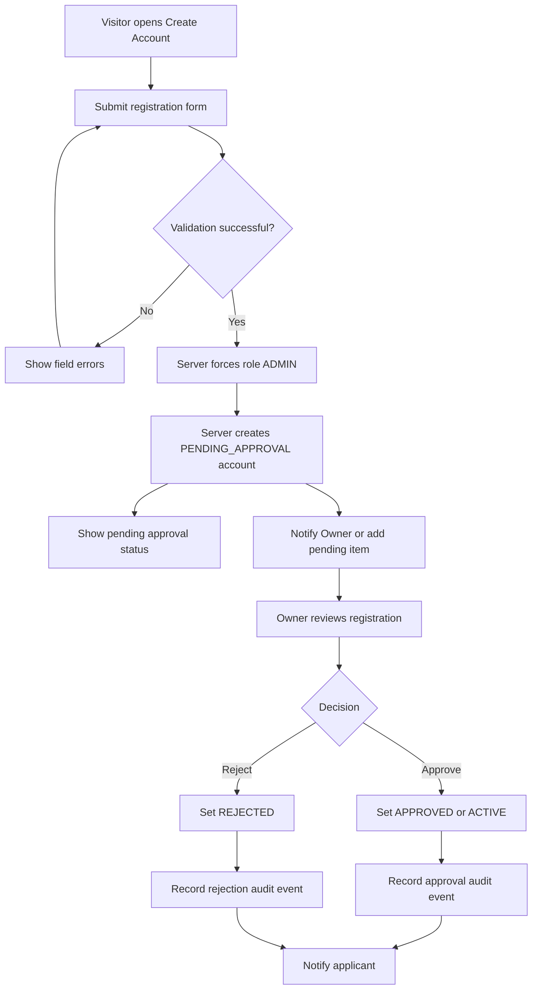
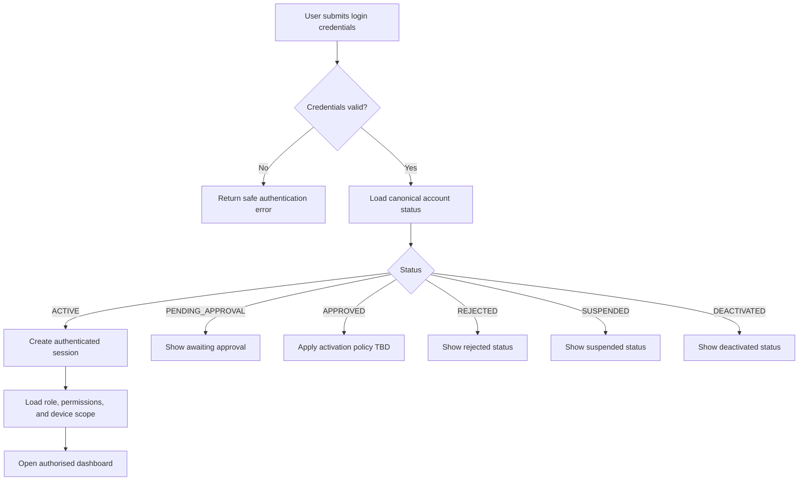
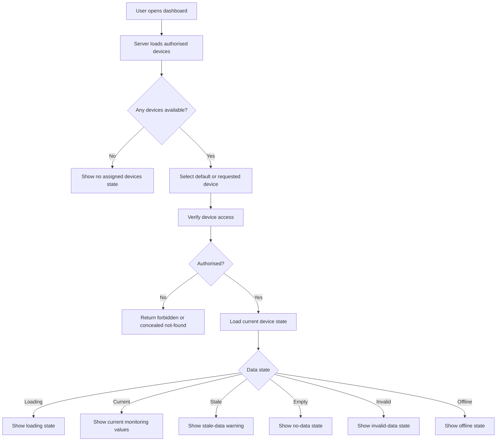
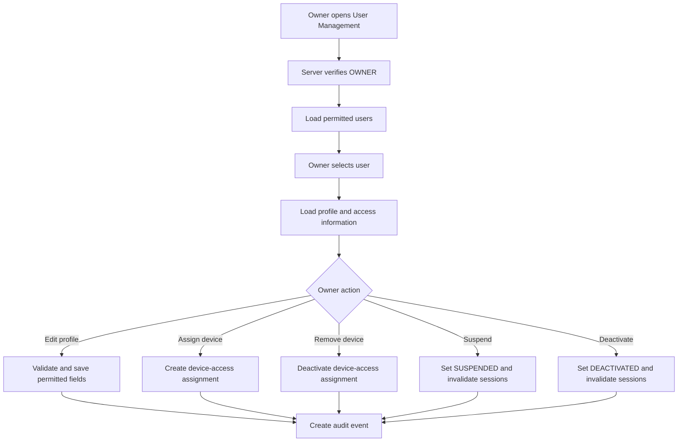
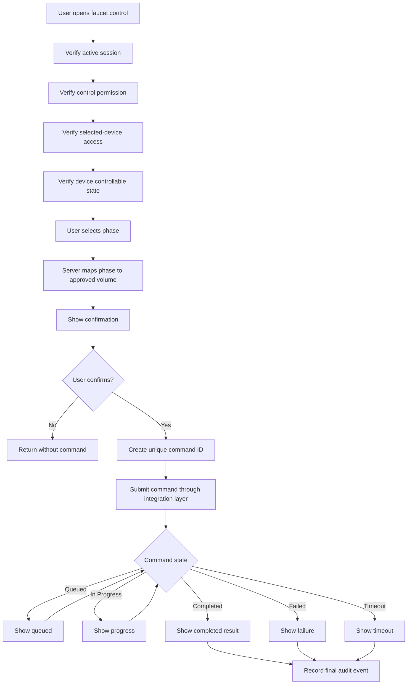
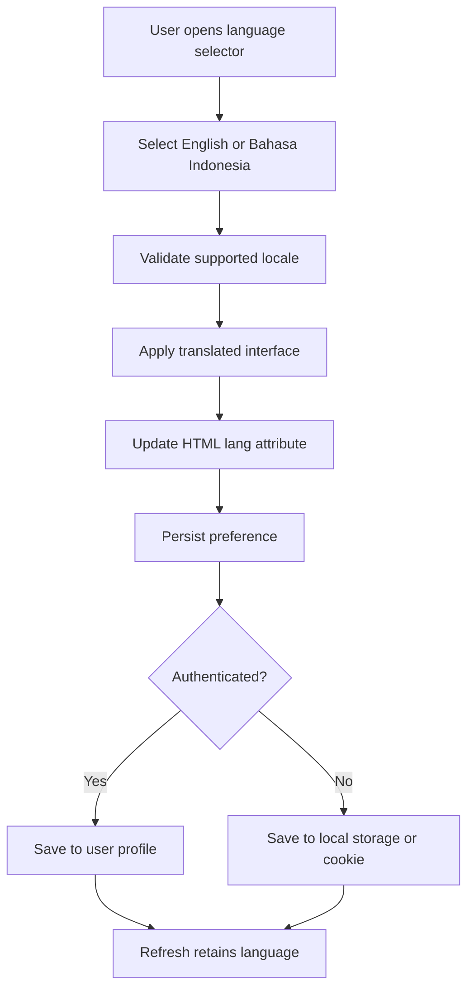

# User Flows Specification

## 1. Document Information

| Item | Description |
|---|---|
| Product | Web-Based Soil and Water Monitoring and Faucet Control System |
| Document | User Flows Specification |
| Version | 1.0 |
| Status | Initial specification |
| Supported roles | `OWNER`, `ADMIN` |
| Supported account statuses | `PENDING_APPROVAL`, `APPROVED`, `ACTIVE`, `REJECTED`, `SUSPENDED`, `DEACTIVATED` |
| Related documents | `FRONTEND_AUDIT.md`, `UI_UX.md`, `PRD.md`, `RBAC.md` |

---

## 2. Purpose

This document translates the product and access-control requirements into end-to-end user journeys.

It defines:

- What triggers each flow.
- Which role may perform it.
- Which server-side checks are required.
- Which UI states must be shown.
- Which audit events must be recorded.
- Which unresolved decisions remain `TBD`.

This document does not define sensor calibration, hardware measurement logic, ESP32 firmware, physical faucet behaviour, or final communication protocol details.

---

## 3. Global Flow Rules

The following rules apply to all flows:

1. Protected pages require a valid authenticated session.
2. Protected server actions require server-side authorisation.
3. Hidden or disabled frontend controls do not replace server-side permission checks.
4. Device-specific actions require device-level access checks.
5. Monitoring permission does not automatically grant faucet-control permission.
6. Public registration always creates an `ADMIN` with `PENDING_APPROVAL`.
7. Public registration must never create an `OWNER`.
8. Admins may manage only their own profile.
9. Owners may manage other users within the authorised scope.
10. Language selection must never alter permissions or account status.
11. Canonical internal values must remain untranslated.
12. Unresolved behaviour is marked `TBD`.
13. Sensor thresholds, units, refresh intervals, hardware execution rules, and alert limits must not be invented by the frontend.

---

## 4. Shared Actors

### 4.1 Unauthenticated Visitor

A person without a valid application session.

### 4.2 Prospective Admin

A visitor submitting an Admin account registration request.

### 4.3 Owner

An active user with role `OWNER`.

### 4.4 Admin

An active user with role `ADMIN`.

### 4.5 System

The web frontend, authenticated backend, database, authorisation layer, and device-integration service.

### 4.6 Device

An ESP32/NodeMCU device registered in the system.

---

# 5. Core Flow Diagrams

## 5.1 Admin Registration and Owner Approval



## 5.2 Login and Account-Status Validation



## 5.3 Device Selection and Monitoring



## 5.4 Owner User Management



## 5.5 Faucet Command Flow



## 5.6 Language Switching



---

# 6. Authentication and Account Flows

## Flow 1 — Unauthenticated Visitor Opens the Website

**Primary actor:** Unauthenticated Visitor  
**Preconditions:** No valid session exists.  
**Trigger:** Visitor opens the root URL or a protected route.

**Main success flow:**

1. The frontend requests the route.
2. The server checks for a valid session.
3. The server finds no authenticated session.
4. The system redirects the visitor to the login page.
5. The login page displays links or actions for login and account creation.

**Alternative flows:**

- The visitor opens the create-account page directly.
- The visitor opens an explicitly approved public legal or help page.

**Error flows:**

- When session validation fails because of a server error, the system displays a safe error state and does not expose protected content.

**Postconditions:** No protected data is disclosed.  
**Required permissions:** None.  
**Relevant account statuses:** None.  
**UI states:** Login page, loading, authentication service error.  
**Audit events:** Optional protected-route access denial.  
**Open decisions:** Which public pages, besides login and registration, are allowed.

---

## Flow 2 — Admin Account Registration

**Primary actor:** Prospective Admin  
**Preconditions:** Visitor is not authenticated.  
**Trigger:** Visitor submits the create-account form.

**Main success flow:**

1. The visitor enters required registration fields.
2. The frontend validates basic format and required fields.
3. The frontend submits the registration request.
4. The server validates the request independently.
5. The server verifies that the email or username is not already in use.
6. The server ignores or rejects any client-supplied role or account status.
7. The server assigns role `ADMIN`.
8. The server assigns status `PENDING_APPROVAL`.
9. The server stores the new account securely.
10. The system creates an account-registration audit event.
11. The system makes the registration visible to an Owner.
12. The applicant sees an approval-pending message.

**Alternative flows:**

- The system sends an approval-request notification to an Owner.
- The applicant receives an email confirming that registration was received.

**Error flows:**

- Duplicate email or username.
- Password does not satisfy policy.
- Invalid required field.
- Registration service unavailable.
- Rate limit exceeded.

**Postconditions:** A pending Admin account exists but cannot access protected pages.  
**Required permissions:** `account.register`.  
**Relevant account statuses:** Created as `PENDING_APPROVAL`.  
**UI states:** Form, submitting, success/pending, validation error, server error.  
**Audit events:** `account.registration.created`.  
**Open decisions:** Required profile fields, email verification, notification channel.

---

## Flow 3 — Registration Validation Failure

**Primary actor:** Prospective Admin  
**Preconditions:** Registration form is open.  
**Trigger:** Submitted data fails validation.

**Main success flow:**

1. The frontend identifies client-detectable errors.
2. The frontend highlights affected fields.
3. The server independently validates submitted data.
4. The server returns structured validation errors.
5. The frontend maps errors to translated messages.
6. The user corrects the data and resubmits.

**Alternative flows:**

- The server returns a general error when revealing the exact cause would create security risk.

**Error flows:**

- Translation key missing: fallback language is used.
- Network interruption: form data remains available where practical.

**Postconditions:** No account is created.  
**Required permissions:** None.  
**Relevant account statuses:** None.  
**UI states:** Inline field errors, error summary, retry.  
**Audit events:** Optional rejected registration attempt; no sensitive data stored.  
**Open decisions:** Password policy and rate-limit thresholds.

---

## Flow 4 — Admin Waiting for Owner Approval

**Primary actor:** Prospective Admin  
**Preconditions:** Account exists with `PENDING_APPROVAL`.  
**Trigger:** Applicant opens the account-status page or attempts login.

**Main success flow:**

1. The system identifies the account as `PENDING_APPROVAL`.
2. The system does not create a protected session.
3. The system displays a translated approval-pending message.
4. The message explains that an Owner must approve access.
5. The system provides approved support or logout actions.

**Alternative flows:**

- The applicant may resend a verification or status notification if implemented.
- The applicant may update limited registration details if the final policy permits it.

**Error flows:**

- The system must not incorrectly treat `PENDING_APPROVAL` as active.
- The system must not disclose Owner identities unless approved.

**Postconditions:** The user remains unable to access protected features.  
**Required permissions:** `account.status.read.self`.  
**Relevant account statuses:** `PENDING_APPROVAL`.  
**UI states:** Waiting approval, contact support, retry status.  
**Audit events:** Optional status-view event.  
**Open decisions:** Whether pending users can edit registration data.

---

## Flow 5 — Owner Views Pending Registrations

**Primary actor:** Owner  
**Preconditions:** Owner is authenticated and `ACTIVE`.  
**Trigger:** Owner opens the pending-approvals page.

**Main success flow:**

1. The server validates the session.
2. The server verifies role `OWNER`.
3. The server verifies `account.approve` or equivalent review permission.
4. The server loads accounts with `PENDING_APPROVAL`.
5. The frontend displays pending users without exposing secrets.
6. The Owner opens a registration record.
7. The system displays submitted profile information and approval history.

**Alternative flows:**

- No pending registrations exist; the system displays an empty state.
- Multiple Owners are reviewing the same request; current status is refreshed before action.

**Error flows:**

- Admin requests the endpoint: server returns `403`.
- Registration no longer exists or is already decided: display updated state.

**Postconditions:** No account status changes until the Owner acts.  
**Required permissions:** `account.approve` and/or `account.reject`.  
**Relevant account statuses:** Owner `ACTIVE`; targets `PENDING_APPROVAL`.  
**UI states:** Loading, list, empty, details, stale decision.  
**Audit events:** Optional approval-record view.  
**Open decisions:** Multiple-Owner policy.

---

## Flow 6 — Owner Approves an Admin

**Primary actor:** Owner  
**Preconditions:** Owner is active; target is `PENDING_APPROVAL`.  
**Trigger:** Owner confirms approval.

**Main success flow:**

1. The frontend asks for confirmation.
2. The server validates the Owner session and permission.
3. The server reloads the target account and verifies current status.
4. The server prevents duplicate or conflicting decisions.
5. The server changes status to `APPROVED` or `ACTIVE` according to the final activation policy.
6. The server records acting Owner, previous status, new status, timestamp, and optional note.
7. The system notifies the applicant through the configured channel.
8. The Owner sees confirmation.

**Alternative flows:**

- If email verification or another activation step is required, status becomes `APPROVED` before `ACTIVE`.

**Error flows:**

- Target already approved or rejected: return `409 Conflict`.
- Owner loses permission during the operation: return `403`.
- Notification fails: approval remains valid, notification failure is recorded.

**Postconditions:** Account is approved; access depends on final activation status.  
**Required permissions:** `account.approve`, possibly `account.activate`.  
**Relevant account statuses:** Target `PENDING_APPROVAL`.  
**UI states:** Confirmation, processing, success, conflict, error.  
**Audit events:** `account.approved`; optionally `account.activated`.  
**Open decisions:** Whether approval directly produces `ACTIVE`.

---

## Flow 7 — Owner Rejects an Admin

**Primary actor:** Owner  
**Preconditions:** Owner is active; target is `PENDING_APPROVAL`.  
**Trigger:** Owner confirms rejection.

**Main success flow:**

1. The Owner selects reject.
2. The UI requests confirmation and optional reason.
3. The server validates Owner permission.
4. The server verifies the target is still pending.
5. The server changes status to `REJECTED`.
6. The system records the decision.
7. The system notifies the applicant through the configured channel.
8. The Owner sees confirmation.

**Alternative flows:**

- A rejection reason may be mandatory if policy requires it.

**Error flows:**

- Target already decided: return conflict.
- Notification fails: rejection remains effective.

**Postconditions:** Target cannot access protected pages.  
**Required permissions:** `account.reject`.  
**Relevant account statuses:** Target `PENDING_APPROVAL` to `REJECTED`.  
**UI states:** Confirmation, reason field, success, conflict.  
**Audit events:** `account.rejected`.  
**Open decisions:** Reapplication and appeal process.

---

## Flow 8 — Approved Admin Logs In

**Primary actor:** Admin  
**Preconditions:** Account is `ACTIVE`; valid credentials exist.  
**Trigger:** Admin submits login form.

**Main success flow:**

1. The server validates credentials.
2. The server loads canonical role and status.
3. The server verifies status `ACTIVE`.
4. The server creates a secure session.
5. The server loads permissions and assigned devices.
6. The frontend redirects to the authorised landing page.
7. The interface displays only permitted navigation items.

**Alternative flows:**

- No devices are assigned; dashboard opens with a no-assigned-devices state.

**Error flows:**

- Invalid credentials.
- Authentication service failure.
- Account changed to suspended before session creation.

**Postconditions:** Admin has an authenticated session with current permissions.  
**Required permissions:** None beyond active account eligibility.  
**Relevant account statuses:** `ACTIVE`.  
**UI states:** Login, loading, dashboard, no devices.  
**Audit events:** `auth.login.success`; failures as appropriate.  
**Open decisions:** Session duration and multi-factor authentication.

---

## Flow 9 — Pending Admin Attempts to Log In

**Primary actor:** Admin applicant  
**Preconditions:** Account status `PENDING_APPROVAL`.  
**Trigger:** Login attempt.

**Main success flow:**

1. The server validates credentials.
2. The server loads status `PENDING_APPROVAL`.
3. The server refuses protected-session creation.
4. The system displays an approval-pending message.

**Alternative flows:** None.  
**Error flows:** The frontend must not redirect to protected pages.  
**Postconditions:** No protected session exists.  
**Required permissions:** `account.status.read.self` only.  
**Relevant account statuses:** `PENDING_APPROVAL`.  
**UI states:** Pending approval.  
**Audit events:** Optional blocked login by status.  
**Open decisions:** Whether a limited status session is used.

---

## Flow 10 — Rejected Admin Attempts to Log In

**Primary actor:** Rejected applicant  
**Preconditions:** Account status `REJECTED`.  
**Trigger:** Login attempt.

**Main success flow:**

1. The server validates credentials without exposing sensitive details.
2. The server identifies `REJECTED`.
3. The server denies protected access.
4. The system displays an appropriate rejected-account message.

**Alternative flows:** Provide approved support or reapplication instructions.  
**Error flows:** Do not disclose internal review notes unless policy allows.  
**Postconditions:** No protected session exists.  
**Required permissions:** Limited self-status access.  
**Relevant account statuses:** `REJECTED`.  
**UI states:** Rejected status.  
**Audit events:** Optional blocked login.  
**Open decisions:** Reapplication policy.

---

## Flow 11 — Suspended or Deactivated User Attempts to Log In

**Primary actor:** Owner or Admin with restricted status  
**Preconditions:** Account is `SUSPENDED` or `DEACTIVATED`.  
**Trigger:** Login attempt.

**Main success flow:**

1. The server validates credentials.
2. The server loads account status.
3. The server refuses session creation.
4. The system displays a safe status-specific message.
5. The system provides approved support instructions where applicable.

**Alternative flows:** A suspended user may later be reactivated by an Owner.  
**Error flows:** Existing stale sessions must not remain authorised.  
**Postconditions:** Protected access remains blocked.  
**Required permissions:** None.  
**Relevant account statuses:** `SUSPENDED`, `DEACTIVATED`.  
**UI states:** Suspended, deactivated.  
**Audit events:** Blocked login; status-change event already exists.  
**Open decisions:** Reactivation process.

---

## Flow 12 — User Logs Out

**Primary actor:** Owner or Admin  
**Preconditions:** Valid session exists.  
**Trigger:** User selects logout.

**Main success flow:**

1. The frontend submits a logout request.
2. The server invalidates the session.
3. Local session state and protected caches are cleared.
4. The user is redirected to login.
5. Back navigation does not reveal protected data.

**Alternative flows:** Automatic logout after session expiry.  
**Error flows:** If network logout fails, local credentials are still cleared and the server session expires according to policy.  
**Postconditions:** No valid application session remains.  
**Required permissions:** Authenticated user.  
**Relevant account statuses:** Normally `ACTIVE`.  
**UI states:** Logging out, login page.  
**Audit events:** Optional `auth.logout`.  
**Open decisions:** Session revocation mechanism.

---

# 7. Profile and User-Management Flows

## Flow 13 — Owner Views Their Own Profile

**Primary actor:** Owner  
**Preconditions:** Active Owner session.  
**Trigger:** Owner opens profile.

**Main success flow:**

1. The server verifies the session.
2. The server checks `profile.self.read`.
3. The server returns the Owner's permitted profile data.
4. The frontend displays system-managed fields as read-only.

**Alternative flows:** Profile data is partially unavailable; show an error without exposing secrets.  
**Error flows:** Session expired: redirect to login.  
**Postconditions:** No data changes.  
**Required permissions:** `profile.self.read`.  
**Relevant account statuses:** `ACTIVE`.  
**UI states:** Loading, profile, error.  
**Audit events:** Normally none.  
**Open decisions:** Exact profile fields.

---

## Flow 14 — Owner Edits Their Own Profile

**Primary actor:** Owner  
**Preconditions:** Active Owner; profile open.  
**Trigger:** Owner submits changes.

**Main success flow:**

1. The frontend permits editing only approved fields.
2. The server verifies `profile.self.update`.
3. The server ignores or rejects role and status changes in this flow.
4. The server validates fields.
5. The server saves permitted changes.
6. The system records an audit event.
7. The frontend shows success.

**Alternative flows:** Email change requires reverification: `TBD`.  
**Error flows:** Validation failure, duplicate email, stale version conflict.  
**Postconditions:** Own profile is updated.  
**Required permissions:** `profile.self.update`.  
**Relevant account statuses:** `ACTIVE`.  
**UI states:** Edit, saving, success, validation errors.  
**Audit events:** `profile.self.updated`.  
**Open decisions:** Editable fields and email-change policy.

---

## Flow 15 — Owner Views Another User's Profile

**Primary actor:** Owner  
**Preconditions:** Active Owner; target user exists within scope.  
**Trigger:** Owner selects a user.

**Main success flow:**

1. The server verifies role and `profile.other.read`.
2. The server verifies target-user scope.
3. The server returns permitted profile and access data.
4. The frontend displays role, status, device assignments, and approval history as allowed.

**Alternative flows:** Target is another Owner; behaviour is `TBD`.  
**Error flows:** Out-of-scope target returns forbidden or concealed not-found.  
**Postconditions:** No data changes.  
**Required permissions:** `profile.other.read`.  
**Relevant account statuses:** Owner `ACTIVE`; target any retained status.  
**UI states:** Loading, user profile, not found, forbidden.  
**Audit events:** Optional sensitive profile view.  
**Open decisions:** Multiple-Owner management.

---

## Flow 16 — Owner Edits Another User's Permitted Profile Fields

**Primary actor:** Owner  
**Preconditions:** Owner may manage target user.  
**Trigger:** Owner submits edits.

**Main success flow:**

1. The frontend shows only Owner-editable fields.
2. The server validates `profile.other.update`.
3. The server verifies target scope.
4. The server validates field-level permissions.
5. The server saves approved changes.
6. The server records before/after values where appropriate.
7. The frontend confirms success.

**Alternative flows:** Role or status changes use separate dedicated actions.  
**Error flows:** Attempt to edit immutable or secret fields is rejected.  
**Postconditions:** Target profile is updated.  
**Required permissions:** `profile.other.update`.  
**Relevant account statuses:** Owner `ACTIVE`; target varies.  
**UI states:** Edit, saving, success, field errors.  
**Audit events:** `profile.other.updated`.  
**Open decisions:** Exact Owner-editable fields.

---

## Flow 17 — Owner Suspends or Deactivates an Admin

**Primary actor:** Owner  
**Preconditions:** Active Owner; target is an Admin within scope.  
**Trigger:** Owner confirms suspension or deactivation.

**Main success flow:**

1. The UI displays consequences and requires confirmation.
2. The server verifies `account.suspend` or `account.deactivate`.
3. The server verifies the target role and current status.
4. The server updates account status.
5. The system invalidates or restricts existing sessions as soon as practical.
6. The system records the action and reason.
7. The Owner receives confirmation.

**Alternative flows:** Owner reactivates a suspended Admin if policy permits.  
**Error flows:** Admin already deactivated; target is unauthorised; session invalidation service fails.  
**Postconditions:** Target loses protected access.  
**Required permissions:** `account.suspend` or `account.deactivate`.  
**Relevant account statuses:** Target usually `ACTIVE`.  
**UI states:** Confirmation, processing, success, conflict.  
**Audit events:** `account.suspended` or `account.deactivated`.  
**Open decisions:** Reactivation process and mandatory reasons.

---

## Flow 18 — Admin Views Their Own Profile

**Primary actor:** Admin  
**Preconditions:** Active Admin session.  
**Trigger:** Admin opens profile.

**Main success flow:**

1. The server verifies `profile.self.read`.
2. The server uses the authenticated user ID, not a client-selected user ID.
3. The system returns only the Admin's own profile.
4. The frontend displays role and account status as read-only.

**Alternative flows:** None.  
**Error flows:** Session expired.  
**Postconditions:** No data changes.  
**Required permissions:** `profile.self.read`.  
**Relevant account statuses:** `ACTIVE`.  
**UI states:** Loading, profile, error.  
**Audit events:** Normally none.  
**Open decisions:** Exact fields.

---

## Flow 19 — Admin Edits Their Own Profile

**Primary actor:** Admin  
**Preconditions:** Active Admin.  
**Trigger:** Admin saves permitted changes.

**Main success flow:**

1. The frontend submits permitted fields.
2. The server identifies the target from the session.
3. The server verifies `profile.self.update`.
4. The server rejects role, account-status, device-assignment, and approval changes.
5. The server validates and saves permitted fields.
6. The system records an audit event.
7. The frontend shows success.

**Alternative flows:** Password update uses a dedicated flow.  
**Error flows:** Invalid data, duplicate email, unauthorised field injection.  
**Postconditions:** Admin's own profile is updated.  
**Required permissions:** `profile.self.update`.  
**Relevant account statuses:** `ACTIVE`.  
**UI states:** Edit, saving, success, validation error.  
**Audit events:** `profile.self.updated`.  
**Open decisions:** Email-change policy.

---

## Flow 20 — Admin Attempts to Access Another User's Profile

**Primary actor:** Admin  
**Preconditions:** Active Admin.  
**Trigger:** Admin changes a URL, request body, or API parameter to another user ID.

**Main success flow:**

1. The server validates the session.
2. The server sees that the requested target is not the authenticated Admin.
3. The server verifies the Admin lacks `profile.other.read` or `profile.other.update`.
4. The server returns `403` or concealed `404`.
5. No private profile data is returned.

**Alternative flows:** None.  
**Error flows:** Frontend may show a generic access-denied page.  
**Postconditions:** No unauthorised access occurs.  
**Required permissions:** Missing by design.  
**Relevant account statuses:** `ACTIVE`.  
**UI states:** Forbidden or not found.  
**Audit events:** High-risk authorisation denial may be recorded.  
**Open decisions:** Whether to use `403` or concealed `404`.

---

# 8. Device-Assignment Flows

## Flow 21 — Owner Assigns a Device to an Admin

**Primary actor:** Owner  
**Preconditions:** Owner active; target Admin and device are within scope.  
**Trigger:** Owner confirms assignment.

**Main success flow:**

1. The Owner opens the Admin's access settings.
2. The system loads devices available for assignment.
3. The Owner selects a device.
4. The server verifies `device.assign`.
5. The server verifies target user and device scope.
6. The server creates or activates the assignment.
7. The system records who assigned it and when.
8. The Admin's effective access updates.

**Alternative flows:** Existing assignment is already active; system reports no change.  
**Error flows:** Device inactive, target not Admin, out-of-scope resource, duplicate conflict.  
**Postconditions:** Admin may access the device according to granted permissions.  
**Required permissions:** `device.assign`.  
**Relevant account statuses:** Owner `ACTIVE`; Admin usually `ACTIVE`.  
**UI states:** Device list, selected, saving, success.  
**Audit events:** `device.access.assigned`.  
**Open decisions:** Site/organisation scope and whether pending Admins can receive assignments.

---

## Flow 22 — Owner Removes Device Access from an Admin

**Primary actor:** Owner  
**Preconditions:** Active assignment exists.  
**Trigger:** Owner confirms removal.

**Main success flow:**

1. The server verifies `device.unassign`.
2. The server verifies assignment scope.
3. The system deactivates the assignment.
4. Effective access is revoked.
5. Current or subsequent device requests are denied.
6. Relevant live views stop receiving new device data.
7. The system records the removal.

**Alternative flows:** No active assignment exists; return no-op or conflict.  
**Error flows:** Active faucet command exists: handling is `TBD`.  
**Postconditions:** Admin can no longer access the device.  
**Required permissions:** `device.unassign`.  
**Relevant account statuses:** Owner and Admin generally `ACTIVE`.  
**UI states:** Confirmation, success, revoked access.  
**Audit events:** `device.access.removed`.  
**Open decisions:** Behaviour during active control sessions.

---

# 9. Monitoring Flows

## Flow 23 — User Opens the Monitoring Dashboard

**Primary actor:** Owner or Admin  
**Preconditions:** Active authenticated session.  
**Trigger:** User opens dashboard.

**Main success flow:**

1. The server validates session and account status.
2. The server loads devices within the user's scope.
3. The frontend loads dashboard shell and available devices.
4. The system selects a default device according to the final rule.
5. The system loads current monitoring data.
6. The dashboard displays soil, water, tank, flow, status, and timestamp components.

**Alternative flows:** No assigned devices; show dedicated state.  
**Error flows:** Device or monitoring service unavailable.  
**Postconditions:** Authorised monitoring context is visible.  
**Required permissions:** `device.read`, `monitoring.current.read`.  
**Relevant account statuses:** `ACTIVE`.  
**UI states:** Loading, dashboard, no devices, error.  
**Audit events:** Normally none.  
**Open decisions:** Default device-selection rule.

---

## Flow 24 — User Selects a Device

**Primary actor:** Owner or Admin  
**Preconditions:** User has access to more than one device.  
**Trigger:** User selects a device.

**Main success flow:**

1. The frontend identifies the selected device ID.
2. The server verifies the user may access that device.
3. The system clears or marks previous device data as transitioning.
4. The system loads the selected device's latest status and data.
5. All device-specific components update consistently.
6. The selected device is retained where appropriate.

**Alternative flows:** Device becomes unavailable during selection.  
**Error flows:** Unauthorised device ID; load failure.  
**Postconditions:** All visible data belongs to one selected device.  
**Required permissions:** `device.read`, relevant monitoring permissions.  
**Relevant account statuses:** `ACTIVE`.  
**UI states:** Device changing, loading, loaded, forbidden.  
**Audit events:** Normally none.  
**Open decisions:** URL, session, or local persistence of selected device.

---

## Flow 25 — User Has No Assigned Devices

**Primary actor:** Admin, or Owner with no scope  
**Preconditions:** Active user has zero authorised devices.  
**Trigger:** Dashboard loads.

**Main success flow:**

1. The server returns an empty authorised-device list.
2. The frontend does not request arbitrary devices.
3. The dashboard shows a no-assigned-devices state.
4. Monitoring and control components remain unavailable.
5. The UI provides appropriate next steps.

**Alternative flows:** Owner may open device-management features if permitted.  
**Error flows:** Empty list must not be confused with loading failure.  
**Postconditions:** No device data is shown.  
**Required permissions:** Authenticated access only.  
**Relevant account statuses:** `ACTIVE`.  
**UI states:** Empty device assignment.  
**Audit events:** None.  
**Open decisions:** Admin support message and Owner device-creation permissions.

---

## Flow 26 — Selected Device Is Online

**Primary actor:** Owner or Admin  
**Preconditions:** Selected device is authorised and currently online.  
**Trigger:** Device state is received.

**Main success flow:**

1. The system displays online status.
2. The system shows last-seen timestamp.
3. Current monitoring values are loaded.
4. Controls are evaluated independently for permission and controllable state.

**Alternative flows:** Data is stale although connection is online; stale state takes precedence for data components.  
**Error flows:** Conflicting status sources are resolved according to the communication specification.  
**Postconditions:** Online device state is visible.  
**Required permissions:** `device.read`.  
**Relevant account statuses:** User `ACTIVE`.  
**UI states:** Online badge, current data.  
**Audit events:** Device status events may be recorded.  
**Open decisions:** Online heartbeat and stale thresholds.

---

## Flow 27 — Selected Device Is Offline

**Primary actor:** Owner or Admin  
**Preconditions:** Selected device is authorised but offline.  
**Trigger:** Offline status or heartbeat timeout.

**Main success flow:**

1. The system displays offline status prominently.
2. The system displays last-seen timestamp.
3. Current values may remain visible as historical last-known values, clearly labelled.
4. Faucet-control actions are disabled in the UI.
5. The backend rejects control requests for the offline device.
6. Historical data remains accessible where permitted.

**Alternative flows:** Device reconnects and status updates automatically.  
**Error flows:** Unknown state is not falsely labelled online.  
**Postconditions:** User understands that live communication is unavailable.  
**Required permissions:** `device.read`; control separately denied by state.  
**Relevant account statuses:** `ACTIVE`.  
**UI states:** Offline, last known data, control unavailable.  
**Audit events:** Device offline event if supported.  
**Open decisions:** Offline threshold.

---

## Flow 28 — Monitoring Data Is Loading

**Primary actor:** Owner or Admin  
**Preconditions:** Monitoring request is in progress.  
**Trigger:** Dashboard or device change.

**Main success flow:**

1. The frontend shows skeletons or loading indicators.
2. Previous device values are not presented as belonging to the new device.
3. Controls requiring current state remain unavailable until validation completes.
4. The loading state ends on success or failure.

**Alternative flows:** Cached data may be shown only when clearly labelled.  
**Error flows:** Request timeout transitions to error or stale state.  
**Postconditions:** No misleading data is shown.  
**Required permissions:** Relevant read permissions.  
**Relevant account statuses:** `ACTIVE`.  
**UI states:** Loading.  
**Audit events:** None.  
**Open decisions:** Cache policy.

---

## Flow 29 — Monitoring Data Is Empty

**Primary actor:** Owner or Admin  
**Preconditions:** Device is authorised but has no readings for the requested context.  
**Trigger:** Server returns no measurements.

**Main success flow:**

1. The system distinguishes no data from zero values.
2. The UI displays a translated no-data message.
3. Each affected component avoids displaying fabricated values.
4. Historical filters may be adjusted.

**Alternative flows:** Some metrics have values while others are empty.  
**Error flows:** Empty response must not be rendered as `0`.  
**Postconditions:** Data absence is clear.  
**Required permissions:** Relevant read permission.  
**Relevant account statuses:** `ACTIVE`.  
**UI states:** Empty metric or empty page.  
**Audit events:** None.  
**Open decisions:** Partial-data presentation standards.

---

## Flow 30 — Monitoring Data Is Stale

**Primary actor:** Owner or Admin  
**Preconditions:** Latest reading exceeds the stale threshold.  
**Trigger:** Data freshness evaluation.

**Main success flow:**

1. The system compares the latest timestamp with the configured stale threshold.
2. The UI labels the data as stale.
3. The last update time remains visible.
4. The system avoids representing stale data as current.
5. Faucet control evaluates device and state rules independently.

**Alternative flows:** Device remains online but readings are stale.  
**Error flows:** Missing timestamp is treated as unknown or invalid, not current.  
**Postconditions:** User sees last-known values with a warning.  
**Required permissions:** Relevant monitoring read permission.  
**Relevant account statuses:** `ACTIVE`.  
**UI states:** Stale warning.  
**Audit events:** Optional stale-data alert.  
**Open decisions:** Exact stale threshold.

---

## Flow 31 — Monitoring Data Is Invalid

**Primary actor:** Owner or Admin  
**Preconditions:** Payload or value fails the agreed contract.  
**Trigger:** Validation failure.

**Main success flow:**

1. The backend rejects or quarantines invalid data.
2. The system preserves the last valid reading where appropriate.
3. The UI marks the affected metric as invalid or unavailable.
4. The UI does not display a fabricated replacement.
5. The system records a validation or integration event.

**Alternative flows:** Only one field is invalid; unaffected fields remain visible if contract permits partial acceptance.  
**Error flows:** Repeated invalid payloads may generate an alert.  
**Postconditions:** Invalid values do not silently replace valid data.  
**Required permissions:** Monitoring read to view state.  
**Relevant account statuses:** `ACTIVE`.  
**UI states:** Invalid metric, integration error.  
**Audit events:** Device payload validation event.  
**Open decisions:** Partial-payload acceptance.

---

## Flow 32 — User Views Historical Data

**Primary actor:** Owner or Admin  
**Preconditions:** Active user; device authorised.  
**Trigger:** User opens history.

**Main success flow:**

1. The server verifies `monitoring.history.read`.
2. The user selects or retains a device.
3. The server verifies device access.
4. The system loads default date range and metrics.
5. The frontend displays charts or tables.
6. Missing intervals are shown as gaps, not zeros.
7. Dates and numbers use the active locale.

**Alternative flows:** No history exists; show empty state.  
**Error flows:** Date range too large, query failure, unauthorised device.  
**Postconditions:** Historical data is visible for one authorised device.  
**Required permissions:** `monitoring.history.read`.  
**Relevant account statuses:** `ACTIVE`.  
**UI states:** Loading, chart, table, empty, error.  
**Audit events:** Normally none; exports separately audited if needed.  
**Open decisions:** Default range, retention, aggregation, export.

---

## Flow 33 — User Changes the Historical Date Range

**Primary actor:** Owner or Admin  
**Preconditions:** History page open.  
**Trigger:** User submits a new range.

**Main success flow:**

1. The frontend validates date order.
2. The server validates range and maximum query limit.
3. The server verifies device access again.
4. The system returns data for the requested period.
5. Charts and tables update.
6. The selected range remains visible.

**Alternative flows:** Aggregation level changes automatically for long periods.  
**Error flows:** Invalid range, unsupported future dates, excessive range.  
**Postconditions:** History reflects the selected period.  
**Required permissions:** `monitoring.history.read`.  
**Relevant account statuses:** `ACTIVE`.  
**UI states:** Filtering, loading, results, range error.  
**Audit events:** None.  
**Open decisions:** Maximum range and aggregation rules.

---

# 10. Language Flow

## Flow 34 — User Changes the Website Language

**Primary actor:** Owner or Admin; optionally unauthenticated visitor  
**Preconditions:** Language selector is available.  
**Trigger:** User selects English or Bahasa Indonesia.

**Main success flow:**

1. The system validates that the locale is supported.
2. The frontend applies translated text.
3. The HTML `lang` attribute updates.
4. Dates, times, and numbers use locale-aware formatting where specified.
5. Canonical values and permissions remain unchanged.
6. For authenticated users, the preference is saved to their profile.
7. For unauthenticated users, the preference is stored locally or in a cookie.

**Alternative flows:** Missing translation falls back to the configured fallback language.  
**Error flows:** Unsupported locale is rejected and fallback is applied.  
**Postconditions:** Interface language changes without changing access.  
**Required permissions:** `language.self.update` for authenticated persistence.  
**Relevant account statuses:** Any page-eligible status.  
**UI states:** Language menu, applying, applied.  
**Audit events:** Usually none, or preference update.  
**Open decisions:** Default and fallback locale.

---

## Flow 35 — User Refreshes After Changing Language

**Primary actor:** Owner, Admin, or visitor  
**Preconditions:** A language preference has been stored.  
**Trigger:** Page refresh or new session.

**Main success flow:**

1. The system reads the authenticated profile preference or local preference.
2. The system validates the locale.
3. The interface loads in the saved language.
4. Missing keys use fallback language.
5. Permission checks continue using canonical values.

**Alternative flows:** No saved preference; browser language or default locale is used according to policy.  
**Error flows:** Invalid stored locale is ignored.  
**Postconditions:** Language choice persists.  
**Required permissions:** None for reading own preference.  
**Relevant account statuses:** Any eligible page state.  
**UI states:** Correct locale on initial render.  
**Audit events:** None.  
**Open decisions:** Locale precedence order.

---

# 11. Alert Flows

## Flow 36 — User Views Alerts

**Primary actor:** Owner or Admin  
**Preconditions:** Active session and alert permission.  
**Trigger:** User opens alerts.

**Main success flow:**

1. The server verifies `alert.read`.
2. The server scopes alerts to authorised devices and user role.
3. The frontend displays alert type, severity, device, timestamp, and status.
4. The user may filter alerts where supported.

**Alternative flows:** No alerts; show empty state.  
**Error flows:** Unauthorised device alerts are excluded.  
**Postconditions:** User sees only authorised alerts.  
**Required permissions:** `alert.read`.  
**Relevant account statuses:** `ACTIVE`.  
**UI states:** Loading, list, empty, error.  
**Audit events:** Normally none.  
**Open decisions:** Alert categories and retention.

---

## Flow 37 — User Acknowledges an Alert

**Primary actor:** Owner or permitted Admin  
**Preconditions:** Active alert exists; user has acknowledgement permission.  
**Trigger:** User confirms acknowledgement.

**Main success flow:**

1. The server verifies `alert.acknowledge`.
2. The server verifies device scope.
3. The server verifies alert is still acknowledgeable.
4. The system records acknowledgement user and timestamp.
5. The frontend updates alert state.

**Alternative flows:** Alert already acknowledged; show current state.  
**Error flows:** Admin lacks permission; alert belongs to unauthorised device.  
**Postconditions:** Alert is acknowledged, not deleted.  
**Required permissions:** `alert.acknowledge`.  
**Relevant account statuses:** `ACTIVE`.  
**UI states:** Confirming, acknowledged, conflict.  
**Audit events:** `alert.acknowledged`.  
**Open decisions:** Whether Admins may acknowledge alerts.

---

# 12. Faucet-Control Flows

## Flow 38 — User Opens Faucet Control

**Primary actor:** Owner or Admin  
**Preconditions:** Active session; device selected.  
**Trigger:** User opens control panel.

**Main success flow:**

1. The server verifies device access.
2. The server verifies whether the role/user has `device.control.dispense`.
3. The system loads device control availability.
4. If permitted and controllable, preset controls are enabled.
5. If monitoring-only, controls remain hidden or disabled with an explanation.

**Alternative flows:** Device offline or status unknown.  
**Error flows:** Direct access without permission returns `403`.  
**Postconditions:** Control UI reflects current permission and device state.  
**Required permissions:** `device.control.dispense` for actionable access.  
**Relevant account statuses:** `ACTIVE`.  
**UI states:** Available, permission denied, offline, loading.  
**Audit events:** Normally none.  
**Open decisions:** Role control matrix.

---

## Flow 39 — User Selects Phase 1: 300 mL

**Primary actor:** Authorised control user  
**Preconditions:** Control panel available.  
**Trigger:** User selects Phase 1.

**Main success flow:**

1. The UI selects Phase 1.
2. The UI displays target `300 mL`.
3. The UI does not allow arbitrary target substitution.
4. The system prepares confirmation context.

**Alternative flows:** User changes to another phase before confirming.  
**Error flows:** Preset configuration missing; action is unavailable.  
**Postconditions:** No command exists until confirmation.  
**Required permissions:** `device.control.dispense`.  
**Relevant account statuses:** `ACTIVE`.  
**UI states:** Selected preset.  
**Audit events:** None.  
**Open decisions:** None for target volume.

---

## Flow 40 — User Selects Phase 2: 1,000 mL

Same requirements as Flow 39, with:

- Phase: `2`
- Target volume: `1,000 mL`

No command is created until explicit confirmation.

---

## Flow 41 — User Selects Phase 3: 1,500 mL

Same requirements as Flow 39, with:

- Phase: `3`
- Target volume: `1,500 mL`

No command is created until explicit confirmation.

---

## Flow 42 — User Confirms a Faucet Command

**Primary actor:** Authorised control user  
**Preconditions:** Valid preset selected; device selected.  
**Trigger:** User selects confirm.

**Main success flow:**

1. The frontend sends the selected device and phase.
2. The server validates session and account status.
3. The server verifies `device.control.dispense`.
4. The server verifies access to the selected device.
5. The server verifies device state and conflict policy.
6. The server maps phase to the approved server-side target volume.
7. The server creates a unique command ID.
8. The server stores the command as `QUEUED`.
9. The integration layer receives the command.
10. The frontend displays queued status.

**Alternative flows:** User cancels confirmation; no command is created.  
**Error flows:** Permission missing, device offline, active command conflict, invalid phase.  
**Postconditions:** A traceable command exists.  
**Required permissions:** `device.control.dispense`.  
**Relevant account statuses:** `ACTIVE`.  
**UI states:** Confirming, submitting, queued, denied.  
**Audit events:** `faucet.command.created`.  
**Open decisions:** Concurrency and tank-state validation.

---

## Flow 43 — Faucet Command Is Queued

**Primary actor:** System and user  
**Preconditions:** Command stored as `QUEUED`.  
**Trigger:** Command awaiting transmission or processing.

**Main success flow:**

1. The frontend displays command ID, phase, target, and queued status.
2. The system attempts to submit through the integration layer.
3. The command transitions to `SENT`, `ACKNOWLEDGED`, `IN_PROGRESS`, or failure state.

**Alternative flows:** Queue delay remains visible.  
**Error flows:** Integration unavailable; transition to `FAILED` or `TIMEOUT` according to policy.  
**Postconditions:** Command has an observable state.  
**Required permissions:** Initiating user may view relevant command status.  
**Relevant account statuses:** User session may remain active; command record persists independently.  
**UI states:** Queued.  
**Audit events:** Status transition.  
**Open decisions:** Queue timeout.

---

## Flow 44 — Faucet Command Is in Progress

**Primary actor:** System and user  
**Preconditions:** Device or integration reports `IN_PROGRESS`.  
**Trigger:** Progress update received.

**Main success flow:**

1. The system verifies the update belongs to the command and device.
2. The command status changes to `IN_PROGRESS`.
3. The frontend displays phase and target volume.
4. Actual progress or dispensed volume is shown only when supplied by the contract.
5. Duplicate or out-of-order updates are handled safely.

**Alternative flows:** No numeric progress is available; show status only.  
**Error flows:** Device disconnects; transition according to timeout/failure policy.  
**Postconditions:** User sees current execution state.  
**Required permissions:** Relevant command-history or device access.  
**Relevant account statuses:** Command continues even if UI session closes, subject to hardware rules.  
**UI states:** In progress, optional progress indicator.  
**Audit events:** Command status update.  
**Open decisions:** Progress payload and stop capability.

---

## Flow 45 — Faucet Command Completes Successfully

**Primary actor:** System and user  
**Preconditions:** Valid completion acknowledgement received.  
**Trigger:** Device reports completion.

**Main success flow:**

1. The system verifies command ID and device ID.
2. The system changes status to `COMPLETED`.
3. The system stores actual volume if supplied.
4. The system stores completion timestamp.
5. The frontend displays success and final result.
6. The event appears in control history.

**Alternative flows:** Actual volume is unavailable; show target and completion status only.  
**Error flows:** Duplicate completion is idempotently ignored or reconciled.  
**Postconditions:** Command is final and auditable.  
**Required permissions:** Relevant control-history read.  
**Relevant account statuses:** Not dependent on current UI session.  
**UI states:** Completed.  
**Audit events:** `faucet.command.completed`.  
**Open decisions:** Actual-volume tolerance presentation.

---

## Flow 46 — Faucet Command Fails

**Primary actor:** System and user  
**Preconditions:** Device or integration reports failure.  
**Trigger:** Failure event.

**Main success flow:**

1. The system verifies command association.
2. The system records `FAILED`.
3. The system stores a safe failure reason.
4. The frontend displays failure and recommended next step.
5. The failure appears in history and alerts where configured.

**Alternative flows:** Retry may be offered only if explicitly permitted.  
**Error flows:** Sensitive integration details must not be exposed.  
**Postconditions:** Command is final unless approved retry creates a new command.  
**Required permissions:** Relevant command-history read.  
**Relevant account statuses:** Not dependent on current session.  
**UI states:** Failed.  
**Audit events:** `faucet.command.failed`.  
**Open decisions:** Retry policy.

---

## Flow 47 — Faucet Command Times Out

**Primary actor:** System and user  
**Preconditions:** Expected acknowledgement or completion is not received.  
**Trigger:** Configured timeout expires.

**Main success flow:**

1. The system changes command status to `TIMEOUT`.
2. The system records timeout timestamp and stage.
3. The frontend displays that final physical state may be unknown unless the integration contract confirms otherwise.
4. The system creates an alert where configured.
5. A new command is not automatically issued unless retry policy explicitly allows it.

**Alternative flows:** Late acknowledgement arrives; reconciliation policy is applied.  
**Error flows:** Do not display timeout as confirmed faucet closure or completion.  
**Postconditions:** Command requires review or reconciliation.  
**Required permissions:** Relevant control-history read.  
**Relevant account statuses:** Command record persists.  
**UI states:** Timeout, uncertain state warning.  
**Audit events:** `faucet.command.timeout`.  
**Open decisions:** Timeout duration and late-acknowledgement policy.

---

## Flow 48 — User Attempts Control Without Permission

**Primary actor:** Owner or Admin lacking control permission  
**Preconditions:** User can access monitoring but not control.  
**Trigger:** Direct control request or manipulated frontend.

**Main success flow:**

1. The server validates session.
2. The server finds missing `device.control.dispense`.
3. The server returns `403`.
4. No command is created.
5. The frontend displays access denied.

**Alternative flows:** Control UI is hidden for usability, but server rule remains.  
**Error flows:** None.  
**Postconditions:** No device action occurs.  
**Required permissions:** Missing by design.  
**Relevant account statuses:** `ACTIVE`.  
**UI states:** Forbidden.  
**Audit events:** High-risk denial may be recorded.  
**Open decisions:** Final role-to-control mapping.

---

## Flow 49 — User Attempts Control of an Unauthorised Device

**Primary actor:** Owner or Admin  
**Preconditions:** User lacks access to target device.  
**Trigger:** Manipulated device ID or stale device selection.

**Main success flow:**

1. The server verifies control permission.
2. The server separately verifies device assignment/scope.
3. The server denies the request.
4. No command is created.
5. No unauthorised device details are returned.

**Alternative flows:** Return concealed `404` instead of `403`.  
**Error flows:** None.  
**Postconditions:** Device remains unaffected.  
**Required permissions:** Device access missing.  
**Relevant account statuses:** `ACTIVE`.  
**UI states:** Access denied or not found.  
**Audit events:** Suspicious access denial may be recorded.  
**Open decisions:** Error-code concealment policy.

---

## Flow 50 — User Attempts Control While Device Is Offline

**Primary actor:** Authorised control user  
**Preconditions:** Device is offline.  
**Trigger:** User submits control request.

**Main success flow:**

1. The frontend disables control where current state is known.
2. If a request is still submitted, the server checks device state.
3. The server rejects the command before integration submission.
4. The frontend displays offline-device error.

**Alternative flows:** Device reconnects; user must re-confirm a new request.  
**Error flows:** Unknown device state is handled conservatively.  
**Postconditions:** No command is sent to an offline device.  
**Required permissions:** Control permission may exist, but state blocks action.  
**Relevant account statuses:** `ACTIVE`.  
**UI states:** Offline, control disabled, rejection.  
**Audit events:** Optional rejected command attempt.  
**Open decisions:** Definition of controllable/online state.

---

## Flow 51 — User Attempts to Submit a Duplicate Command

**Primary actor:** Authorised control user or network retry  
**Preconditions:** A command request with the same idempotency key or command context already exists.  
**Trigger:** Duplicate submission.

**Main success flow:**

1. The server checks the idempotency or command identifier.
2. The server identifies an existing command.
3. The server does not create a second physical command.
4. The system returns the existing command state.
5. The frontend displays the current command.

**Alternative flows:** A genuinely new request uses a new identifier after user confirmation.  
**Error flows:** Ambiguous duplicate context returns conflict.  
**Postconditions:** One logical command maps to at most one execution request.  
**Required permissions:** `device.control.dispense`.  
**Relevant account statuses:** `ACTIVE`.  
**UI states:** Existing command, conflict.  
**Audit events:** Duplicate request detection.  
**Open decisions:** Idempotency-key generation and retention.

---

## Flow 52 — User Cancels or Stops a Command

**Primary actor:** Authorised user  
**Preconditions:** Command is cancellable; feature is enabled.  
**Trigger:** User selects cancel or stop.

**Main success flow:**

1. The UI requests confirmation.
2. The server verifies `device.control.cancel` or `device.control.stop`.
3. The server verifies command ownership/scope and current state.
4. The server sends the appropriate cancellation or stop instruction.
5. The system tracks acknowledgement and final state.
6. The frontend displays the result.

**Alternative flows:** Command already completed and cannot be cancelled.  
**Error flows:** Stop instruction times out; physical state may be unknown.  
**Postconditions:** Command is cancelled/stopped only when confirmed by the integration contract.  
**Required permissions:** `device.control.cancel` or `device.control.stop`.  
**Relevant account statuses:** `ACTIVE`.  
**UI states:** Confirming, stopping, cancelled, failure.  
**Audit events:** `faucet.command.cancel.requested`, final status.  
**Open decisions:** Whether this feature exists and which roles receive it.

---

# 13. Session and Dynamic-Access Flows

## Flow 53 — Session Expires While User Is Active

**Primary actor:** Owner or Admin  
**Preconditions:** Session exists but expires or becomes invalid.  
**Trigger:** User navigates or performs an action.

**Main success flow:**

1. The next protected request fails session validation.
2. The server returns `401`.
3. The frontend clears protected local state.
4. The user is redirected to login.
5. Unsaved non-sensitive form data may be handled according to policy.

**Alternative flows:** Silent session renewal if securely implemented.  
**Error flows:** Protected cached data must not remain visible indefinitely.  
**Postconditions:** User must authenticate again.  
**Required permissions:** None after expiry.  
**Relevant account statuses:** Any.  
**UI states:** Session expired, login.  
**Audit events:** Optional session-expiry event.  
**Open decisions:** Session duration and refresh policy.

---

## Flow 54 — User Role or Device Access Changes During an Active Session

**Primary actor:** Owner changes another user's access; affected Admin is active  
**Preconditions:** Existing active session uses prior permissions.  
**Trigger:** Role, account status, permission, or device assignment changes.

**Main success flow:**

1. The Owner completes an authorised access change.
2. The system updates canonical access records.
3. Subsequent protected requests reload or revalidate effective access.
4. Revoked pages, devices, or actions become unavailable.
5. If the account is suspended or deactivated, the session is invalidated.
6. Live subscriptions to revoked devices are terminated or filtered.
7. The affected UI transitions to an access-changed or session-ended state.

**Alternative flows:** Granted access becomes available after refresh or permission-cache invalidation.  
**Error flows:** Stale cached permissions must not allow continued server actions.  
**Postconditions:** Effective access reflects the latest server state.  
**Required permissions:** Owner change permission; affected user uses updated permissions.  
**Relevant account statuses:** Usually `ACTIVE`, possibly changed to `SUSPENDED` or `DEACTIVATED`.  
**UI states:** Access changed, device removed, session ended.  
**Audit events:** Access-change event.  
**Open decisions:** Permission cache duration and real-time invalidation method.

---

# 14. Shared UI States

All relevant pages and components shall support the following states where applicable:

| State | Required behaviour |
|---|---|
| Loading | Show progress without presenting stale content as current |
| Empty | Explain that no records or devices are available |
| Success | Confirm completed user action |
| Validation error | Identify correctable fields |
| General error | Display a safe translated message and retry option |
| Offline | Clearly identify unavailable device communication |
| Stale | Show last update time and stale warning |
| Invalid | Do not fabricate values |
| Forbidden | Do not expose protected data |
| Session expired | Redirect to login |
| Pending approval | Explain Owner approval requirement |
| Rejected | Explain that access was not approved |
| Suspended | Explain temporary restriction |
| Deactivated | Explain disabled account status |
| Queued | Display pending command state |
| In progress | Display current command state |
| Completed | Display confirmed result |
| Failed | Display safe failure reason |
| Timeout | Warn that final physical state may be uncertain |

---

# 15. Shared Error States

The system shall standardise error handling for:

- `400 Bad Request`: invalid request or validation failure.
- `401 Unauthorized`: no valid session.
- `403 Forbidden`: authenticated but not permitted.
- `404 Not Found`: missing or intentionally concealed resource.
- `409 Conflict`: stale state, duplicate decision, or conflicting active command.
- `422 Unprocessable Entity`: optional structured domain validation.
- `429 Too Many Requests`: rate limit.
- `500 Internal Server Error`: unexpected server failure.
- `503 Service Unavailable`: integration or dependency unavailable.

Error messages shall:

- Be translatable.
- Avoid exposing secrets.
- Avoid exposing internal stack traces.
- Preserve stable machine-readable error codes.
- Offer a clear recovery action where possible.

---

# 16. Required Audit Events

At minimum, the system shall record:

```text
account.registration.created
account.approved
account.rejected
account.activated
account.suspended
account.deactivated
profile.self.updated
profile.other.updated
device.access.assigned
device.access.removed
auth.login.success
auth.login.failed
auth.logout
alert.acknowledged
faucet.command.created
faucet.command.sent
faucet.command.acknowledged
faucet.command.in_progress
faucet.command.completed
faucet.command.failed
faucet.command.timeout
faucet.command.cancel.requested
authorisation.high_risk.denied
```

Each audit event shall include relevant actor, target, timestamp, result, and safe metadata.

---

# 17. Cross-Flow Security Rules

1. Public registration shall force role `ADMIN`.
2. Public registration shall force status `PENDING_APPROVAL`.
3. Protected access shall require status `ACTIVE`.
4. Role and status values from the browser shall never be trusted.
5. An Admin shall never manage another user's profile.
6. An Admin shall never approve, reject, suspend, activate, or deactivate another user.
7. Device access shall be verified for every device-specific request.
8. Monitoring permission shall remain separate from control permission.
9. Phase-to-volume mapping shall be validated on the server.
10. Duplicate commands shall be prevented through idempotency controls.
11. Status updates from devices shall be linked to a valid command and device.
12. Language selection shall not alter role or permission evaluation.
13. Account suspension and deactivation shall invalidate or restrict active sessions.
14. Revoked device access shall take effect on subsequent server requests.
15. Audit records shall not contain passwords, session tokens, device secrets, or private keys.

---

# 18. Open Decisions

1. Whether `APPROVED` and `ACTIVE` remain separate statuses.
2. Exact activation process after Owner approval.
3. Whether email verification is required.
4. Whether rejected applicants may reapply.
5. First Owner provisioning process.
6. Whether multiple Owners are allowed.
7. Owner scope model.
8. Admin device-assignment model details.
9. Default selected device.
10. Monitoring refresh method and interval.
11. Stale and offline thresholds.
12. Historical-data retention and aggregation.
13. Exact alert categories and thresholds.
14. Whether Admins may acknowledge alerts.
15. Whether Owners may control faucets.
16. Whether Admins may control faucets.
17. Whether control permission is role-based, user-based, device-based, or combined.
18. Whether command cancellation is supported.
19. Whether emergency stop is supported.
20. Concurrent-command policy.
21. Command timeout and retry policy.
22. Handling of late device acknowledgements.
23. Actual-volume tolerance presentation.
24. Session duration and renewal.
25. Permission-cache invalidation method.
26. Language default and fallback.
27. Exact editable profile fields.
28. Export permissions.
29. Public support and legal pages.
30. Notification channels.

---

# 19. Conflicts and Gaps Found

1. Login and Owner approval are confirmed, but the activation step after approval remains unresolved.
2. Owner and Admin roles are confirmed, but faucet-control permissions for each role remain unresolved.
3. Multiple devices are required, but Owner scope and Admin assignment rules require final approval.
4. Device online, offline, and stale states are required, but timing thresholds are not defined.
5. Monitoring history is required, but retention, date-range, and aggregation rules are not defined.
6. The language switch is required, but the default locale and locale-precedence rules are not confirmed.
7. Faucet phase targets are confirmed, but command timeout, cancellation, concurrency, and acknowledgement rules are not final.
8. The system must display command progress, but the hardware contract may not provide numeric progress.
9. Alert workflows exist, but Admin acknowledgement permission and alert thresholds are unresolved.
10. The existing frontend must be checked against every shared UI state listed in this document.
